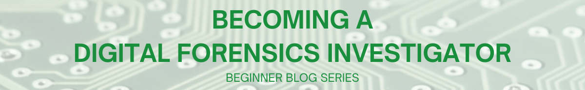
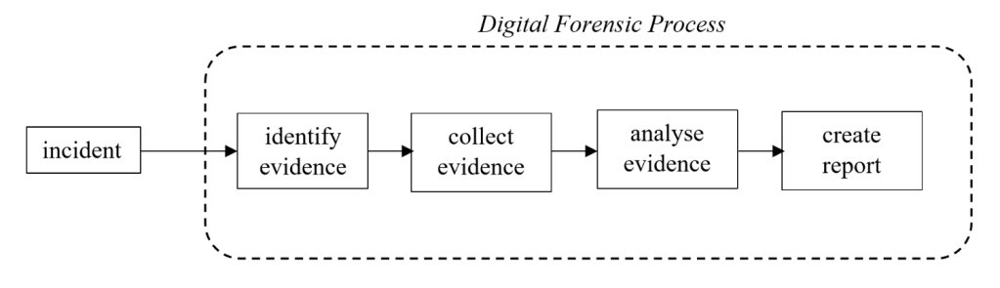

(becoming_digital_forensics_investigator)=
# Becoming a Digital Forensics Investigator
Let’s consider a scenario. The new *Batman* movie has just come out. You are unable to watch it in the theatres, so you head over to a website that says, “Download this software, you can watch the new *Batman* movie immediately!”. You download the software, only to find out it is fake. Disappointed, you carry on with your work. Soon after, you begin to notice that the mouse cursor moves across the screen, on its own, without you actually using the mouse. This is not expected behavior.

## What is an Incident?

An event involving a computer or a network, that is out of the ordinary, is qualified as an incident. Activities surrounding that incident need to be identified, to prevent such an unexpected incident from occurring again. This is formally referred to as “Incident Response”, abbreviated as IR.

In our scenario, the mouse cursor moving by itself can be qualified as an incident. The activity surrounding that incident is the software download.

Given the amount of cybercrime we see today, there is high probability that the software was hosted by a cybercriminal. Once the software was downloaded, the criminal has been able to remotely access your computer.

## What is Digital Forensics?

To confirm if a such an incident has really occurred, a qualified professional who knows their way around incidents, can be called in to take a look.

In the real world, scenarios similar to the one mentioned, and even more threatening, occur regularly. When a professional is called in, they would need to collect the computers or data from the computers involved in the incident. The collected entities referred to as evidence, will be taken to a special laboratory for analysis.

Digital Forensics is the process of identifying, collecting, preserving and analysing evidence collected from digital devices, to identify the events that led to an incident. The competent professional who is trained to perform digital forensics, is referred to as a digital forensic investigator.

Incident Response and Digital Forensics are typically performed one after the other. In the professional world, it is referred to as DFIR - Digital Forensics and Incident Response.

## Are Digital Forensics and Incident Response the same?

Although both terms are used together, there is a clear distinction between the two.

Let’s assume a burglar has broken into a home and stolen something. Incident Response (IR) will help identify that someone has broken into that home. That’s it. Digital Forensics (DF) will help find out if something has been stolen.

You can use this scenario to mirror the computer world. Incident Response can identify that an unexpected event (incident) has occurred. Digital Forensics will help find out the magnitude of that incident and propose what can be done for recovery.

IR and DF complement each other. Both processes need to be done to identify an incident and recover from it.

## Basics of Digital Forensics

The moment unexpected behaviour is suspected on your machine or your network, it is advised to not interact with the machine further and call in a professional to assess the incident.

## Digital Forensic Process

The following illustration provides a high-level overview of the digital forensic process.

1. **Evidence Identification:** Files or computers that appear relevant to the incident, are identified in this phase. Considering the scenario discussed above, the software setup file that claimed to provide the movie, can be classified as evidence.

2. **Evidence Collection:** The identified evidence must be labelled and collected, to be taken to the forensic investigator’s laboratory for digital forensics analysis.

3. **Evidence Analysis:** A forensic investigator’s laboratory has specialised hardware and software equipment to perform analysis on the collected evidence. Digital forensics hardware involves special computers, cables and storage devices to handle the evidence. Digital forensics software involves specially developed software tools that can read and interpret data from storage devices like hard disk drives, solid state drives and USB drives.

4. **Report Creation:** A doctrine that applies to digital forensics is, “If you did not document it, it did not happen”. To prove the occurrence of an incident, the investigator must document every identified event that led to the incident. The documented findings must be presented in a professional report.

A digital forensics report would be carefully constructed, so that technical and non-technical personnel can understand how the incident had occurred.

Every step discussed above gives you a brief idea. During the study of digital forensics, you will be exposed to every step, in detail.

## Challenges of Digital Forensics

One of the main challenges is handling an incident on time. With every interaction, the internal state of computers is constantly changing. Competent professionals will know how to handle incidents carefully.

Another challenge concerning digital forensics is the volume of storage devices in use today. The average human uses gigabytes of storage on their personal computer, storing a large number of files. In the event of an incident, it is critical to know which files to inspect. Digital forensic techniques help narrow down the set of files to scrutinize and conduct investigation promptly.

## What is Digital Forensics used for?

Typically, an incident occurs when humans utilise computers with malicious intentions. The forensic process performed will help identify the humans involved with the occurrence of the incident.

Considering the scenario, when digital forensics is performed on your computer, it will help prove that the software download that claimed to provide the new *Batman* movie, was the reason why the mouse cursor is moving around the screen on its own. It could be because someone is controlling your computer remotely. The IP address of the person having remote access to your computer can be identified.

## Why is Digital Forensics important?

Digital Forensics is important because it helps uncover how an unexpected incident had occurred. Appropriate remediation procedures can revert the system to a good working state. Steps can be taken to prevent the occurrence of such incidents in the future.

Now you know not to download software that claims to provide new movies for free!

## Is Digital Forensics Hard?

You spent enough time learning the English alphabet, grammar rules, and how sentences can be constructed. Now you can easily interpret this article.

In the same way, once you learn the fundamental aspects of digital forensics and practise how to apply them in the field, you will be on the road to becoming a competent Digital Forensics Investigator. So, digital forensics is not hard.

## How to get trained in Digital Forensics?

Universities offer bachelor’s and masters’ programmes that teach you the basic theoretical concepts and principles surrounding digital forensics. Formal education lays a good foundation for the fundamental aspects.

If you want to get a taste of what this field is like, you can browse through resources on YouTube or books in a library. You can also experiment with free digital forensics tools like Autopsy, DumpIt, Origami, etc. There are numerous free resources available on the internet.

## What can you do with a Digital Forensics Degree?

Once you have a basic level of training in Digital Forensics, you can choose to either work for the government or for private corporations. However, to be considered for a job, you will be expected to have practical skills. This is where professional certifications come in.

Online courses and certifications can greatly enhance your formal education by providing you with practical skills. Regardless of how much theoretical knowledge a candidate has, the level of practical skills possessed by a candidate appears lucrative to a potential employer.

There are numerous professional certifications in the market. It would be a good idea to carefully choose a certification that would train you practically.

The MCSI Online Learning Platform offers a certification titled “MCSI Certified Digital Forensics and Incident Response Specialist”, which teaches you the practical skills employers look for in candidates.

## How to get a job in Digital Forensics?

Organizations typically have a ‘Careers’ page on their website that lists open positions. You can look for entry-level jobs that can put your new skills to use.

If you are unable to land a job, it is recommended to keep yourself engaged in the field. You can take up online courses, write blog posts, participate in CTF events and even connect with like-minded professionals on LinkedIn. Try to carve a space for yourself. Your unconventional experience will be a plus point on your resume, to help you land your first job.

## Conclusion

Hopefully, this post gave you a good primer to the world of digital forensics. Happy learning!

> **Want to learn practical Digital Forensics and Incident Response? Enrol in [MCSI's MDFIR - Certified DFIR Specialist Certification Programme](https://www.mosse-institute.com/certifications/mdfir-certified-dfir-specialist.html).**