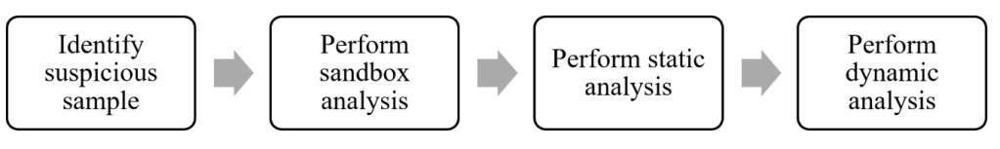

(becoming_malware_analyst)=
# Becoming a Malware Analyst

You have been using the free trial version of a tool called *My Photo Editor* for your image editing activities. However, the trial period has ended and a licence has to be purchased from the website to continue using the software. There is another third-party website that claims to provide the full version of *My Photo Editor* for free. All you need to do is click on a link to download the setup file. Soon after installing the setup, you notice that your computer is behaving strangely. Text files are being created and deleted from the desktop without your involvement, the Command Prompt application is running even though you did not start it and the computer seems to be running at a slow pace overall.

This could be because the software hosted by the third-party, could be a malicious version of *My Photo Editor*. It poses as a legitimate application, but behaves differently. Malicious software is formally referred to as malware.

## What is Malware Analysis?

When you suspect a piece of software to be malicious, it is important to take steps to prove whether it is malicious or not. If the software turns out to be malicious, it is crucial to identify the extent of malicious behaviour.

Malware Analysis is the technique of analysing the behaviour of a suspicious file or software. It helps to uncover if that file or software is doing an activity it is not supposed to do.

## How to start Malware Analysis?

When you encounter suspicious software, you can perform a Google search to find out if other people have faced the same situation. Vendors in the industry typically publish material guiding users about how to handle the situation. The suspicious software can be uploaded to a website like www.virustotal.com to quickly confirm its malicious nature. Then you can use techniques to study the behaviour of that malware in a laboratory environment.

## How to build a Malware Analysis Lab?

It is very easy to build a Malware Analysis Lab. You can have one on your own computer. A prerequisite for performing Malware Analysis is the ability to use virtual machines. There are many guides freely available on the internet to walk you through the setup of virtual machines. VirtualBox is one tool that can handle multiple virtual machines.

It is recommended to use a computer with at least 8GB RAM, capable of handling two virtual machines at a time. The two virtual machines and the host machine should be on separate networks. VirtualBox has capabilities to create this setup. This would constitute your own malware analysis lab environment.

Once the lab environment is ready, the suspicious sample can be subjected to static malware analysis and dynamic malware analysis. The analyses would be performed on the virtual machines using malware analysis tools like *PEStudio*, *Resource Hacker*, *FakeNet*, *ProcMon*, *Wireshark*, *Cuckoo Sandbox*, etc.

## What is Static Malware Analysis?

Let’s assume you have purchased a car. Just by looking at the car, without driving it, you would be able to infer facts about it. For example: the number of people that can be seated, the colour, form factor, etc.

In the same way, once you suspect a file or software to be malicious; without opening the file or without running the software, you can use some tools to decipher it’s working.

Static Malware Analysis is the technique of identifying the nature of suspicious files or software without executing them.

## How to perform Static Malware Analysis?

In the malware analysis lab, the analyst would have a set of software tools to assist in static and dynamic analysis. In the static analysis phase, only the relevant tools would be used - those that help to analyse a file’s internal structure without executing it. Some examples are *PEStudio* and *Resource Hacker*.

## What is Dynamic Malware Analysis?

Let’s consider the car again. This time you are taking it around for a test drive. Before you start the test drive, you will have a checklist in mind about the things to look out for. Once you start driving, you can easily realise the efficiency of the car, ease of use, etc. Also, you would take the test drive in a specially designated location, not in a busy highway.

In the same way, a suspicious file can be executed and its behaviour can be studied. Before executing the file, you will have in mind about the aspects of behaviour that require attention. For example, considering the suspicious sample of *My Photo Editor*, when it is being analysed dynamically, you will see if text files are being created on the desktop without your involvement. The analysis has to be performed in a virtual environment, so the host machine is not affected in any way.

Dynamic Malware Analysis is the technique of analysing the suspicious behaviour of a software by executing it in a virtual environment.

## How to perform Dynamic Malware Analysis?

In the dynamic analysis phase, tools that can monitor the behaviour of the sample as it is executing would be setup. Some examples are *FakeNet*,*ProcMon* and *Wireshark*. Once the setup is complete, the sample would be executed. This factor is the main difference between static and dynamic malware analysis.

The various tools will capture information that a malware analyst can inspect and form inferences. This phase can also be referred to as the malware behaviour analysis phase.

## What is Sandbox Malware Analysis?

Let’s consider the car again. Once you have the model’s name in mind, before going on a test drive or before purchasing it, you would go on YouTube and see if someone has reviewed that car model already. Watching a review video would give you an idea about the physical form factor, the colour (static analysis) and also how the car performs when it is driven (dynamic analysis).

Similarly, considering malware analysis, a malware analysis sandbox is a software or cloud-based tool that can automate static and dynamic analysis of a sample. Once the analysis is complete, the sandbox would display the obtained results.

Typically sandbox malware analysis is done to quickly get an idea about the suspicious sample. Based on the results, in-depth static and dynamic analysis would be done using other tools.

Some examples of malware sandboxes are *Joe’s sandbox*, *Cuckoo Sandbox*, *Falcon Sandbox*, etc. Hybrid Malware Analysis is a unique technique used by *Falcon Sandbox*.

## Overview of Malware Analysis

The following illustration provides a high-level overview of the malware analysis process.

## How to learn Malware Analysis?

Most bachelor’s and masters’ programmes in Cyber Security will introduce you to Malware Analysis. Formal education would provide you the fundamental theoretical concepts of Malware Analysis. You would be introduced to the various types of malware and how they may manifest.

To become a proficient malware analyst, it is recommended to enrol for a professional certification that will provide you with practical skills. The MCSI Online Learning Platform offers a certification titled “MCSI Certified Reverse Engineer”, that teaches you malware analysis skills.

## Is Malware Analysis for me?

If you are someone who enjoys solving puzzles, then you might find Malware Analysis interesting. Happy learning!

> **Want to learn practical Malware Analysis? Enrol in [MCSI's MRE - Certified Reverse Engineer Certification Programme](https://www.mosse-institute.com/certifications/mre-certified-reverse-engineer.html).**