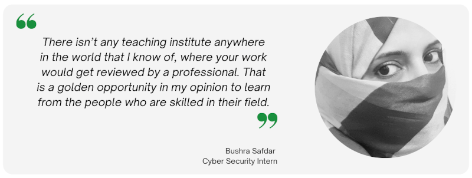

:orphan:

(bushra)=

# Review and Testimonial: Bushra Safdar
This post is an interview of one of our top students: Bushra Safdar. She began her journey in IT by completing a course in web development. This was the moment that she developed an interest in cyber security too. Bushra wanted to gain practical skills, and that's why she enrolled in MCSI's Remote Internship Programme. She completed the course in November of 2021 and received both a Certificate of Completion and a Letter of Recommendation from Benjamin Mossé. This interview details her entire experience learning with MCSI.

## Hello Bushra! You have been a student on the MCSI Online Learning Platform for a while now. Can you please tell us about how you embarked on your learning journey?

Hello and thank you for meeting with me.

Back in 2018, I decided to resume my career after a long break of ten years since my graduation in electrical engineering in 2009. I was always interested in the field of information technology and really enjoyed doing programming. I did a course in full stack web development and from there onwards I got introduced to the field of cyber security which got me really interested. At that point all the knowledge that I had about cyber security was purely theoretical. I was in the search of an opportunity that would help me gain some practical experience.

A friend referred me to this amazing platform. The registration process for the remote internship was quite smooth. After solving a first few exercises in that course, I felt like this is exactly the kind of place that can give me the experience that I want.

I completed my MCSI remote internship over the course of 8 months and I can now confidently say that I have come really far in terms of knowledge and skills. I not only learnt how to do work but I also learnt how to present it professionally which I couldn’t have learnt otherwise.

## Did you enroll in any of the MCSI Certifications?

Yes I decided to get enrolled in the MCSI remote internship program after my friend referred it to me. The internship is designed exceptionally well and you get to experience the flavor of almost every domain of cyber security from working on security tools, to performing threat analysis, writing PowerShell scripts for Cyber Defence, creating offensive malware for Red Teams and so on.

## That’s great to know! Did another MCSI Certification interest you?

Yes of course. There is no place like MCSI. I had already decided on getting another professional certification from MCSI during my internship. I am currently deciding on which path to choose as each domain that I worked on was very challenging yet exciting.

## What was your first impression about the platform?

The teaching style at MCSI where you get to research on an exercise, working your way towards the solution and getting personalized feedback from industry certified professional instructors was something that really made its mark on me. This unconventional teaching style was something new and wonderful for me, where you don’t have to watch long hours of video tutorials. This research method, I think is an excellent way of retaining the knowledge that you gain along the way.

## Were you able to navigate through the platform with ease?

Oh absolutely. The platform has been designed in a very user friendly way. It helps you to keep a track of your progress and the milestones you have achieved so far. The exercises have been divided into different sections related to each domain. Every exercise indicates the difficulty level i.e. Novice, Advanced Beginner, Competent etc. and the time it can take to complete the exercise for a person who is attempting the exercises for the first time. There is no time limit to complete the exercises and you can try to solve the exercises again even if you failed them at the first attempt. The resources needed to complete any exercise are included within it. The instructions to complete every exercise are very clear and concise.

## How would you describe your learning experience so far?

It has been very empowering. If I compare my knowledge and skills to what I knew eight months ago, I’d say I have gained a lot. I feel so confident and encouraged after completing the challenging exercises from the internship. One thing that I literally had no idea about before doing this internship was how to write professional reports. Completing the exercises that involved making reports and getting feedback from the instructors to make my work look more professional, was very enlightening. After taking such a long break in my career, I needed some solid skills to get back into the game. I strongly feel like MCSI is the only place that will help me achieve my goals.

## Did you require any special equipment to work on the exercises?

I didn’t use any special equipment. All I used was my laptop with virtual box installed on it to run different virtual machines, to complete the exercises. All the other resources required to complete the exercises are listed within the exercises itself.

## Did you encounter any challenges while working on the exercises? If yes, how did you navigate through them?

Some of the exercises in the internship were challenging and there were instructional videos included to help students familiarize themselves with the new concepts. If I felt stuck somewhere, the MCSI student forums proved to be of so much help. I found the answers for so many questions that had already been posted on the forum. Also if you have any question that hasn’t been answered yet, you can post it on the student forum and you will receive a prompt reply from any of the instructors.

## How was your experience submitting the solutions for every exercise?

The experience was very smooth. The instructions for completing the submissions and the expectations for quality work are very clearly stated with examples. There are instructional videos and video solutions by different students on the MCSI YouTube channel which is very helpful. All you need to do is to follow the instructions properly and it will become very easy to complete the exercises.

For submitting video solutions, you need to reproduce the solution to the exercise in your video recording. For submitting the file solutions, you need to include all the files in a single zip folder. For submitting your code it is necessary to indent and include comments to assist the person reviewing your code to understand how it works.

The exercise submissions helped me greatly understand how work is done in a professional setup. From applying file naming conventions to learning how to write all the essentials parts of a professional report, I couldn’t have learnt to do it without this invaluable internship.

## For exercises that involved a video submission, did you have to learn video editing skills?

No, I didn’t have to learn any video editing skills. To create clear video submissions I used the software ‘Tiny Take’ that made my job really easy and served the purpose. I made sure to include only the relevant details and kept the video time under 3 minutes.

## Were you comfortable with how the exercises were graded upon submission?

That was actually my favorite part. Even if I didn’t pass the exercise, the feedback really helped me improve my work and I would take this as an opportunity to work harder. There isn’t any teaching institute anywhere in the world that I know of, where your work would get reviewed by a professional. That is a golden opportunity in my opinion to learn from the people who are skilled in their field. And of course whenever I received a pass on the exercise, the validation of my work felt really rewarding. I couldn’t be more grateful for the effort and time that the MCSI instructors spend to review the exercise submissions from so many students.

## How do you expect your career to advance with the skills you have gained from the Online Learning Platform?

After doing internship on this platform, I have no doubt that this is the only place that can help me acquire the skills that are required by companies worldwide. I am confident that these practical skills can help me attain the goal of becoming a top notch cyber security analyst one day.

## Who do you think is the appropriate audience for this platform?

This platform is the best for anyone passionate about cyber security and is willing to acquire practical skills. It can be a beginner in the field be it a student or someone going for a career change, or it can be a professional in the field looking to improve their skills.

You can complete the exercise at your own ease however it suits your schedule. There is no time limit or expiry on these certifications. All it takes is the commitment to invest some time and effort to gain skills that can help advance your career.

## On an ending note, what would you like to tell our readers about the MCSI Online Learning Platform?

You will not regret enrolling with MCSI. Once you start, you are bound to get hooked to its learning methodology. MCSI Online Learning Platform is a combination of value and affordability. If you want to be a professional who is at the top of his/her game, that too in an affordable price, then this is the place to invest your time and resources.

MCSI provides you with certificates for each and every exercise that you can use to showcase your skills to the potential employers. As a professional in the field of cyber security where the attack scenario keeps on changing rapidly, you need to learn new skills and be up to date on the recent knowledge. MCSI Online Learning Platform helps to achieve exactly that because their exercises are developed after careful consideration.

Also I really love how accepting this platform is of all the people all around the world without any discrimination and how it has formed into a unified community. MCSI provides an opportunity to students who are in any part of the world, to gain the skills required to break into the field of cyber security. That to me is just wonderful.

> **Want to learn practical skills that will land you a job in cyber security? Enrol in [MCSI's MRCI - Remote Cybersecurity Internship](https://www.mosse-institute.com/certifications/mrci-remote-cybersecurity-internship.html).**