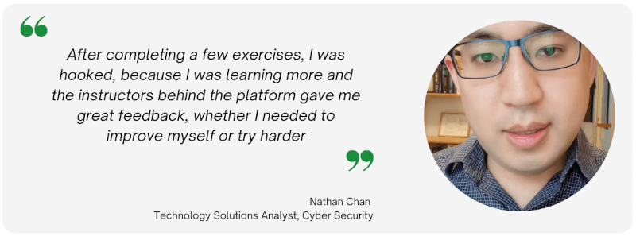

:orphan:

(nathan)=

# Review and Testimonial: Nathan Chan

This post is an interview with one of MCSI's top students, Nathan Chan.  Nathan Chan has a knack for digital forensics, incident response, reverse engineering, penetration testing, red teaming, blue teaming, and exploit development. He is well-rounded in cyber security, taking on many hats. On a day-to-day basis, Nathan Chan is a seasoned incident responder. He believes that with the power of Google and reading and understanding books, nothing is impossible in IT.  He is proficient in Windows, Mac, and Linux forensics.

## Hello Nathan! You have been a student on the MCSI Online Learning Platform for a while now. Can you please tell us about how you embarked on your learning journey?

Nice to meet you all!

After topping cyber competitions back then such as TryHackMe, Immersive Labs, and CyberDefenders, I have decided to give MCSI a try and see what it had to offer.  And, after completing a few exercises, I was hooked, because I was learning more and the instructors behind the platform gave me great feedback, whether I needed to improve myself or try harder.  I even created my own PHP web shell (how impressive is that?)  I first heard about MCSI while I was Googling for practical exercises online.

There were many excellent reviews from a lot of students about this particular platform, especially the MRI (Mossé Cybersecurity Remote Internship) course.  Since the genesis of this platform, I was attracted to MCSI’s style of 100% hands-on training, especially with penetration testing and threat intelligence.  I have never heard of many of these new hacking techniques. And, some were not covered in traditional courses like the OSCP.

With MCSI’s practical experience, I had honed my skills to top-notch even making it to the most Formidable Student submissions, where I submitted 1000+ lines of code for a Microsoft Windows Server hardening project.

## Did you enrol in any of the MCSI Certifications?

Yes, I definitely did.

My first enrollment of a traditional hands-on MCSI certification was when I blogged how good MCSI was in comparison to other practical courses out there.  From what I remember, I gave MCSI a 11/10 for the best cyber training out there. I really loved the approach of it. I didn't know that what I wrote impacted a lot of MCSI enthusiasts that would start a next generation of avid white hat hackers. It was like the gospel (good news) of MCSI. Benjamin Mossé rewarded me the MTIA course, which I didn’t expect.  That was my first ever MCSI course.

I have also enrolled in the MRCI course and many other ones, including the Penetration Testing Bundle and the MBT (Mossé Certified Blue Teamer). The MRCI course was where I learned the basics of cybersecurity including playing with some scripting exercises, which helped me enhance my PowerShell and Python skills.

## What was your first impression of the MCSI platform?

My first impression of the platform was that I was never alone in learning. I could post in the forums, and I would get a quick response and feedback as to what I was going to need in order to complete the exercise.  My impression also was that research and skills mastery was everything, since MCSI's motto is "Skills mastery wins".  I was also under the impression that these courses were military-graded courses harder than traditional try harder courses like the OSCP and many times harder.  I had a joke with one person the other day about MCSI. I told them that a traditional cybersecurity course was like earning a BMW. MCSI's courses were like earning a Rolls Royce in learning.

## Were you able to navigate through the platform with ease?

The UX/UI design of the site made it really easy and professional to work with. I also felt like the colors bright green with a mix of darker greens made me feel like I was enrolling in military-graded training. I still remember other sites had awards like badges for gamification.  It is nice that MCSI includes elements of gamification as well such as the scoreboards and the badges.  The certificates were really rewarding, as each one was a crown jewel to my collection of skills.

## Did you require any special equipment to work on the exercises?

I did require sometimes purchasing cloud subscriptions to accomplish tasks such as renting out some free-tier machines from AWS or Google Cloud.  I got to learn how to approach the cloud to get the most of it.  I also watched videos to setup my malware analysis home lab, which included purchasing a VPN connection and learning how to set up an isolated environment for the lab in a VMWare environment.  

## Did you encounter any challenges while working on the exercises? If yes, how did you navigate through them?

I encountered a lot of challenges, but that didn't mean it was bad for me. It was a great learning experience.

My philosophy is this: Never give up! For every project that I couldn't do, I would skip it for another day until I read a book or understood the conceptual layers behind them. MCSI's exercises are harder than normal exercises, which require you to punch in a flag for solving that problem. I would also pray to God for help and He would answer me (providing me with the clear mindset as to how I would approach a problem). Sometimes, I would even draw flowcharts and take a plan of action to accomplish mini steps at a time for the bigger picture. For example, if I needed to learn how to program a PHP web shell, I would need to build really foundation in PHP first before taking on the challenge!

## How was your experience submitting the solutions for every exercise?

I didn’t have problems submitting a video. I have heard that most people out there use OBS Studios for their video product.  I used commercial tools such as Camtasia Studio for my recordings. It was a easy to work with.  The solutions had to be submitted as code files or videos or reports.

MCSI requires you to put a huge amount of effort producing quality professional source code and reports. I got used to the MCSI Method. That is why I can land a job having met their curriculums. Also, in the real world, what I found out is that if you land a role in a top-tier company, you need to present with elite PowerPoint and Word skills. MCSI teaches you how to do that!

## Were you comfortable with how the exercises were graded upon submission?

Take it like this – if you are not afraid of failure, the challenge is yours. You can take each exercise an unlimited number of times. After you finish each challenge, you will gain a certificate. After you go up levels in MCSI certification systems, you will obtain industry certificates.

## How do you expect your career to advance with the skills you have gained from the Online Learning Platform?

I hope to take this as an opportunity to sharpen my skills and learn how to buff up my research skills so that I can be more productive at work. It's definitely easier said than done. For the long-term goal, my plan is to become a professional reverse engineer with the skills to program a ransomware decryptor.

## Who do you think is the appropriate audience for this platform?

I personally think there is no set audience for this particular platform. For anyone interested in upgrading their cyber skills, there is MCSI which is a "Try Harder" platform.

I would say that most exercises – to be frank – are made for avid learners who want to get a deeper dive into a specific area in cybersecurity. It's not easy since you have to be disciplined to make videos each time uploaded to YouTube, but there are many opportunities to improve yourself.  It is like climbing a rope; you need to take baby steps to further your movements.

## On an ending note, what would you like to tell our readers about the MCSI Online Learning Platform?

The creators of MCSI always want you to score the best and have the best for you.  Even Benjamin Mossé, the founder of MCSI, gave me a reference needed for the challenging job that I am in right now at MNP LLP, a top-tiered consulting firm in Canada.

I want to also shout out to Harris Wassylko and his team for making this happen, as it is not an easy job having to mark hundreds of assignments a day. This exemplifies the hard work put into the program. Thanks MCSI for everything!

> **Want to learn practical Blue Team skills? Enrol in [MCSI's MBT - Certified Blue Teamer](https://www.mosse-institute.com/certifications/mbt-certified-blue-teamer.html).**