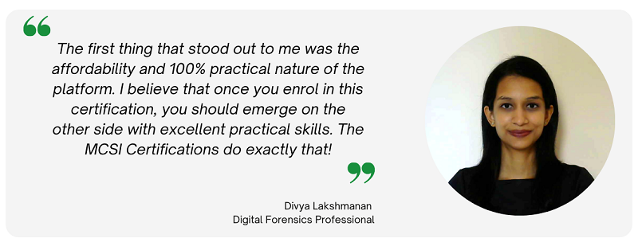
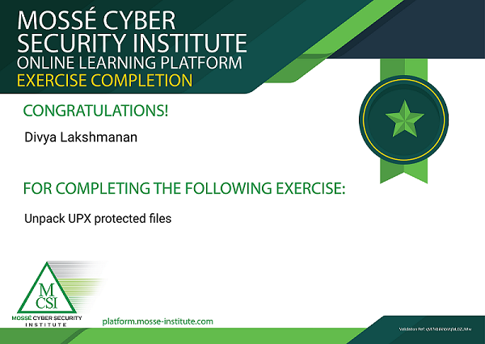

:orphan:
(review-and-testimonial-divya-lakshmanan)=

# Review and Testimonial: Divya Lakshmanan

This post is an interview of one of our top students: Divya Lakshmanan. Within a year, Divya completed [MCSI's Remote Internship Programme](https://www.mosse-institute.com/certifications/mrci-remote-cybersecurity-internship.html) and reached 50% completion on our [Incident Response and Digital Forensics certification training](https://www.mosse-institute.com/certifications/mdfir-certified-dfir-specialist.html) which is referred to as MDFIR. Today, Divya works on complex DFIR engagements where she responds to ransomware attacks, endpoint threats, and business email compromises. She's proficient in Windows and Android forensics.

## Hello Divya! You have been a student on the MCSI Online Learning Platform for a while now. Can you please tell us about how you embarked on your learning journey?

Hello! Thank you for meeting with me.

I have always aspired to be a skilled professional. Formal education in Cyber Security, introduced me to the various domains in this field. It taught me about what netcat tool can do, but in the real world, I was expected to know about the switches of netcat and use them competently. When self-education attempts were not sufficient, I decided to level up my game.

While looking out for a structured curriculum or learning path that could impart high-quality practical skills, I came to know about Mossé Cyber Security Institute’s Online Training Platform on LinkedIn.

After registering myself as a student on the platform, the free curriculum provided access to beginner-level practical exercises across domains like Security Tools, Windows Fundamentals, etc. This made me think to myself, “Wow, this is what I was looking for!”. So, I decided to invest few months in gaining some practical skills.

## Did you enrol in any of the MCSI Certifications?

I decided to register for the [MCSI's Remote Internship Programme](https://www.mosse-institute.com/certifications/mrci-remote-cybersecurity-internship.html), which has 68 practical exercises, across six domains - Security Tools, Penetration Testing, Cyber Defence, Threat Hunting, Secure Software Development and Red Teaming. This internship strengthened my foundational skills in Cyber Security. If I had known about this programme during my college education, it would have been a great addition to my learning journey then. After working my way through the internship programme, I finally gained the practical skills that my college education should have provided me. I wanted more!

## That’s great to know! Did another MCSI Certification interest you?

I enrolled myself in the [MCSI Certified DFIR Specialist (MDFIR) Certification](https://www.mosse-institute.com/certifications/mdfir-certified-dfir-specialist.html#:~:text=The%20MCSI%20Digital%20Forensics%20and,and%20analyse%20modern%20APT%20samples). Being passionate about Digital Forensics, I was delighted to gain skills in areas like File Analysis, Windows Forensics, Malware Analysis, Threat Intelligence, Network Forensics, Memory Forensics, Incident Response and more. This certification is giving me a steep learning curve, teaching me things I was never aware of. The exercises have been designed based on real-world scenarios. Without question, it is an excellent professional certification.

## What was your first impression about the platform?

The first thing that stood out to me was the affordability and 100% practical nature of the platform. I have considered taking up other certifications available in the market. They are either too expensive or theory-oriented. I believe that once you enrol in a certification, you should emerge on the other side with excellent practical skills. The MCSI Certifications do exactly that!

## Were you able to navigate through the platform with ease?

Of course! In the curriculum for a certification, the exercises are organized into categories. You can work your way through the curriculum in any order. Each exercise is presented with objectives, specifications and references - just like a field mission. Everything you need to know to complete an exercise is in front of you, you just need to get started. I felt that along with gaining practical technical skills, I also learnt ‘how to think’ like a professional in the field.
Every student is presented with a customised performance tracker to assess progress over time. A profile is also maintained for every student, that can be shared with potential employers. I felt that this is a great way to showcase my skills.

## How would you describe your learning experience so far?

It has been very rewarding! For every exercise, the student needs to perform research and come up with a solution, that meets the specifications. This helps the student cultivate a research-oriented mindset, which is a demanded quality in this fast-paced professional world. An outcome of performing research is gaining confidence and learning to look at facts objectively. You become independent; you can tackle any problem with courage; you also learn to ask for help! After working on some advanced exercises, I realized the value of this research-based learning.

Every submitted exercise is evaluated by highly-trained Instructors, who provide valuable feedback. The feedback received after every exercise provided validation for the hard work performed and encouraged working on the next one.

## Did you require any special equipment to work on the exercises?

All the equipment needed for this research-based learning, is a personal computer or a laptop capable of handling two virtual machines at a time and good internet connectivity.

## Did you encounter any challenges while working on the exercises? If yes, how did you navigate through them?

Every project has challenges along the way. The Online Learning Platform has tools to navigate any challenges faced. There is a section on the platform that has videos explaining fundamental concepts in cyber security. It was like having a cyber security dictionary!

In case you are stuck with an issue, you can raise a question about it on the student forums. An Instructor would respond to you within 24 hours or even your fellow students will come to your need. Being engaged in the forums was a valuable reminder that we are all learning and improving.

## How was your experience submitting the solutions for every exercise?

Submitting the solutions for every exercise was a simple process. On the platform, the available guidelines and sample submissions helped greatly. The solutions had to be submitted as code files or videos or reports or a specified combination among the three.

For code submissions, it is required to follow professional formatting and presentation - which is great when you want to share your work with your colleagues. Also, the creation of generic code was encouraged, making code reusable across multiple exercises. After working on some exercises where I became familiar with programming in Python, when a friend needed help with writing a script, I was able to come up with a quick algorithm to construct that script. I was not able to do that before working on the MCSI curriculums!

For report submissions, the feedback provided by the Instructors took my reports from standard to professional fairly quickly.

For video submissions, a screencast of that exercise’s outcome was required, which was like demonstrating the skills learnt!

## For exercises that involved a video submission, did you have to learn video editing skills?

I did not have to learn video editing skills to make the video submissions. Making a good professional video was easy. All I had to do was record a screencast of an exercise in action and include the required details. Tools like Tiny Take and Open Broadcaster Software (OBS) proved handy here. An exercise in the MCSI Remote Cybersecurity Internship (MRCI) curriculum, walked me through this process.

<iframe width="560" height="315" src="https://www.youtube.com/embed/pg4xTg0_UV4" title="YouTube video player" frameborder="0" allow="accelerometer; autoplay; clipboard-write; encrypted-media; gyroscope; picture-in-picture" allowfullscreen></iframe>

_Exercise Solution Video: Analyse Malware From A Memory Dump Using The Volatility Framework_

## Were you comfortable with how the exercises were graded upon submission?

Yes! After an Instructor reviews the solution for an exercise, it is marked as either pass or fail. In case an exercise is marked as fail, then the Instructor would provide constructive feedback on how it can be improved. There are unlimited attempts to an exercise. You can work on it until you get it right! Instructors will be there along the way to guide you. I felt this was a great way to keep the student motivated.

One thing that impressed me was, how the MCSI platform redefined the word ‘failure’. In traditional academia, a failure is seen as a termination point. The human mind gets wired to avoid failure at any cost! Refreshingly, on the MCSI platform, when an exercise has been marked as ‘fail’ and you wish to attempt it again, you are presented with this message: ‘Failing a submission is an opportunity to try harder and learn some more’. This message was a reminder that we can always keep improving.

<i>Certificate of Exercise Completion: Unpack UPX Protected Files</i>

## How do you expect your career to advance with the skills you have gained from the Online Learning Platform?

The industry is always looking out for professionals with practical skills. The professionals are encouraged to constantly renew their skills with the ever-changing technological landscape.

The skills that I gain from the Online Learning Platform, will keep me on par with professionals globally. The platform also provides lifetime access to affordable certifications that I can work on at my convenience. The hardcore practical skills that I gain from the platform, will make me an exceptional candidate for a potential employer.

## Who do you think is the appropriate audience for this platform?

This platform is suitable for anyone who is committed to improving their practical skills! Certifications exist for learners at every stage - beginner, intermediate and advanced. The Institute’s website provides sufficient information about every certification to help you make a decision. The ‘Course Overview’ video on every certification’s page gives you a glimpse into the exercises.

Also, there are no deadlines on this platform. How cool is that? You are free to work at your own pace. You schedule your learning time. I feel this freedom eliminates rigid boundaries that come with traditional education. It’s all about the knowledge, the skills, and how far you are willing to go to get to where you want to be!

## On an ending note, what would you like to tell our readers about the MCSI Online Learning Platform?

Just like how a skyscraper needs a good foundation to hold itself up high, if you want a solid foundation for your Cybersecurity career, this is where you want to be! I highly recommend enrolling yourself on the MCSI Online Learning Platform.

I have learnt more on the platform than I have as a student in traditional academia. Just figure out where you want to get to in life and put in the work. The only competition for you is the person looking at you in the mirror. You can achieve anything.

Think of the knowledge as treasure. The platform provides a map for you to reach that treasure. It’s available for anybody who wants it. Do you want it?

:::{seealso}
Want to learn practical Digital Forensics and Incident Response? Enrol in [MCSI's MDFIR - Certified DFIR Specialist Certification Programme](https://www.mosse-institute.com/certifications/mdfir-certified-dfir-specialist.html)
:::
