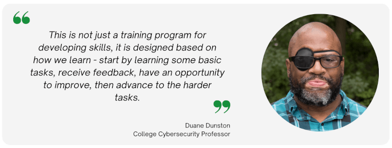

:orphan:

(review-and-testimonial-duane-dunston)=

# Review and Testimonial: Duane Dunston
Duane Dunston is an Associate Professor at Champlain College in Burlington, Vermont.  He teaches cybersecurity courses and mentors people transitioning into the cybersecurity field or those new to the cybersecurity industry.  He is currently enrolled in the Threat Intelligence Analyst and Threat Hunter certification programs.

## Can you please tell us about how you embarked on your learning journey?

I wanted to learn a new domain within cybersecurity and became interested in Threat Intelligence this past summer.  I started looking around for training programs that were affordable because our professional development budget is quite small. All the training that went in-depth on Threat Intelligence far exceeded my available professional development budget except for this training institute.

## Did you enrol in any of the MCSI Certifications?

Yes, I enrolled in the free introductory courses and saw that even those were reviewed by an instructor and was quite surprised. I had not heard of a training program where someone graded *every* assignment, even the free ones. I perused through those to see the types of assignments and was impressed that each assignment had real-world applicability.  It is also when I saw that video submissions were required and sometimes code.  That really piqued my interest.

## Did another MCSI Certification interest you?

At the time, I was only interested in Threat Intelligence.  However, as I started learning to use Pandas, as a result of the modules in the Threat Intelligence course, I became interested in Threat Hunting so I enrolled in it, as well.  It was nice to see that the assignments from Threat Intelligence that overlapped with Threat Hunting were applied.

## What was your first impression about the platform?

My first impression was disbelief that this type of training was around.  Online training of this type is self-paced and you generally study on your own or test labs on your own, but this was different because of the evidence-based assignments. Not only did I have to set up a basic lab and download the tools, but I had to show evidence of it.  Also, each module is laid out in a way that scaffolds learning. That part was a major selling point.  This is not just a training program for developing skills, it is designed based on how we learn - start by learning some basic tasks, receive feedback, have an opportunity to improve, then advance to the harder tasks.

## Were you able to navigate through the platform with ease?

Navigating the platform is quite easy.  When I log in, the dashboard shows me everything I need to see right away and I can click on my course and start the next assignment.  Also, the checklist feature is quite awesome because it is the rubric that students are used to seeing with their assignments.  There were a few times where I completed an exercise and went to check off each item and realized I didn't complete one or two tasks.  That was very helpful and is a nice pedagogical tool to help folks stay on track with what they should be doing to complete the lab.

## How would you describe your learning experience so far?

It has been fantastic.  I've heard of Jupyter, but have never had a need for it so I didn't bother learning it.  Then I had to use it for this course and learned a lot about it and had to refresh my incident response skills, which I haven't done since I started teaching.  I had to refresh my Python skills since I haven't used or taught a class in it in several years, as well.

I've had the opportunity to use new tools that I haven't before and realized how those would have been of tremendous help when I was an incident responder.  I've told many people, including on Twitter how I wish I had known about using data science to perform incident response.  It took days and several people to review systems where there was a confirmed or suspected mass compromise.  Python and some basics on data analysis would have changed days of sifting through data to a few seconds to produce a report to more easily see the systems that were impacted.

It has caused tension where I wish I was back in the industry to apply this or that more people knew about how to apply some basic mathematics to identifying compromised hosts.

## Did you require any special equipment to work on the exercises?

I switched to using a server for the Yara rules and searching through malware because on my laptop it took 35 to 40 minutes and on the server that I switched to, it took a few seconds.  The 'special equipment’ was out of convenience not that I needed it.  I would suggest folks have at least 16GB RAM so they can run at least two virtual machines for the labs.

## Did you encounter any challenges while working on the exercises? If yes, how did you navigate through them?

Yes, indeed. In the Threat Intelligence course, the Yara rules were quite challenging because I didn't know how to use it to search for specific locations in a file.  I use Google heavily for this course.  I used a YouTube video to learn some basics on Pandas.  Ever since then, there are a few sites I have bookmarked that have provided me all the information I need to use Pandas functions, outside of the Pandas main website documentation.

## How was your experience submitting the solutions for every exercise?

Submitting assignments was and continues to be quite seamless.  I have a screen recorder that is built into my Chrome browser and I'm ready to go.  The checklist is very helpful to work through before I start recording to ensure I am recording the appropriate information.

## For exercises that involved a video submission, did you have to learn video editing skills?

I didn't have to learn any new skills, I would only do basic editing if I made a mistake typing a command and needed to snip something from the video.  I also had to snip the long wait times when using Yara to search through malware.

## Were you comfortable with how the exercises were graded upon submission?

Yes. The feedback provides another good pedagogical practice in that the feedback only contains details when it is needed.  Otherwise, the quick replies of "Good work!" or "Great Work!" is all that is needed to know that I accomplished the task, as intended.  There are a couple of assignments where I had to, and currently, have to improve on.  However, that is what I like about this training program.  Nothing gets by that is lackluster.  It has to meet the quality expected.  The times I received feedback were followed with an explanation on why it is necessary to improve on the assignment and not just that I didn't do it properly.  The instructors are also encouraging with reminders to 'keep up the good work.'

## How do you expect your career to advance with the skills you have gained from the Online Learning Platform?

Well, for one, I'm going to apply what I'm learning in the Threat Intelligence and Threat Hunter course to a local agency.  They know I'm a student in this program and what I'll be doing and are excited to have the assistance and someone to review their systems for anomalies. 

As a professor, MCSI has helped me to learn how to create harder problems, and how to scale them based on my students’ experience levels.

## Who do you think is the appropriate audience for this platform?

The audience for this platform are folks who are self-starters and self-learners.  Since there are no tutorials or videos which provide guidance on completing the assignments. However, this platform would be a good framework for training cybersecurity professionals with the help of a teacher who can prepare them to complete the labs, through other guided methods.

It is also for advanced learners who want to work on hard problems.  Some folks may not want the certification or have to go through the Novice level training, they may just want to be challenged and this platform provides that opportunity.

## On an ending note, what would you like to tell our readers about the MCSI Online Learning Platform?

What you will learn with MCSI is based on real-world tasks.  There is no "busy work."  It is all relevant and scaffolds nicely.  With each video submission, where applicable, you have to show understanding and not just complete a task.  You will have to learn non-verbal communication and be able to present information in a short period of time.  If you get stuck on an assignment the forums are there for students and instructors to provide assistance when needed.  You can take your time with this course and work through it at your own pace.

If you select a training path that is based on your current role, you will be able to refresh or advance your knowledge and apply it to your day-to-day work tasks.  I wish I had known about this training when I was in the industry.  The fundamental modules would have provided value because I didn't know how to perform those tasks then.  The Yara and pandas modules, for example, would have saved hours and hours of work by applying basic mathematical principles to analyzing incident report collections.  There are many tools you'll learn about that could be the one tool you've been needing to learn how to use.  What is important about that previous statement is that you have to demonstrate you have learned how to use the tools and that you can interpret the output.  I found it interesting that I can do that non-verbally and within 3 minutes.

Finally, you will have a profile that you can show to employers or your current employer to see your progress or provide them with video evidence of your skill development.

> **Want to learn practical Threat Intelligence Analyst skills? Enrol in [MCSI's MTIA - Certified Threat Intelligence Analyst Certification](https://www.mosse-institute.com/certifications/mtia-certified-threat-intelligence-analyst.html).**