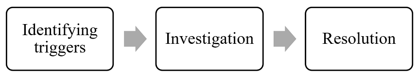

:orphan:
(becoming_threat_hunter)=

# Becoming a Threat Hunter

% start-after

A rare diamond is on display at a local museum for few weeks. An efficient security system is in place to ensure the diamond does not get stolen. The system comprises alarms, cameras, and trained staff. In spite of the security system, the staff would always be vigilant for theft attempts on the diamond. This includes studying the behaviour of visitors coming in to see the diamond.
% end-before

## What is Cyber Threat Hunting?

In the cyber world, organisations take massive steps to defend their network from attackers. However, attackers still find ways to enter the network. An attacker’s entry into the network would happen sequentially. If the initials steps in the sequence are identified, it becomes easy to predict the attacker’s operation within the network and eventually stop it.

When trained cybersecurity professionals use various tools and techniques to identify an attacker’s presence in the network, it is referred to as Cyber Threat Hunting. These professionals are referred to as threat hunters.

## Cyber Threat Hunting Process

The three steps in the cyber threat hunting process are illustrated below:

## 1. Identifying Triggers

Threat Hunters on a network adopt a ‘always under attack’ mindset to identify malicious activity. Every network would have a baseline of normal operation. Any deviation from the baseline, accounting for abnormal behaviour, is referred to as an ‘Indicator of Compromise’ (IOC). A threat hunter would use various tools and threat hunting techniques to identify these Indicators of Compromise. In some cases, events flagged as IOCs may not be really malicious. These are referred to as ‘false positives’.

Considering the bank scenario, a security staff overheard the conversation between two visitors. It went like this: _'I think it would be easy to remove this diamond at midnight'._ The staff would classify this statement as an IOC. If the visitors were joking about it, then classification of this conversation as an IOC is a false positive. However, it might also be part of a plan to steal the diamond.

## 2. Investigation

Next, the threat hunter collects more information about the identified abnormal behaviour. The accuracy of the IOC is verified.

## 3. Resolution

Once the threat hunters have verified the abnormal behaviour, they would notify the Incident Response (IR) team. The IR team would qualify the abnormal behaviour as an incident. They take steps to ensure that the incident is contained and does not spread within the network.

The IR team then notifies the Digital Forensics team, who work to assess the magnitude of the incident.

Every organization would have separate teams of qualified professionals who can perform threat hunting, incident response and digital forensics. The three activities usually occur one after the other.

## Why must organisations invest in threat hunting?

Organizations always have network defences like firewalls and intrusion detection systems in place. Attackers have found ways to evade these defences. Threat hunting steps help identify abnormal behaviour on the network that were not identified by other network defences.

An organization’s threat hunting team scans the network for threats every day. Sometimes threats can be identified before they evolve into a large-scale attack, saving the company a lot of money.

## Cyber Threat Hunting Tools

One common tool used for threat hunting is YARA, which involves writing rules. YARA rules follow a special syntax to specify strings and expressions, that help to detect unusual activity within a network.

Other threat hunting tools are _Cuckoo Sandbox, Maltego CE, YETI_ and _CrowdFMS_.

Enterprise network setups handle a large amount of data every day. Data science can be used to efficiently identify threats in such setups.

## Is Threat Hunting for me?

If you are someone who has the ability to identify patterns and unusual events, then threat hunting would be a great choice for you.

The MCSI Online Learning Platform offers a certification titled “MCSI Certified Threat Hunter” that provides cyber threat hunting training. Happy learning!

> **Want to learn practical Threat Hunting tactics and strategies? Enrol in [MTH - Certified Threat Hunter Certification](https://www.mosse-institute.com/certifications/mth-certified-threat-hunter.html).**
