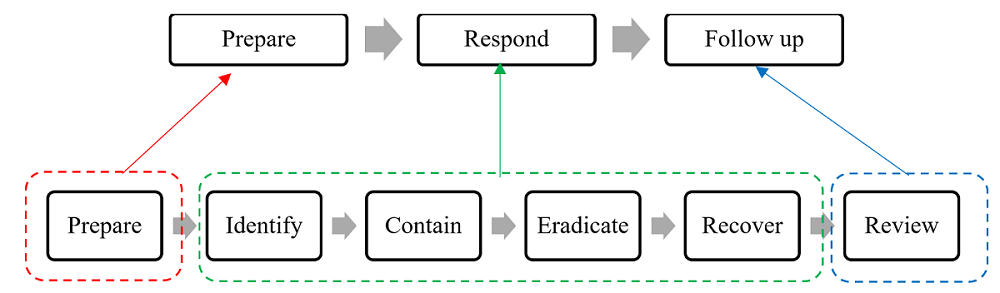

:orphan:
(becoming_incident_responder)=

# Becoming an Incident Responder

% start-after

Let us assume that a building has caught fire. Firefighters must act at a moment’s notice to extinguish the flames. A building catching fire is an unexpected event. Similar unexpected events occur in the cyber world that affects regular business operations. Any event out of the ordinary qualifies as an incident.

Some examples of cyber incident scenarios are:

- Files getting encrypted for ransom
- Software malfunction
- A sudden network outage
- Unauthorised access to data

Such incidents must be handled in an organised manner.

% end-before

## What is Incident Response?

Incident Response is the series of steps undertaken to recover from an incident. Considering the burning building, incident response involves taking steps to extinguish the fire.

Cyber Incident Response ensures that business operations return to normal at the earliest. The following illustration depicts the various phases of incident response.

## Cyber Incident Response Phases

## 1. Prepare

Even if an organisation does everything right, cyber incidents are inevitable. A good ‘Cyber Security Incident Response Plan’ guides how to handle unpleasant surprises. An Incident Response Plan is a document that lays out answers to the following questions:

- Is the incident response team trained and ready to work at a moment’s notice?
- Does the team have the required software and hardware tools to identify and contain the incident?
- Who are the significant members who must be informed of the incident?

The following steps outline how to create an Incident Response Plan:

- Establish expected behaviour of the organization’s assets on the network
- Set up tools to detect abnormal behaviour
- Describe the steps to take when an incident occurs

Regular mock drills can be provided to the Incident Response team, to test the efficiency of the Incident Response Plan.

## 2. Identify

A crucial step in Incident Response, is to identify that an incident has occurred. A deviation from normal behaviour is enough to call in the Incident Response team.

## 3. Contain

The next step is to determine the extent of the incident. This might involve isolating the affected systems from the network or even taking them offline.

## 4. Eradicate

This step is the most crucial in incident response. It involves eliminating factors that led to the incident. The elimination must be done in a way that the same incident does not occur again. This makes the eradication phase of incident response difficult.

## 5. Recover

By this time, the incident has been handled completely. The affected systems are clean and can be used again for business operations.

## 6. Review

Now is a good time to reflect on the incident and identify what can be done to prevent it from occurring again.
The identification, containment and eradication phases constitute the vital parts of the cyber incident response process. Cyber incident response and recovery is complete once documentation is done. A document can be created with the following information:

- How the incident was identified
- How the incident was handled
- Steps taken to prevent the incident from occurring again

## What is Cyber Incident Response Maturity Assessment?

A Cyber Incident Response Maturity Assessment tests an organization’s capability to handle incidents. The assessment typically occurs in three phases:

1. Prepare
2. Respond
3. Follow up

The main function of cyber incident response capability is to ask:

**Phase 1: Prepare**

- How good is my Incident Response Plan?

**Phase 2: Respond**

- In the event of an incident, am I prepared to undertake all the Cyber Security Incident Response Steps?
- Do I have the required Cyber Incident Response Tools handy?

**Phase 3: Follow Up**

- Do I have proper documentation practices in place?

The following image illustrates the mapping between the Incident Response phases and the Maturity Assessment phases.

The readiness of an organization in every phase is graded from 1 to 5, with 5 being the highest.

## Beyond Cyber Security Incident Response

Typically, the cyber domains Digital Forensics and Malware Analysis are referred to when talking about Incident Response.

Let’s consider the fire scenario again. The firefighters have identified that the fire was not an accident. The electrical system in the building was tampered with, which caused a fire to break out. Identification of events that led to the incident constitutes Digital Forensics.

The firefighters might call in some electrical personnel to identify the scope of tampering done to the electrical system. Analysing and recognising intricate details of the events that led to the incident constitutes Malware Analysis.

Criminals always leave behind clues about their activity. Let’s say a bunch of crooks have an agenda to tamper with the electrical system of many buildings and cause fires. They have a significant ‘style’ to their tampering. They leave behind a ‘tampering signature’.

In the cyber world too, criminals leave behind such signatures. Threat Intelligence is a domain of cybersecurity that studies signatures like:

- Coding patterns
- File naming schemes
- Image watermarks

Information gathered by Threat Intelligence comes in handy while dealing with cyber incidents.

## Is Incident Response for me?

If you are someone who can think and act quickly in high-pressure situations, then Incident Response would be a good choice for you.

The MCSI Online Learning Platform offers a certification titled “MCSI Certified Digital Forensics and Incident Response Specialist”, that teaches you Incident Response skills. Happy learning!

:::{seealso}
Want to learn practical Incident Response? Enrol in [MCSI's MDFIR - Certified DFIR Specialist Certification Programme](https://www.mosse-institute.com/certifications/mdfir-certified-dfir-specialist.html)
:::
