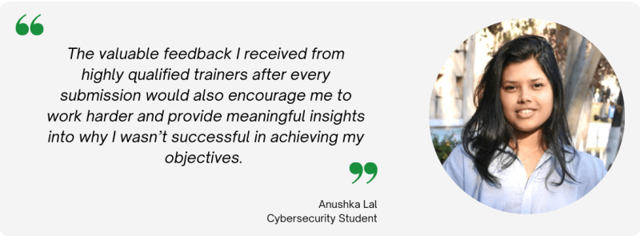

:orphan:

(anushka)=

# Review and Testimonial: Anushka Lal
This post is an interview of one of our top students: Anushka Lal. Within a year, Anushka completed MCSI's Remote Internship Programm while studying for her Bachelor's Degree in Computer Engineering. 

## Hello Anushka! You have been a student on the MCSI Online Learning Platform for a while now. Can you please tell us about how you embarked on your learning journey?

Hello! Thank you for having me here.

As a cybersecurity enthusiast, I was looking for new opportunities and fortunately landed an opportunity to participate in the US based 100 Women in 100 Days Cybersecurity Career Accelerator Program to complete my CompTIA Security+ certification.  This was where I first learned about the Mossé Cyber Security Institute’s Online Training Platform. 

As participants of the 100 Women in 100 Days program, we were given access to a few of the learning modules on this platform along with a live walkthrough through the platform. Soon after, I registered myself as a student on the platform and explored the different free curriculum and beginner exercises. I was surprised to see how everything was so well structured and laid out. There were so many new domains to explore and a perfect place to practice my technical skills. That’s how I first started my journey at Mossé Cyber Security Institute’s Online Training Platform.

## Did you enroll in any of the MCSI Certifications?

In order to develop and acquire the industry desired practical skills, I decided to immediately register myself for the MCSI Remote Cybersecurity Internship Programme (MRCI), which has a total of 68 practical exercises, covering six different domains - Security Tools, Penetration Testing, Cyber Defense, Threat Hunting, Secure Software Development and Red Teaming. As a novice in this field, my aim was to better understand my interests and strengths across these six domains. As an undergraduate pursuing a degree in Computer Engineering, this internship greatly helped me expand my knowledge outside the classroom environment and helped me greatly strengthen my foundational skills in the security domain. It helped me connect my theoretical knowledge to real world applications. 

## What was your first impression about the platform?

“Is this platform for real?”

Looking at how everything, from curriculum to learning path, was so well structured, that too at such an affordable price, this platform totally stood out as a unique one. The exercises are also designed to help one impart their brilliant practical skills as they would be expected in an industrial environment. 

## Were you able to navigate through the platform with ease?

Definitely! Every certification has its well-planned curriculum. Based on this, the exercises are organized under different categories. The platform is designed to allow you to navigate through these categories according to your interests and comfortability. The exercises are further broken down into objectives, specifications and references. I found this quite helpful throughout my learning journey. The platform doesn’t just list down exercises to be done, instead provides the background under which scenarios they might be useful to carry, why it is important to complete it, and what are the outcomes of the same. The exercise checklist also indirectly lays out the path that leads to achieving the exercise objectives. 

Moreover, I had my own personalized profile that would help showcase my skills to my employers. I could also easily track my progress on the way. The leaderboard was also quite motivating, especially when my name would be at the top. 

## How would you describe your learning experience so far?

Overall, it has been an interesting, research oriented, challenging and insightful experience. The exercises are definitely designed to help curate a curious mindset and move forward with a strategic plan. They help us develop skills that would be required in an industrial world. 
The valuable feedbacks received from highly qualified trainers after every submission would also encourage me to work harder and provide meaningful insights into why I wasn’t successful in achieving my objectives. 

## Did you require any special equipment to work on the exercises?

All these exercises required was my personal laptop capable of running two virtual machines at once and a good internet connection. 

## Did you encounter any challenges while working on the exercises? If yes, how did you navigate through them?

As a novice in the field, every exercise was a challenge in itself. Some exercises could be done with a little bit of research and effort, while most of them required a day or two of in depth research for understanding the basics before jumping to the solution. I had to push through my own limits to prove I can do it. There were exercises that I could not comprehend well so I deconstructed them into multiple smaller ones to get better understanding at a block level. The platform also made sure that adequate information and resources were also provided through video explanations and article references.   

The best part was the discussion forum that can be used to raise any personalized problems we are facing along the way and view responses of similar questions in the past. Instructors are always there to help. The response time is also as fast as within 24 hours. This forum is in itself motivating in a way that we see everyone is facing some sort of challenge but have not stopped growing and learning. 

## How was your experience submitting the solutions for every exercise?

Submitting the solutions was fairly a simple process. For some only video submission was required and for some both the code and video had to be submitted. The guidelines for submission were specifically helpful and were designed such that everything was as professional as it would be in the industrial world. 

## For exercises that involved a video submission, did you have to learn video editing skills?

No. I did not have to learn any video editing skills to make the video for submissions. I relied on apps like Bandicam for screen recording purposes. Besides, recording I just had to slightly include some required details to produce a good professional video. Moreover the platform itself has a walkthrough of this process so it all comes in handy. 

## Were you comfortable with how the exercises were graded upon submission?

Of course! Every submission was graded as either Pass or Fail. Since, any number of attempts is allowed for the exercise, the Fail grade is just a way to ask us to work harder. In fact every reattempt starts with the ‘Try Harder’ button. The Instructors also provide detailed feedback on how our approach can be improved. Overall it's a great method of learning, practicing our skills and rectifying our mistakes.

## How do you expect your career to advance with the skills you have gained from the Online Learning Platform?

Cyber industry is an ever changing field. With the evolving technologies, there is always a risk associated with it. The best way to stay on the frontlines of this industry is to stay updated about all these techniques and practical skills that is needed. 

The greatest lesson that I learnt from the Online Learning Platform, is to attempt every task with great patience, persistence and focus. My journey during the remote internship was full of bumps and obstacles. Nevertheless, it instilled in me a resolute desire to study and practice cybersecurity in great depth. I have built a unique personality that always motivates me to remain curious about things and ask as many questions until I am fully satisfied. All of this will always help me present myself professionally and confidently in any global industry. 

## Who do you think is the appropriate audience for this platform?

As an academia student myself, if I could complete the remote internship curriculum, I can confidently say that anyone from any background can do it. This platform is for everyone who is just beginning their career in this field and wants to develop skills that are required in the industrial world.  The certifications provided by this platform meet the needs of learners at every stage: beginner, intermediate and advanced. All the necessary information and guidance is provided on the platform to help decide the suitable path and certification. What's more? It is all self-paced. You can choose your own schedule to do these exercises and complete them at your own pace. The biggest advantage to this is that there will be absolutely no excuse for not investing enough on your self-improvement journey. 

## On an ending note, what would you like to tell our readers about the MCSI Online Learning Platform?

Even if the slightest part of the cyber world excites you, I highly recommend you to enroll yourself on the MCSI Online Learning Platform. There is not much you can lose but definitely a lot to learn from. This platform has ample resources to help you get started from any point on your journey. Just take up the challenge and see the results for yourself.  

> **Want to learn practical skills that will land you a job in cyber security? Enrol in [MCSI's MRCI - Remote Cybersecurity Internship](https://www.mosse-institute.com/certifications/mrci-remote-cybersecurity-internship.html).**