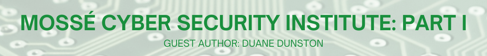

:orphan:
(Mosse_part_I)=

# Mossé Cyber Security Institute: Part I

This is the first article in a three-part series where I will discuss how some aspects of the training provided by the Mossé Cyber Security Institute's training are supported by cognitive science and how people learn. I will also provide some tips on obtaining the most from their training and some suggestions which could further support their students.

## Highlights

- Benjamin Mossé, CEO/Founder Mossé Cyber Security Institute
- Institute created to provide self-paced, low-cost, and practical cybersecurity training
- Training provides real-world challenges with applicability to current roles
- Some courses offer Quickstarters to allow applying immediately to current roles
- All labs are reviewed by industry experts
- Free training courses could help support their goal to train 1 million cybersecurity professionals
- All courses, including the free training, help students build a portfolio to demonstrate their skill
- Many aspects of their training are supported by cognitive science

## History

The Mossé Cyber Security Institute provides cyber security services and training to individuals, corporations, and governmental agencies. They currently offer [21 online certification courses, 6 specialist courses, 6 master course bundles](https://www.mosse-institute.com/certifications.html), and some onsite training at their primary location in Australia, though they have a presence in the US, as well. The Mossé institute was founded by CEO/Founder Benjamin Mossé and one of his friends.

Benjamin first became interested in cybersecurity when he was 12. During that time, he was able to find mentors online that provided him with challenges he had to complete. They offered him feedback for improvement or what he did well with the challenge. By the age of 16, he was employed as a cybersecurity professional. While he was enrolled in the university, and still working as a cybersecurity professional, he experienced what many others have described with cybersecurity courses in some higher education institutions - it was theoretical and very little to no practical experience. He later found out that he is the only one in cybersecurity as a practitioner of the students who graduated with him.

When the Mossé Cyber Security Institute was founded, Benjamin wanted to create training the way he learned it - by providing real-world challenges and giving feedback. The logistics of managing a training program and keeping up with the content and other aspects of a training program were not appealing. Also, the materials needed to learn cybersecurity is available online or via the vendor’s documentation. The first training exercises they developed were 60 labs and were only the lab title but no attached rubric. As they began to have more students enrolled, the rubrics were created to help provide guidance to students. Benjamin wanted the training to be affordable and flexible for students, which is still the current business model. That model exists because other life events took precedence when he would reach out to students who were not submitting assignments. Benjamin wants to train cybersecurity professionals but let them learn at their own pace and not pay extra if unexpected events temporarily sideline their training. The current pricing structure for the Mossé training is a flat fee with no renewal costs, no time limits, and it is self-paced. Benjamin's goal is to train 1 million cybersecurity professionals. That goal can be reached, especially with the free training they provide. Most of the courses cost $450, and there is tremendous value to the training that comes along with it.

## My Experience

I have been enrolled in the Mossé training courses since August 2021 and started with their [Certified Threat Intelligence Analyst (CTIA) course](https://www.mosse-institute.com/certifications/mtia-certified-threat-intelligence-analyst.html). I’m now in the [Blue Team](https://www.mosse-institute.com/certifications/mbt-certified-blue-teamer.html) and [Threat Hunter](https://www.mosse-institute.com/certifications/mth-certified-threat-hunter.html) certification courses. Some of the labs overlap across certifications, and those completed labs are credited towards other certifications when applicable. The reason I’m enrolled in multiple courses at the Mossé Institute is that their training provides structure and organization to the unstructured and unorganized information that exists on the internet.

Before enrolling in the CTIA course, I enrolled in their free tier to better understand their training. I do admit, when I saw the price tag of `$450`, it piqued my interest. I do not challenge an organization or individual person's course quality based on price. I have enrolled in many good quality Udemy courses for `$9.99` or free or enrolled in Humble Bundle course offerings for `$29.99`. I also have unlimited access to the Ethical Hacking Academy and EC-Council’s CodeRed platform. All were purchased at discounted prices, and with our limited professional development budget, `$450` was within my price range. The non-Mossé courses have played a role in helping with my skill development to pass a few of the Mossé labs.

When I logged in to the Mossé [MICS - INTRODUCTION TO CYBER SECURITY](https://www.mosse-institute.com/certifications/mics-introduction-to-cyber-security.html) course, I was surprised by the training process. The first module contained two exercises:

- Create a template for a professional document
- Lab Setup: Screen Recording

And there was a rubric attached to each exercise explaining the expectations of the deliverable. For example, “Create a template for a professional document” required:

- Include a Table of Content
- Demonstrate how you would format a citation
- Demonstrate how you would format a caption
- Develop a nice cover page
- Date your document
- Display page numbers
- Develop nice headers and footers
- Create a simple logo. Add it to the front page and the headers/footers
- Create a Revision History section to track document versions and authors

Though, that is not what surprised me. I had to submit the assignment, and then I received feedback on it:

_Excellent work!_

_You have correctly implemented all the specifications to create a professional document template. Well done!_

_I really like your mock company name, logo and tagline. Very creative._

_Congratulations on completing this exercise._

_Keep up the great effort._

Why is that a surprise? The MICS course is free, and I submitted my assignment and received feedback on it. I have been involved in one program that reviewed my cybersecurity project. It was the [final paper](https://citeseerx.ist.psu.edu/viewdoc/download?doi=10.1.1.28.9091&rep=rep1&type=pdf) for my [SANS certification](https://www.giac.org/certified-professional/Duane-Dunston/101331) from years ago. With the Mossé training, every assignment is reviewed by an industry expert even though I didn’t pay anything for the course. It got me interested in their other courses, and the experience is the same. I complete the lab, submit it with a video recording and sometimes code, and it is reviewed with feedback. Many times the feedback is “Great work!” but, when needed, it is a bit more extensive. "Great work!" is not bad feedback. I'll discuss that in a future article. The use of video recordings not only allow the Mossé instructors to ensure they complete the assignments but allows students to create a [portfolio to show to potential employers](https://www.youtube.com/watch?v=36hbC-4Aoss).

## Application of Skill

One new feature that has been added to some of the courses is “Quickstarter” modules. The “Quickstarter” allows someone courses to begin learning tasks that could be used immediately in their current job. The immediate applicability is inherent in many of their labs. For example, in the Certified Threat Hunter course, there are Quickstarter labs where you write Yara rules to find small executables and perform threat hunting to search for Powershell execution. Both would have immediate value to someone who wants to learn threat hunting or someone transitioning to the role and wants to develop their skills, or to an experienced threat hunter who wants to improve or test their skills. The progression of skill development is one aspect of learning inherent in the Mossé training.

## Conclusion

When I started the Mossé training, I was just beginning my dissertation and research, focusing on cognition and learning. Before that, I presented on training cybersecurity experts at the [Diana Initiative](https://www.dianainitiative.org/) in 2021. I'll have an article on how Mossé training is suitable for experts. In 2020, I presented at the Diana Initiative on training someone transitioning into cybersecurity. My approach was using a cognitive framework for both presentations. When I enrolled in the Mossé training, I immediately saw many elements that are ideal for learning based on empirical studies. I will be writing a few articles on how Mossé training is an excellent platform for learning cybersecurity and how their free tiers could be improved for newcomers to the field. However, some new features are coming out that will be very helpful in this regard.

The following articles, in this series, will explain the benefits of rubrics, feedback and how it should be delivered, metacognition, and expert skill development.

_NOTE: I am not employed with the Mossé Cyber Security Institute, I am not paid, and do not receive any benefits from their institute for these articles. I am one of their students and, incidentally, found overlap with my research studies and career as a college professor._

**Author: Duane Dunston** _College Cybersecurity Professor_

[Link to original article](https://www.linkedin.com/pulse/moss%C3%A9-cyber-security-institute-part-i-duane-dunston/)
