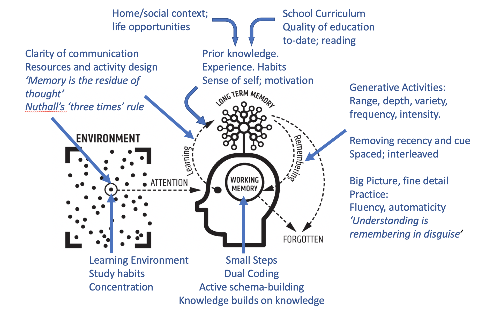

:orphan:
(Mosse_part_II)=

# Mossé Cyber Security Institute: Part II

This is Part II of a III part series where I examine some principles of cognition and learning and their implementation in the Mossé Cyber Security Institute training courses and suggest areas for improvement. I'll also provide some tips on maximizing learning with their training courses.

## Highlights

- Self-directed learning is difficult for some people so they, initially, need more guidance.
- The guidance should teach strategies of how to learn.
- Tasks should have relevance and be explicitly stated to learners which could increase their motivation.
- Hard problems could lead to anxiety and shallow learning, where learners seek the answer but do not understand how they arrived at it.
- Hard problems for newcomers should start with smaller, though relevant tasks that become more complex.
- Rubrics help provide guidance on what needs to be performed to complete an assignment.
- Feedback should be specific and relevant to the assignment and rubrics.
- Direct guidance should be gradually faded with feedback mechanisms to determine if the learner is demonstrating the ability to learn on their own.
- Learners should take time to reflect on previously learned tasks to complete complex tasks.

## Introduction

One of the first principles central to their training is self-directed learning. Self-directed (or self-guided learning) is a contentious teaching method. It requires students to be motivated to start the assignment and sustain the motivation and effort to complete it eventually. The motivation to start and sustain through completing a task requires the student to have self-efficacy. Someone with a moderate or high degree of self-efficacy can sustain when they encounter problems because they can seek out resources, instructor assistance, or take time to determine if they can come up with creative methods to continue a task. Self-efficacy is not focused on completing the assignment but on starting and sustaining to its completion. The Mossé training requires moderate to high degrees of self-efficacy because there are very few guided instructions to provide an example of how to start working on an unfamiliar topic. The first assignment in the second module with the introductory course could cause some anxiety among students. Searching the internet could lead to many examples and explanations and be overwhelming and time-consuming to sift through and understand. Sites such as Stackoverflow are a great resource, though the explanations could be complicated for a newcomer to cybersecurity to understand.

Self-directed learning could impose a heavy cognitive load (aka information overload). Cognitive Load Theory (CLT) focuses on how instructional design (the presentation and delivery of Mossé training) can impact moving information from short-term to long-term memory. CLT uses the concept of working memory as a temporary storage space for information that we receive (via reading or listening) until we can connect it with existing knowledge. Working memory is like a teacup, it can only hold so much water before it overflows. For example, listening to a lecture on a new topic can be overwhelming (or even this article) if you do not have any existing knowledge to help you understand what is being spoken (or what you read). That is why speakers and writers will often provide examples or visualizations to help connect new information to existing information so it is "understood" and retained.

**[Figure 1: Cognitive load diagram](https://teacherhead.com/2020/03/10/a-model-for-the-learning-process-and-why-it-helps-to-have-one/)**

For example, imagine filling the teacup with water (information you want to learn) and wanting to save some water (so you can recall the information to learn later and connect it to newer and similar information). If you want to save that water, you remove the teacup from the water stream and put it into a jug for long-term storage. If you fill the teacup too much, it goes down the drain and is lost. Kind of like at about 10 minutes into a lecture if you don't understand the context and language the speaker is stating you forget virtually everything else or just tune out. Just as the teacup (working memory) has too much water (incoming information), if there is no jug to save it (context, diagram, picture, animation, or analogy), no learning occurs. New information is forgotten - or goes down the drain.

Cognitive overload can lead to boredom, anxiety, and potentially abandoning what is trying to be learned. Everyone does not learn the same or at the same rate. It does not mean someone is smarter because they do not need much guidance when learning a task. Some folks just need more **initial** guidance.

Next, we’ll explore how to provide some guidance.

## What Mossé does well

Mossé modules provide a pebble-and-stone approach to learning cybersecurity or the subject of the course you are enrolled. You have an overall goal (stone) but are assigned smaller, related tasks (pebbles). However, **completing the smaller tasks must be related to the end goal**.

Each module has a header that explains the exercise, **some with more details than others**. Most modules have references that provide supplemental information to help complete the exercise. The first module in the [MICS - INTRODUCTION TO CYBER SECURITY](https://www.mosse-institute.com/certifications/mics-introduction-to-cyber-security.html) course explains why it is important to create a professional document, the purpose of the screen recordings, and why the video uploads to YouTube have to be Unlisted.

**The essential learning tools that Mossé provides are rubrics and feedback.** Originally, Mossé exercises were just the titles, so "Create a template for a professional document" would be pretty vague without some context. The rubric clearly outlines what should be included in the assignment submission. When the document is submitted, a cybersecurity professional that has written dozens of reports can determine if the format is professional. The rubric items could be met but not formatted well in the document. **Mossé shines in their feedback because it is specific and only relevant to the assignment.** The rubric and feedback together facilitate simple feedback. **Too much feedback could cause further confusion and impose a heavy cognitive load** if information unrelated to the exercise is provided. Submitting a professional document and receiving "Great work!" is sufficient because that means the submission met the rubric expectations. I've never received too little or not too much feedback. I've received concise, relevant, and positive feedback, even when I didn't pass the exercise. Another benefit of their training is that you have the option to resubmit until you pass the exercise.

These suggestions go back to the contentious issue of self-directed learning. The primary problem is that students could spend hours on an assignment and not learn much. Some studies have found students spending 50+ hours trying to complete a task and not clear on whether or not they are on the right track. At some point, students will simply want the answer, and learning doesn't occur when they arrive at it. **Students may engage in shallow learning where they seek the answer, though not understand how they got there or the relevance of the exercise**.

## What needs improvement to support learning?

The second module in the MICS - INTRODUCTION TO CYBER SECURITY course “Internet Searching” is a good example where more guidance is needed. The module has exercises on using search engines to search for information. The FTP exercise has a description with the purpose but no context for using the recommended search operators in the description. A new person may get confused and not know how to proceed or what those mean.

Also, the last assignment in the second module is on using a specific search engine. That exercise contains a Reference Link on using the advanced search operators. That Reference Link should be in each assignment or move that last assignment to the first one. Since the audience is someone new to information security, there are few contexts to search filters in the exercise's description for the FTP exercise. Too, the title of the last exercise is what they're doing in the first exercise.

Another exercise is on translating text, but no explanation on why that is an important skill to learn for cybersecurity. Two additional lines explaining its relevance will elevate that exercise and help newcomers understand the context. Otherwise, it may seem like busy work or a nonsequitur to learning cyber security. An additional two or three lines to explain each exercise in that module, for instance, could dramatically improve the chances of motivating a student to start, sustain through, complete the assignment, and engage in deep learning. **Remember that students want to ensure everything they learn has relevance, which can increase their motivation to start the assignment and work until they complete it.** Accordingly, the second module needs more "pebbles." A link to the search engine's power search course would be an invaluable reference to include.

One principle from CLT to minimize cognitive load is the worked example effect. The worked example effect is when the instructor demonstrates or provides the steps to complete a task, and then the student completes a similar task. **Not everyone has the self-efficacy for self-directed learning and needs guidance.**

Many people say they learn best by 'doing it' or 'seeing someone complete an example.' That is a method of learning most people have adopted since they were born, so that is one suggestion why I believe it is most people's preferred method of learning. Essentially, we've naturally learned by mimicking others and being corrected when we were in danger or did or said something that is not polite or praised for good behavior.

Most newcomers to a discipline will need more guidance to start and sustain through the Mossé assignments (even some seasoned people). There are a plethora of Youtube videos that can help provide worked examples to complete some Mossé exercises. Transferring that knowledge to a Mossé assignment could still be difficult for some people. However, a well-developed module providing "pebbles" where students learn to use Youtube, Windows online documentation, or common Linux commands needed for Mossé exercises would be invaluable. The first 4 or 5 modules should include descriptions that explain the relevance of the exercise and how it will help them when they start X exercise in Module X. That will further help newcomers understand they can refer back to the previous exercise when they are about to start the new one. **This one change reminds students that what they are learning in each lab will have some relevance later on.**

## Guidance fading must be a part of learning

What is important to understand about worked examples and explicit or direct instruction is that **direct guidance must fade slowly so that the student begins to learn on their own**. Basically, the worked examples (or references to YouTube or blog posts) slowly fade by removing some of the references but keep the descriptions and relevance of the exercises. It may help in the first 4 to 5 modules to remind students of previous exercises to help them start the new one. Slow fading is a principle of CLT called the guidance fading effect and is a very effective step in the learning process.

One method to begin the process is to require students to include one, two, or three references they used to help them complete the exercises in Modules 5 and 6, for example. That can show the Mossé instructors that the student is capable of or starting to learn on their own and increasing their self-efficacy. It can also demonstrate students are learning to use reputable sources that help them learn and explain the "why" with the exercise and not just resources that give them an answer. Accordingly, **these suggestions are teaching students how to learn** that could be applied to virtually any aspect of learning outside of the Mossé training.

## What can students do to maximize learning?

- Take a breath and read the overview of the assignment and why it is relevant (if it is available). When students understand the reason for a task, they tend to be more motivated to start and complete it and may increase their self-efficacy.
- Read the rubric to understand what is required to demonstrate completion of the exercise.
- Review the references to help understand key concepts, protocols, tools, etc. The provided references may not help or be too technical for someone new to the topic.
- As you progress through a module and assignments, and it becomes progressively more difficult, stop to think about previous exercises you completed. Remember to take time to review all of your assignments and video submissions periodically. That will help you remember that the previous tasks you completed (the pebbles) will help you with subsequent assignments. Incidentally, it reinforces what you previously learned.
- Make use of the "Quick Question" feature recently added when you are not sure how to proceed with the assignment.
- Read the "Frequently Asked Questions" section which includes information on the most common reason people do not pass the exercise.
- Step away and be patient with responses, depending on where you live (the instructors are in Australia).

Everyone doesn't learn the same. Some people may thrive in the self-directed learning training that Mossé offers. Some people will need more guidance so the suggestions provided are to help those that need additional guidance, which may help students work through each exercise and complete the course.

I tend to do well in self-directed learning, though I learned strategies through independent study classes when I was in college that has stayed with me. I also learned how to ask for help and learned how to search for help. I am still working through a Pandas exercise to profile an OS and have been through 7 rounds of feedback sessions rounds. Each one has progressively elevated my Python skills due to the feedback I've received from Benjamin Mossé. I have completed the general purpose of the exercise, so the feedback has been to make my programming more efficient.

**[Figure 2: Detailed cognitive load diagram](https://teacherhead.com/2020/03/10/a-model-for-the-learning-process-and-why-it-helps-to-have-one/)**

## Resources for cybersecurity training providers and content creators

[Cognitive Science Approach To Teaching Cybersecurity Education](https://www.youtube.com/watch?v=6w_EwCpjxXA) This is a workshop I presented on using cognitive science principles to teach Log Analysis. 1.52 hours.

[Evidence-informed learning design: Creating training to improve performance.](https://www.amazon.com/Evidence-Informed-Learning-Design-Creating-Performance/dp/1789661412/ref=sr_1_1?crid=G4U7UNTL9Z1L&keywords=Evidence-informed+learning+design&qid=1642177939&sprefix=evidence-informed+learning+design%2Caps%2C69&sr=8-1)

[Metacognition Handbook by Jennifer Webb](https://www.amazon.com/Metacognition-Handbook-Practical-Teachers-Leaders/dp/1913622533/ref=sr_1_1?crid=EGO7WQI9HVLQ&keywords=jennifer+webb+metacognition&qid=1642177910&sprefix=jennifer+webb+metacognition%2Caps%2C237&sr=8-1)

[Sweller’s Cognitive Load Theory in Action](https://www.amazon.com/Swellers-Cognitive-Load-Theory-Action/dp/1913622231/ref=tmm_pap_swatch_0?_encoding=UTF8&qid=1642178177&sr=8-1)

[The researchED Guide to Direct Instruction: An evidence-informed guide for teachers (The researchED Series)](https://www.amazon.com/researchED-Guide-Direct-Instruction-evidence-informed/dp/1912906376/ref=sr_1_2_sspa?crid=2726S3H2LXAXB&keywords=direct+instruction&qid=1642178617&s=books&sprefix=direct+instuction%2Cstripbooks%2C77&sr=1-2-spons&psc=1&spLa=ZW5jcnlwdGVkUXVhbGlmaWVyPUExMFZYMzFUOVdYVFZGJmVuY3J5cHRlZElkPUEwMDczNzE0Mk44SjZCRlQ5U0kwRyZlbmNyeXB0ZWRBZElkPUEwNDcwNzgzVVlUVTRMTTJYQlNLJndpZGdldE5hbWU9c3BfYXRmJmFjdGlvbj1jbGlja1JlZGlyZWN0JmRvTm90TG9nQ2xpY2s9dHJ1ZQ==)

## References

Andrade, H. G. (2005). Teaching with rubrics: The good, the bad, and the ugly. College teaching, 53(1), 27-31.

Bandura, A. (1986). The explanatory and predictive scope of self-efficacy theory. Journal of social and clinical psychology, 4(3), 359-373.

Hmelo-Silver, C. E., Duncan, R. G., & Chinn, C. A. (2007). Scaffolding and achievement in problem-based and inquiry learning: a response to Kirschner, Sweller, and. Educational psychologist, 42(2), 99-107.

Hung, W. (2011). Theory to reality: A few issues in implementing problem-based learning. Educational Technology Research and Development, 59(4), 529-552.

Neelen, M., & Kirschner, P. A. (2020). Evidence-informed learning design: Creating training to improve performance. Kogan Page Publishers.

Kirschner, P., Sweller, J., & Clark, R. E. (2006). Why unguided learning does not work: An analysis of the failure of discovery learning, problem-based learning, experiential learning and inquiry-based learning. Educational Psychologist, 41(2), 75-86.

Merrill, M. D. (2002). First principles of instruction. Educational technology research and development, 50(3), 43-59.

Rohrer, D. (2012). Interleaving helps students distinguish among similar concepts. Educational Psychology Review, 24(3), 355-367.

Sweller, J., van Merriënboer, J. J., & Paas, F. (2019). Cognitive architecture and instructional design: 20 years later. Educational Psychology Review, 31(2), 261-292.

**Author: Duane Dunston** _College Cybersecurity Professor_

[Link to original article](https://www.linkedin.com/pulse/self-guided-guided-instruction-moss%25C3%25A9-training-part-ii-duane-dunston/)
