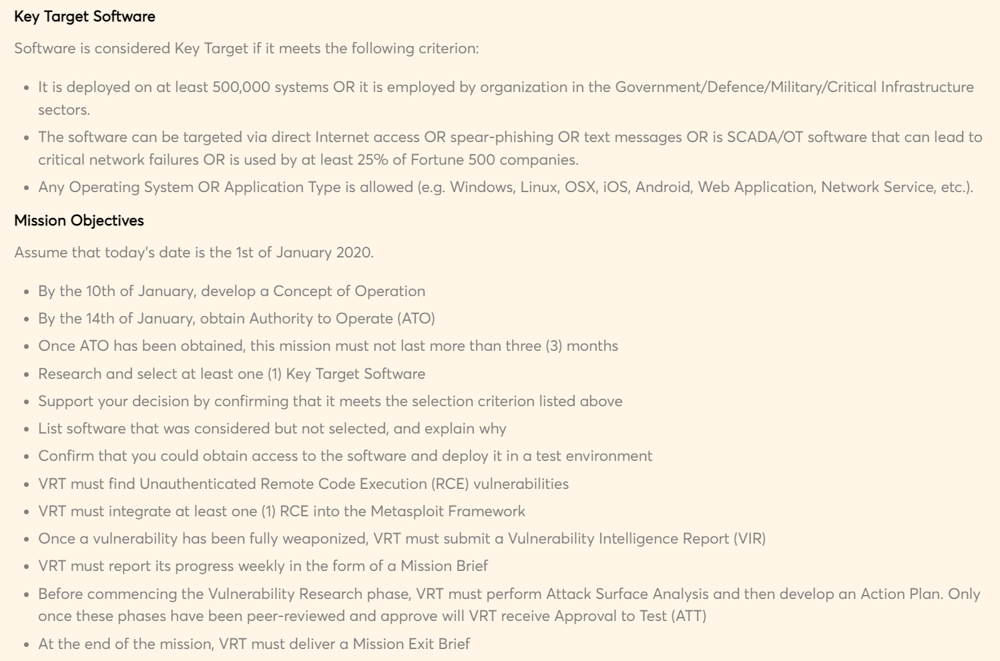

:orphan:
(introduction-to-the-vulnerability-research-and-exploitation-workflow)=

# Introduction to the Vulnerability Research and Exploitation Workflow

It is critical to follow a workflow when conducting vulnerability research to ensure accuracy and thoroughness. Identifying the target, acquiring information about the target, locating security crashes, and exploiting major vulnerabilities are all possible phases in this procedure. Each stage in the workflow is crucial, and omitting any of them can result in a outcome that is incomplete or erroneous.

Below is an example of a workflow that we follow at Mossé Security:

The goal of a workflow diagram isn't to foresee every possible scenario. So it's entirely natural if you're looking at this one and thinking of things you'd change or add. The most critical factor is to establish a diagram that a Vulnerability Research Team (VRT) can follow and understand.

## Why do we need a formal approach to vulnerability research?

### Unstructured Research vs. Structured Research

They are two main approaches to vulnerability research:

- **Unstructured Research:** We give researchers complete freedom to attack the target software in any way they see fit. This strategy works especially well if the VRT is talented and acquainted with the program under evaluation. In such cases, employing a formal workflow may not be necessary.

- **Structured Research:** The VRT is targeting a wide range of software that they aren't familiar with. They might have junior members who haven't yet integrated a vulnerability research strategy. Using a systematic procedure in this scenario is quite advantageous. The team is aware of the critical phases and processes that must be followed in order to complete the mission.

### Quality Assurance

It's also worth noting that many workplaces can't justify investing in uncontrolled raw talent. The organization will enforce a bureaucratic culture in order to ensure quality, satisfy minimal objectives, and provide a high degree of reporting. In that circumstance, using a defined vulnerability research methodology is required.

## What are the key phases in a vulnerability research workflow?

Penetration testing engagements form the foundation for many of the industry's vulnerability research approaches. You should be aware that these are primarily intended for application and infrastructure intrusions lasting two to ten days. These approaches, in our perspective, are only partially applicable to a comprehensive Vulnerability Research Team (VRT) that may spend months or years attacking critical software. They may also target unknown technology for which no automated testing tools and approaches exist.

When we dug more into this type of job, we realized that we needed to create our own workflow. When comparing our approach to that of the industry, you'll see that we place a larger emphasis on preparation, comprehension, planning, and project completion. Our researchers are required to be well-versed in a variety of methodologies and approaches for attacking various types of software. We spend less time making sure they went through their whole arsenal and more time making sure they understand the mission, the target software, and the end goals.

We propose that you consider the following essential steps in whatever manner you create your own workflow:

### Phase 1: Prepare

The purpose of this phase is to agree on the mission's mission statement and objectives. What do we intend to accomplish, and under what conditions must it be accomplished?

The key deliverables at the end of this phase are:

1. **The mission statement:** A clear and concise statement (one simple sentence) of what the team is assigned to accomplish.

2. **The mission objectives:** VRT must achieve a number of milestones and targets, which are listed in bullet points.

3. **Target software description:** A high-level description of the Key Target for which VRT is responsible for finding vulnerabilities, as well as the kind of vulnerabilities they must be looking for.

Here's an example from one of our MVRE certification course's exercises:

### Phase 2: Understand & Plan

_"We must know more about the Key Target Software than the developers did when it was built."_

This phase's purpose is to spend time learning about the Key Target Software (KTS) and planning how we'll locate the right vulnerabilities in it. This is likely the most underappreciated phase, and it is one on which team leaders should focus their efforts.

1. **Contextual Analysis:** Contextual Analysis is the study of all components of a system or environment to determine how and by whom it is used.

2. **Technology Analysis:** Technology Analysis is a technical review of the KTS. Here, we reproduce the same artefacts that developers would when writing it. For example:

   - System architecture diagrams
   - Network architecture diagrams
   - Flowcharts
   - Sequence Diagrams
   - Components diagrams

3. **Attack Surface Analysis:** We check for any locations where critical vulnerabilities may exist once we have a thorough understanding of the KTS. This analysis should be done last because we don't want to overlook anything.

This phase's final product should be a Concept of Operation (CONOP). The CONOP paper lays out how the operation will be carried out. With the understanding of the KTS they've gained from completing this phase, the VRT must demonstrate their comprehension of the mission, its objectives, and explain their approach for accomplishing those goals.

### Phase 3: Research and Exploit

VRT identifies security flaws in the KTS and creates full-fledged exploits for the finest ones in this phase.

Below a list of techniques and tactics commonly used in vulnerability research:

- Code Reviews
- Reverse Engineering
- Fuzzing
- Crash Analysis
- Exploit Tooling
- Weaponization
- and many more...

It's vital to remember that if VRT performed the previous two rounds effectively, it should be able to find high-value vulnerabilities more quickly. It should also have a "research memory" that it can refer to in the future if new vulnerabilities in the same KTS must be uncovered.

### Phase 4: Close Project

Working exploits against a pre-defined list of software versions and builds are standard deliverables in a vulnerability research project. VRT creates professional work products here, like as reports, attack demonstrations, a Vulnerability Intelligence Report (VIR), and other artefacts that can help the end user.

### Optional: Maintain Exploits

Some engagements necessitate long-term exploit maintenance. This implies either updating the exploits to support the latest version of the KTS or improving the exploit to get beyond the vendor's new mitigations. This stage is regarded to be quite exhausting because it might continue months or even years. In certain circumstances, it even comes with pre-negotiated Service Level Agreements (SLAs) that require VRT to release fixes within a certain time frame or face penalties.

> **Looking to expand your knowledge of vulnerability research and exploitation? Check out our online course, [MVRE - Certified Vulnerability Researcher and Exploitation Specialist](https://www.mosse-institute.com/certifications/mvre-vulnerability-researcher-and-exploitation-specialist.html). In this course, you'll learn about the different aspects of vulnerability research and how to put them into practice.**
