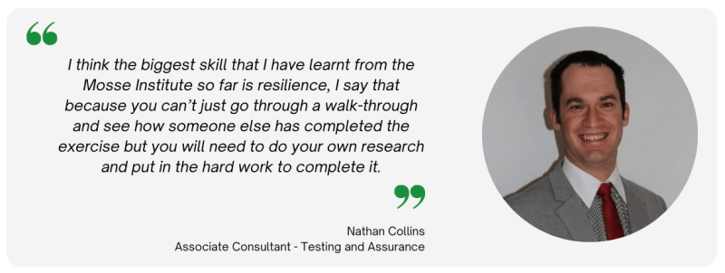

:orphan:
(review-and-testimonial-nathan-collins)=
# Review and Testimonial: Nathan Collins

Nathan Collins, one of our best students, was interviewed for this piece. Nathan started his profession by obtaining theoretical certificates before moving on to practical training. He joined in MCSI's Remote Internship Program, which assisted him in gaining the skills and competences he needed to secure a career in the field.

## Hello Nathan! You have been a student on the MCSI Online Learning Platform for a while now. Can you please tell us about how you embarked on your learning journey?

First of all, thank you for giving me this opportunity to be interviewed and write about my experience learning with the Mosse Institute. I started my learning journey particularly in cyber security a couple of years ago. I bought a course to study cyber security through industry certifications like compTIA A+, Security+, CySa+ etc. I found those courses and their associated exams to be very dry and not practical enough for me. I was searching on Google for other courses that offered practical exercises that I could use to hone my cyber security skills and that is when I stumbled across the Mosse Institute. After some thought I signed up to the Remote Cyber Security Internship.

## Did you enroll in any of the MCSI Certifications?

I enrolled in the Remote Cyber Security Internship.

## That's great to know! Did another MCSI Certification interest you?

Yes, I'm very interested in Penetration testing as I have just started a job as a penetration tester. I’m interested in the MPT - Certified Penetration Tester

## What was your first impression about the platform?

The platform has changed a lot since I originally discovered it. I find it to be intuitive and easy to navigate. I like the dashboard its clean with all the necessary information, like currently enrolled course(s), graphical representation of exercises completed each month and other useful information.

## How would you describe your learning experience so far?

I've thoroughly enjoyed the learning experience, it is very real world, each exercise you have a description or background of the exercise and what learning objective the exercise will teach you. My favorite part of the learning experience is that every exercise is practical and applicable in the real world, it's not just a multi choice questionnaire. You also receive feedback from the Mosse team whether you pass or fail the exercise which is a great part of the learning experience.

## Did you require any special equipment to work on the exercises?

You will need to run virtual machines on your PC to complete some of the exercises. You can download a type 2 hypervisor (VirtualBox, Hyper-V, VMware), there are hypervisors available for windows, Linux and Mac. I recommend having a minimum of 8GB of ram if your host OS is Linux or Mac, or 16GB ram if you host OS is Windows. There is also an exercise on how to deploy a virtual machine and this is an essential skill for a lot of Cyber Security roles.

## Did you encounter any challenges while working on the exercises? If yes, how did you navigate through them?

Yes, in all of the exercises you will need to do your own research. I had to do a lot of creative problem solving and thinking to come up with solutions to some problems. One exercise I had to write a PowerShell script to detect multiple local administrator accounts. The challenging part was figuring out how to get the members from the sub groups within the local administrator group on a PC. There wasn’t a direct answer on Google and I had to think of different ways to solve the challenge.

## How was your experience submitting the solutions for every exercise?

It was a reasonably smooth experience. You have to record a video showcasing your solution and depending on the exercise you would also need to submit your solution files as well. 

## For exercises that involved a video submission, did you have to learn video editing skills?

Not many, I just recorded the video with a free open-source screencast tool and then used a simple video editing tool to add the student info to the start of the video and a thankyou message at the end of the video.

## Were you comfortable with how the exercises were graded upon submission?

Yes, if I failed the exercise then I would receive some feedback on what I missed and encouraged to try again. There wasn't any grading, apart from a simple PASS or FAIL. The Mosse employee marking the exercise would leave a comment. If your submission was exemplary then they would comment accordingly.

## How do you expect your career to advance with the skills you have gained from the Online Learning Platform?

I've just started a Job within the Cyber Security industry with a leading Cyber Security company. I feel that the skills I have learnt will help me to continue to grow in this industry. I think the biggest skill that I have learnt from the Mosse Institute so far is resilience, I say that because you can't just go through a walk-through and see how someone else has completed the exercise but you will need to do your own research and put in the hard work to complete it.

## Who do you think is the appropriate audience for this platform?

Anyone who wants to get into cyber security or who wants to keep their skills up to date.

## On an ending note, what would you like to tell our readers about the MCSI Online Learning Platform?

It’s a great platform, but don’t just take my word for it, there is a lot of free exercises you can attempt yourself. If you haven't already, go and create your own account and try some of the free exercises, they range in difficulty and it's a great way to try and see if the platform is the right fit for your learning style. If you get stuck, don't give up, keep researching, post questions on the student forum and try harder!!!

> **Want to learn practical skills that will land you a job in cyber security? Enrol in [MCSI's MRCI - Remote Cybersecurity Internship](https://www.mosse-institute.com/certifications/mrci-remote-cybersecurity-internship.html)**