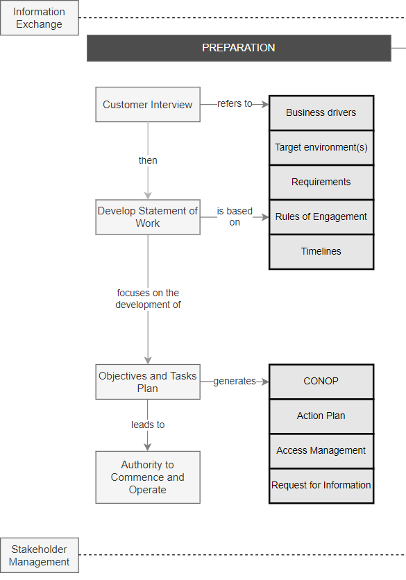

:orphan:
(mastering-the-preparation-phase-in-penetration-testing-engagements)=
# Mastering the Preparation Phase in penetration testing engagements

In every penetration testing engagement, the first and most important phase is the preparation phase. This is the phase where the pentester understands the client's environment and starts to plan the attack. In order to master the preparation phase, the pentester must first understand the client's business and objectives. Only then can the pentester start to understand the client's IT infrastructure and how it relates to the business. With this knowledge, the pentester can start to plan the attack and find the best ways to test the client's systems. 

In our previous [Penetration Testing Workflow](introduction-to-the-penetration-testing-workflow) post, we discussed the overall penetration testing workflow that we follow here at Mossé Security. In this article we will look at the 'Preparation' phase in detail.

  

Preparation is an essential part of this process because it allows you to focus your efforts and avoid wasting time on ineffective or out-of-scope tasks. Before we begin, we should define the goals of the engagement and the rules and constraints, the timelines, and the target environments. We should also devise a strategy for carrying out our tests, including the tools and techniques we intend to employ. This beforehand planning can help ensure that the penetration test is tailored to meet the customer's specific needs.

## Step 1: Interview the Key Stakeholders

It is critical to commence by interview key stakeholders. These interviews will help us understand why they want a penetration test to be conducted, the constraints imposed on the engagement, the desired outcomes and how they will define success.

**1. Identify the Business Drivers:**
   
To ensure that your penetration test is effective, it is important to determine the organization's drivers for carrying out penetration tests. The drivers should be based on the relevance of the criteria, which would typically include compliance, the impact of serious security attacks, the use of outsourced services, the introduction of new processes, and changes in the perceived threat.

The drivers should take into account how the penetration test can be tailored to this specific engagement, include the type of organization being tested and their risk appetite, as well as overall compliance requirements. It should also be based on a structured approach, with tests defined based on from previous risk assessments and security incidents.

**2. Agree on the Target Environment(s):**
   
A variety of factors should be considered when selecting the target environments that need to be subject to penetration testing. 

- <u>The criticality of the systems:</u> To identify the most critical systems, your organization should consider the nature of the business, the size of the target system, and the sensitivity of the data associated with the system.
   
- <u>Regulatory and compliance requirements:</u> Certain industries and data types are regulated and must be handled securely (like the financial sector, or credit card data). In this case, as part of the certification process, your regulator will require a penetration test. Penetration testing is also required by some industry standards, such as ISO 27001 and the Payment Card Industry Data Security Standard (PCI DSS).

- <u>Major business or IT changes:</u> In today's dynamic world, most organizations make significant changes on a fairly regular basis, whether to business processes, applications, IT systems, or end user environments, many of which can have a significant impact on an organization's threat profile and security arrangements. As a result, it is critical to conduct a penetration test on a system immediately after a significant change to the system or the business environment it supports.

- <u>Critical systems under development:</u> The decision to perform independent penetration testing on a new system is frequently made late in the project lifecycle. As a result, there is frequently insufficient time and budget for desired testing, and little ability to change the system as a result of any security vulnerabilities discovered. Security testing should thus, be fully integrated into your system development lifecycle (SDLC) rather than performed as a checkbox exercise at the end.

- <u>Outsourced applications or infrastructure (including cloud services):</u> Many organizations rely heavily on services they have outsourced (often to cloud service providers), but an attacker is not limited by whether the organization manages its own environment or not. Any flaws in these third-party security can have a significant impact on the integrity of an organization's IT security.

If you are not permitted to test an important environment controlled by a third party, you should seek assurances that appropriate penetration tests are performed on a regular basis by appropriately qualified staff working for a certified organization. This can be achieved using Request for Information (RFI) documents.

Once you have understood all the options, select one or multiple environments to test. For example UAT Sydney and Production US Central for custom applications, and production for third-party services (outside of standard business hours).

**3. Discover All the Requirements:**
   
Spend time discovering all the requirements attached to an engagement. For example:

- Times during which the testing should be conducted
- What systems should be excluded
- The frequency with which penetration testing is performed (weekly, monthly, quarterly, biannually, or annually)
- Reporting cycles (i.e. weekly briefing, daily email reports etc.)
- Reporting requirements (what do people want to know? How should the reports be formatted?)
- Escalation pathways (Who do we contact if things go wrong?)

Penetration testing requirements should be formally documented, reviewed by experts, and signed off by management in order to ensure that they are met. The requirements should be reviewed and revised throughout the engagement.

## Step 2: Develop a Statement of Work

A Statement of Work (SOW) is a document that describes the specific work that a Penetration Testing team will perform during an engagement. The document describes the system to be tested, the scope of the test, the techniques to be used, and the expected results. This majorly depends on the "Rules of engagement" and "Requirements" identified in the previous step.
 
When conducting a pentest, it is critical to adhere to the rules of engagement to ensure that the test is carried out in a safe and controlled manner. The rules of engagement should be agreed upon ahead of time by both the pentester(s) and the organization's IT team, and should include details such as the scope and nature of the test, the systems and networks to be penetrated, and the dates and times for activity.

There are frequently questions about how far a test should go and whether certain systems or networks should be included. The answer to both questions is yes, provided that the test objectives are agreed upon in advance and that the appropriate security measures are implemented.

## Step 3: Define Technical Objectives and Plan the Tasks

Based on the SOW, this plan should outline the goals that the team will achieve during the project. It should include a list of what the team will accomplish and how it will be accomplished within the time frame specified.

**1. Develop a CONOP Brief:**

CONOP stands for "Concept of Operation," and is a document that outlines the planned actions and objectives of a penetration test. The document should be designed to provide an overview of the test, including who will be performing the test, what systems will be tested, and what the goals of the test are.

CONOPs are used during the planning stages of a penetration test engagement. They are particularly useful for:

  - Briefing stakeholders on the upcoming engagement
  - Validating that you have understood the engagement and not missed any key requirements
  - Ensuring that the team understands their mandate and the key objectives
  - Obtaining approval to commence testing

**2. Create an Action Plan:**

An action plan is a more detailed plan that outlines the specific steps that will be taken to achieve the penetration test's goal. The action plan will also specify the tools and techniques to be used, as well as the personnel who will be involved in the test's execution. 
     
The primary distinction between a CONOP and an action plan in penetration testing is that a CONOP is more high-level and outlines the objectives of the test, whereas an action plan is more detailed and specifies the tasks that will be taken to achieve these objectives.

**3. Request access to the target environment(s)**

Work with the customer to obtain access to the target environments. Your IP address may need to be whitelisted, or you may need to use VPN software. For all authentication endpoints, you should also request test credentials and URLs. If you're testing APIs, Postman JSON configuration files or something similar should be requested.

Before you start working, double-check that everything is in working order.

**4. Request additional information (optional)**

If you require any further information to plan the engagement, send RFI documents via email. This could include seeking extra test credentials, describing how a specific application feature works, or requesting network topology details.

## Step 4: Obtain Authority to Commence and Operate (ATC/ATO):

The penetration testing team should formally get Authority to Commence and Operate (ATC/ATO) via written email once your CONOP Brief and Action Plan have been accepted. This is a formal stamp of approval and go-ahead from all stakeholders.

## Streamlining The Process

Of course, this entire process can be streamlined, especially for minor penetration testing contracts. Pre-assessment surveys, template RFIs, template CONOP briefs, and other tools can help with this. As a penetration tester, you'd be wise to prepare all of these templates ahead of time and keep them up to date throughout your career.

> **Looking to expand your knowledge of penetration testing? Check out our online course, [MPT - Certified Penetration Tester](https://www.mosse-institute.com/certifications/mpt-certified-penetration-tester.html). In this course, you'll learn about the different aspects of penetration testing and how to put them into practice.**
