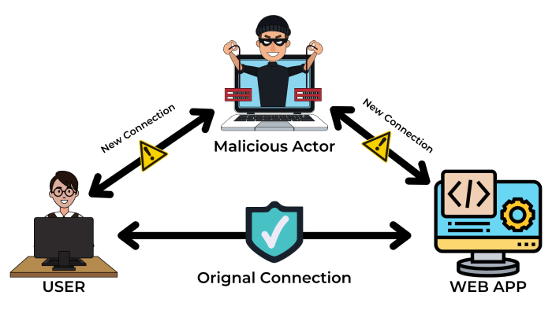

:orphan:
(be-aware-of-person-in-the-middle-attacks-and-take-steps-to-prevent-them)=

# Be Aware of Person-in-the-Middle Attacks and take Steps to Prevent them

A person-in-the-middle attack is a type of cyber-attack in which the attacker intercepts communication between two parties (the user and the application) in order to obtain information or data. This type of attack can be difficult to detect and the primary objective is to steal sensitive information like login credentials, personal information, and financial details. Let's take a look at what a person-in-the-middle attack is.

## Introduction

As seen in the diagram above, the malicious actor places himself between the user and the online application he wishes to access. In a person-in-the-middle (PITM) attack, the attacker uses a fake website that exactly similar to a genuine website.

Upon tricking the user into entering sensitive information such as credentials or financial information, the data is intercepted by the attacker, who appears to the user as a legitimate server. The attacker then forwards the packet to the original server or sends a response directly to the user, which appears to be a response sent from the original server. This is how an attacker gains access to sensitive information by staying hidden in between two connections.

## Types of Person-in-the-Middle attacks

**1. DNS spoofing**

DNS spoofing is a technique in which an attacker gains access to a DNS server and modifies the address records of a target website. As a result, the attacker redirects any traffic to the actual website's IP address to a fake website, where anything you submit travels directly to the malicious actor.

**2. Wi-Fi Eavesdropping**

WiFi Eavesdropping is a technique in which an attacker creates a WiFi access point with a legitimate-sounding name. This is typically done near an office, store, or cafe, with the attacker naming the wifi with names similar to the nearby business. For example, if the target is a coffee shop called "Best Coffee," the attacker names the access point "Best Coffee wifi" or something similar. When you connect to it, every packet from your device is routed through the attacker's network, allowing him to watch your online activities and gain access to sensitive information.

**3. IP Spoofing**

The IP address in the packet header directs data flow from source to destination.

IP spoofing is a technique in which a malicious actor alters the IP address in the packet header, causing any user attempting to connect to a web application located at that IP address or URL to be redirected to an attacker-controlled website.

**4. HTTPS Spoofing**

Hypertext transfer protocol is an application layer protocol used to transmit data across the internet. When visiting any website, HTTPS is the left-most part of the URL, where S means Secure. In HTTPS Spoofing, the attacker uses a domain that is almost similar to the target website, tricking the user to think that he is connecting to a legitimate website.

For example, https://www.example.com can be replicated by an attacker as https://www.exmaple.com, where both the URL look similar to each other unless the URL is carefully observed.

**5. Email Interception**

In email interception, the attacker has gained access to an organization's email server, where he waits and observes the communication between the user and the organization. During this period, he compiles a list of commonly used terminologies by the organization in their email. The attacker then creates an email utilizing the terminologies acquired in order to trick the users into doing an action that the attacker has created.

**6. ARP Spoofing**

The address resolution protocol, often known as ARP, is used to map an IP address to its corresponding MAC address. When a user wants to contact another server using the server's IP address, the user checks his ARP cache, so if the corresponding MAC address is not found, the user requests the MAC address. During this process, specially crafted packets sniff the traffic between the two parties and extract information such as session cookies, giving attackers complete access to the user's accounts.

**7. Session Hijacking**

Every web application has a login page to authenticate the user, which generates a temporary session cookie that holds the user's login information, which allows the user to browse the website seamlessly without needing to log in on every request. In session hijacking, the attacker gains access to the user's session cookie by which the attacker can spoof the user's account without needing to login.

## How to prevent Person-in-the-Middle attack

**1. Encrypt your Wifi**

Wifi with weak encryption is always what an attacker is looking for, due to lack of encryption, wifi is vulnerable to brute-force attacks. Using Security protocols such as WAP or WAP 2 Encryptions helps you defend against PITM.

**2. Use VPN**

A Virtual Private Network (VPN) encrypts your connection by default by creating a tunnel between your device and the server. As a result, even if you are forced to use an HTTP website, the data being sent is still encrypted, limiting a hacker's ability to read and monitor the connection and adding an extra layer of protection to your data.

**3. Avoid using public wifi**

By default, public wifi is not secure, which means that any information you transmit over it is unencrypted and available to any attacker watching it and its connections. To encrypt your network, always use a VPN.

**4. Enable HTTPS everywhere**

Nowadays, many browsers have security measures such as HTTPS everywhere, also known as HSTS, which forces the browser to use HTTPS websites wherever possible.

**5. Monitor your network**

Monitor your network with security tools such as intrusion detection systems (IDS), which alert you when unusual traffic flows across your network.

## Final words

PITM will continue as an attacker's go-to technique for gaining access to sensitive information such as passwords and credit card numbers. Although there is no one definitive way to prevent person-in-the-middle attacks, the best defense is to be aware of the possibility of such attacks and take steps to minimize the chances of falling victim to one. Use robust authentication mechanisms, encrypt all messages, and use caution when connecting to an unknown network.

> **Do you want to get practical skills to work in cybersecurity or advance your career? Enrol in [MCSI Bootcamps](https://www.mosse-institute.com/bootcamps.html)!**
