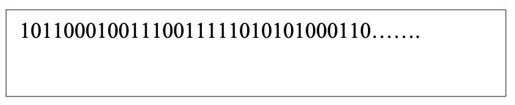
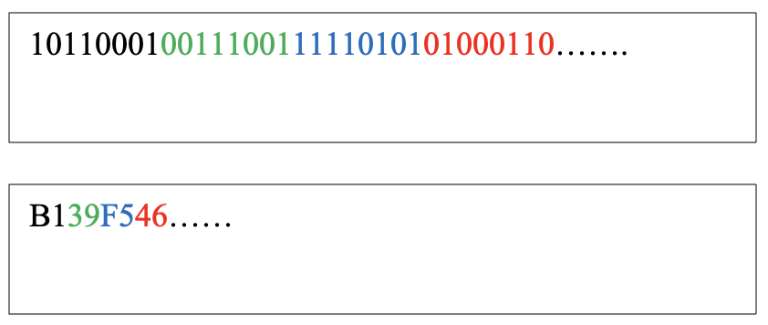
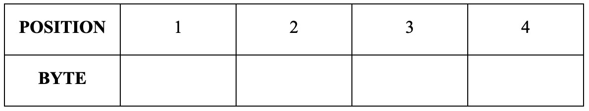
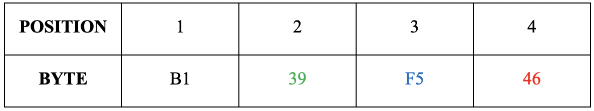
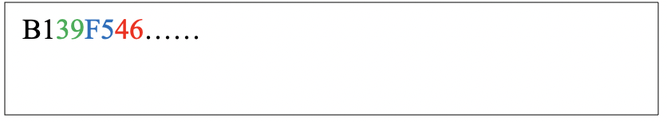
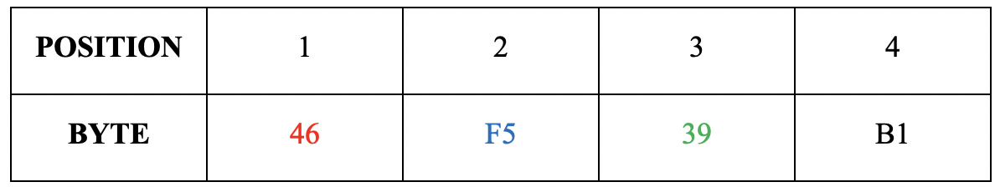
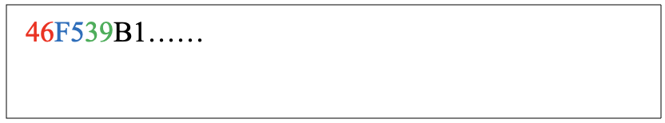
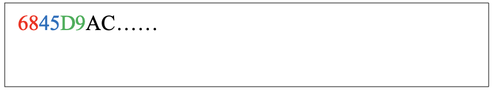

:orphan:

(endian-systems-explained-little-endian-vs-big-endian)=

# Endian systems explained: Little-endian vs Big-endian

Have you wondered what the terms little-endian and big-endian mean? It refers to the ordering of data stored in memory. This blog post will highlight the difference between little-endian and big-endian systems.

## How is data ordered in memory?

Computers understand only binary data: zeros and ones. At this very moment, the hard disk present on your computer, is simply having a very specific ordering of zeros and ones to represent your data.

Each zero or one present is referred to as a bit. For the various applications on your system to read and interpret data bits, a structure is required.

Data is interpreted as a set of 8 bits, called a byte. Each byte is interpreted in hexadecimal form. In the following figure, the first set of 8 bits 10110001, representing one byte, is B1 in hexadecimal form. One tool to help convert data from binary to hexadecimal representation is an online calculator like this one: [Binary to Hex Converter](https://www.binaryhexconverter.com/binary-to-hex-converter). You can also perform this conversion using the calculator application on your computer in programmer mode.

Whenever you perform an operation on your computer, say reading a file, the processor reads the file from disk and loads it in memory. The processor can be Intel based or ARM based. Depending on the processor type, data is handled differently in memory. This is where endianness comes in.

Now let’s consider the position of these hexadecimal bytes:

Assume that the positions refer to addresses in memory. In this case, position 1 is a low address and position 4 is a high address. The byte value to be stored in memory is B139F546.

## Understanding big-endian

On processors that handle data in big-endian, the bytes are read from left to right and stored in memory starting at the low address. This is like reading English.

This is how data would appear on memory where data is handled in big-endian.

## Understanding little-endian

On processors that handle data in little-endian, to store B139F546, the bytes are read from right to left and stored in memory starting at the low address. This is like reading Arabic.

This is how data would appear on memory where data is handled in little-endian.

## Looking at the big picture

All the files on your hard disk are stored in an organized way. Every file is stored as a unique sequence of bytes using specific data structures. Depending on the processor and operating system, the bytes are handled in memory as little-endian or big-endian.

1. Intel 32-bit and 64-bit processors running Windows and Linux interpret data in little-endian
2. ARM M1 chip running Mac OS interprets data in big-endian
3. Intel processors running Mac OS interprets data in little-endian

Modern systems that have the ability to switch between using little-endian and big-endian are referred to as bi-endian.

## Why is endianness important for forensics?

Most commercial and open-source forensic tools can interpret data from collected evidence and present it in a human-readable manner. However, in some unusual situations, the forensic investigator may have to dig deeper into hexadecimal data and interpret it. This is like performing surgery on raw bytes.

Knowing which endianness is in use, will assist the investigator to interpret byte sequences.

Let’s assume that you are the investigator processing some bytes on a Windows machine. The bytes appear in memory as shown below:

We know that Windows typically runs on Intel processors and handles data in little-endian. To interpret the above sequence of bytes, since they are read right to left before storing, they need to be swapped back before being interpreted. To swap, simply read the bytes right to left again.

After swapping, the final sequence of bytes will be: AC D9 45 68.

Let’s assume that you are processing the same sequence of bytes on a Mac running on M1 chip.

We know that Mac OS running on M1 chip handles data in big-endian. The sequence of bytes in memory will be interpreted as it appears: 68 45 D9 AC.

For now, if you understand the difference between the endian systems and how byte sequences stored using both systems can be interpreted, it is enough.

If you are working on a problem that requires understanding endianness, you know where to come to refresh your knowledge!

:::{seealso}
Want to learn practical Digital Forensics and Incident Response skills? Enrol in [MCSI's MDFIR - Certified DFIR Specialist Certification Programme](https://www.mosse-institute.com/certifications/mdfir-certified-dfir-specialist.html)
:::
