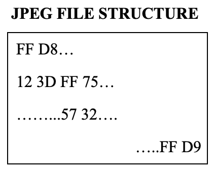
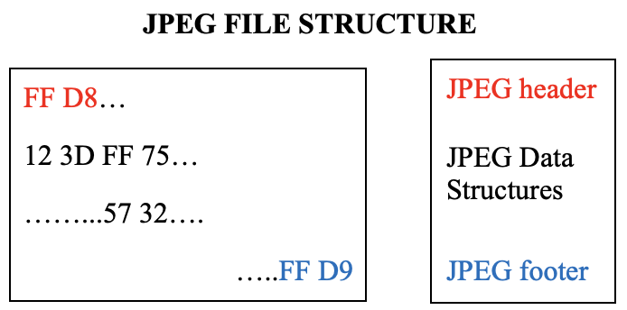
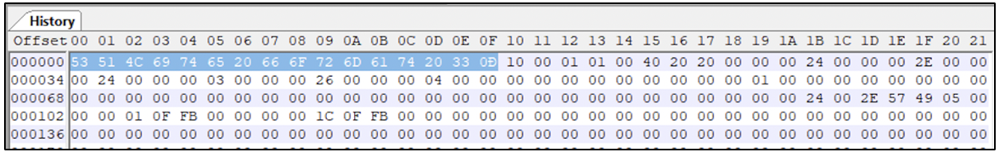
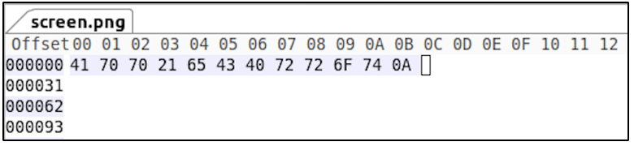
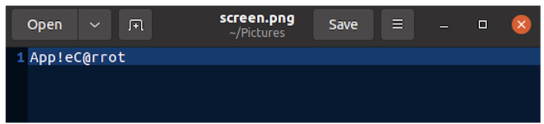

:orphan:
(file-magic-numbers-the-easy-way-to-identify-file-extensions)=

# File Magic Numbers: The Easy way to Identify File Extensions

When an x-ray of the human body is taken, the complete skeletal structure of a person can be seen. This structure defines how the human body exists. Similarly, all the files stored on your hard disk too have a special structure. This structure begins with a unique sequence of bytes referred to as file magic number. This blog post introduces you to the internal structure of files on disk and file magic numbers; and why you should know it for digital forensics.

## Internal structure of files on disk

Consider an image, more precisely a JPEG file. The file would exist on disk as a sequence of zeros and ones, which will be interpreted as bytes (8 bits make up 1 byte). The following image is a representation of how the bytes within a JPEG file would be organized.

This sequence of bytes represents the actual image and also information about when the image was taken, where the image was taken, file size, etc.

The first two bytes in a JPEG file are always FF D8 and the last two bytes are always FF D9. The first two bytes are referred to as file header or magic number and the last two bytes are referred to as file footer. The internal bytes which vary depending on the data, are represented by various data structures specific to JPEG.

Consider other file formats like PNG or PDF. Those formats too would have their unique file header, file footer and data structures to hold the data.

At this very moment, all the files on your hard disk with various extensions like DOCX, XLSX, MP3, AVI, MOV, ZIP, etc., exist with a magic number (header), an optional footer and extension-specific data structures.

## Why should you know about file magic numbers for digital forensics?

Digital forensics is typically performed to identify the sequence of events that led to an incident. For this, the investigator has to inspect a large number of files.

In some cases, files that are considered critical to the investigation may not have an extension. Consider the following example: an investigator is analyzing Edge browser related artifacts from a Windows computer. There is a file called `History` (shown in the following screenshot), which does not have an extension.

It is required view the contents of this file. Windows is unable to identify the application to use to open this file.

If the file magic number is known, then the file extension can be identified and the appropriate application can be used to open this file.

To identify the file extension of this `History` file, it is opened in a hex editor and the first few bytes are observed. Hex editors are applications that can display the hexadecimal representation of a file’s contents, helping an investigator identify the file’s magic number.

The first few bytes are highlighted in the following screenshot.

A quick Google search will reveal that this magic number corresponds to SQLite database files. This file can be opened using a database browser application and analyzed.

How is it possible to know how many bytes constitute this magic number? Typically, a magic number is between 2 to 15 bytes long.

Consider another scenario: there is a PNG file `screen.png` but the file size appears to be 12 bytes.

The smallest possible size for a PNG file is 67 bytes. The file size and the file extension does not add up. On Linux-based systems, `file` command can be used to identify the file type based on its contents, regardless of the assigned extension. From the following screenshot we can see that the PNG file is actually a text file.

The magic number for PNG file is 89 50 4E 47 0D 0A 1A 0A. When this file is opened in a hex editor, the magic number for PNG does not exist. Rather the 12 bytes present in the file can be seen.

Opening the text file in an editor reveals the contents to be a code or password of some kind.

If this file was part of an investigation, it could potentially be a critical piece of evidence.

## A final word about magic numbers

Using the magic number, it is possible to identify the file extension but it is not possible to use the file extension to predict the magic number.

It is not required to remember the magic numbers and their relevant file extensions. There are freely available lists of magic numbers online. Searching through those lists would help identify the extension suitable for a file.

> **Want to learn practical Digital Forensics and Incident Response skills? Enrol in [MCSI's MDFIR - Certified DFIR Specialist Certification Programme](https://www.mosse-institute.com/certifications/mdfir-certified-dfir-specialist.html).**
