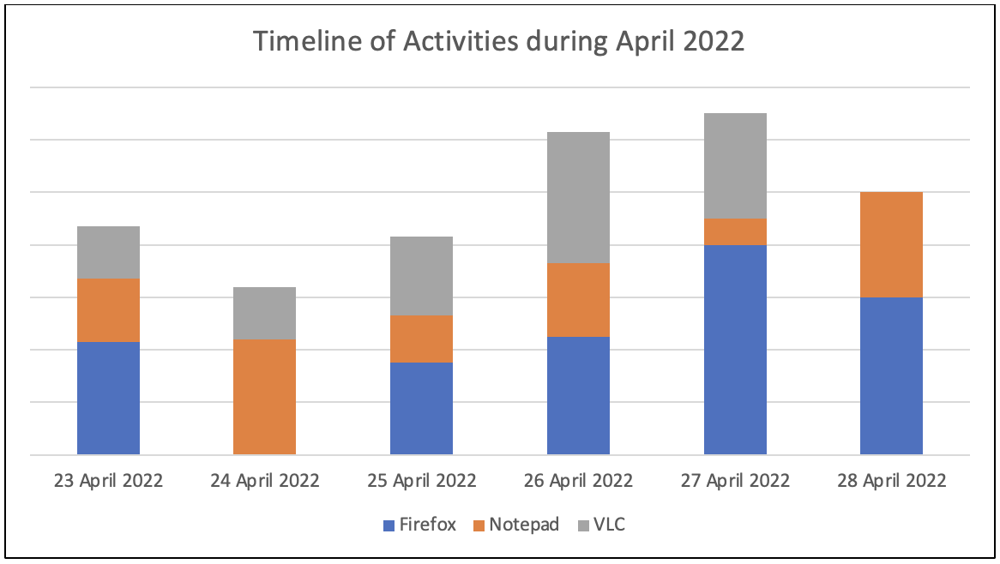

:orphan:
(importance-of-timelines-in-a-forensic-investigation)=

# Importance of Timelines in a Forensic Investigation

Some people write down events of their daily lives in a journal. Looking through the pages of the journal, gives a glimpse into how the person has lived over the years. A journal holds the timeline of a person’s life. Similarly, every time you use your computer, some data about your activity is stored in specific locations. Looking through that data gives a glimpse into how you have used your computer over time. This blog post tells you about the importance of timelines in a forensic investigation.

## Timestamp vs timeline

This section clarifies the difference between timestamps and timelines.

A **timestamp** indicates exactly when a single event occurred. It is a value having the date and time of the event.

For example: Bob used _Notepad_ application on **28-04-2022 at 10:30 am**.

Let’s assume you are investigating Firefox browser history on a Linux-based computer. You will identify the file that holds the history of user activity and look for events that occurred at a specific time. _[Timestamp Format in Windows, Linux-based and MAC Operating Systems](timestamp-format-in-windows-linux-mac-os)_ blog post gives you an idea about how timestamps appear on the three major operating systems: Windows, Linux-based and Mac.

A timeline is a sequence of events that have occurred on a system over time. The following is a sketch of a timeline:

- 26th April 2022, 11:06 pm: Bob used _Notepad_
- 27th April 2022, 05:45 am: Bob used _Chrome Browser_
- 28th April 2022, 10:30 am: Bob used _Notepad_

## How is a timeline useful during an investigation?

Think about how many applications you would use on your computer in one hour! You may be using a web browser, music player, text editor, email client, word processing software, etc.

Now assume you are the forensic investigator assigned to a high-profile case. You have been tasked with analyzing the activities on a Windows computer over the last month, and identifying suspicious events. Think about the volume of information you may have to process!

There are forensic tools that have the ability to gather relevant evidence and build a timeline of all the activity on the system. The following chart helps you visualize the activity on a computer between 23rd April 2022 and 28th April 2022.

You can infer that _Firefox_, _Notepad_ and _VLC_ have all been used on the 23rd, 25th, 26th and 27th of April.

On 24th April, only _Notepad_ and _VLC_ have been used. _Notepad_ has been used more than _VLC_.

On 28th April, only _Firefox_ and _Notepad_ have been used. _Firefox_ has been used more than _Notepad_.

During your investigation, if you have a specific time window of interest, say April 25th to April 27th, you can use the timeline to:

1. Identify the applications that were used during those days.
2. Look for data generated by those applications. For example: Firefox browser history
3. Examine that data and identify the exact time when suspicious activity occurred

The chart shown above is a basic representation of the timeline you will encounter during an investigation. In reality, the timeline generated by forensic tools will be loaded with a lot of information. The exact timestamp of when all the events occurred on a system will be available.

If you know what you are looking at, you can utilize the timeline well and uncover critical evidence of user activity.

## How is a timeline useful after an investigation?

A Digital Forensics report is generated after the investigation is complete. It is a detailed account of the incident and findings from the investigation. Every DFIR report has a mandatory section called the _Timeline of Events_ which lists the sequence of events that led to an incident, along with the timestamps. You can read more about DFIR reports _[Providing Clarity in the Face of Adversity - Digital Forensics Reports](providing-clarity-in-the-face-of-adversity-digital-forensics-reports)_.

For an incident where a user had accidently executed malware, the timeline in the DFIR report may have information like this:

- 27th April 2022, 10:25 am: User opened email from unknown sender
- 27th April 2022, 10:26 am: User downloaded attachment from that email
- 27th April 2022, 10:27 am: User opened downloaded attachment
- 27th April 2022, 10:28 am: Computer infected by malware

Understanding the importance of timelines during and after an investigation will help you approach an investigation better.

> **Want to learn practical Digital Forensics and Incident Response skills? Enrol in [MCSI's MDFIR - Certified DFIR Specialist Certification Programme](https://www.mosse-institute.com/certifications/mdfir-certified-dfir-specialist.html).**
