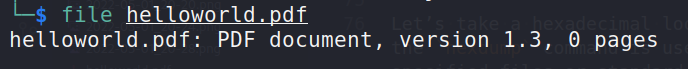

:orphan:
(reverse-engineer-malware-without-the-risk-of-infection)=

# Reverse Engineer Malware Without the Risk of Infection

Static code analysis is the process of analyzing a program's source code without executing it. This can be useful for malware reverse engineering, because it can help to identify malicious code without running it and potentially infecting the analyst's system. Static code analysis can be performed manually or using automated tools.

## Introduction

Malware analysis is now a thriving industry in the field of information security. There are different malware analysis techniques. Performing malware analysis is done by following two methods:

- static analysis
- dynamic analysis

Static analysis is the process of dissecting malware without actually running it. This also can be broken down further into two techniques:

- **Basic**: The analyst attempts to comprehend the malware by examining the file, file structure, malicious functions, and so on.

- **Advanced**: The analyst recovers the malware's code architecture, understands what all the functions do and is capable of re-implementing key features.

This is often where the malware sample is disassembled.

### Where can I find samples to experiment with?

There are so many resources available online to help you find more samples to experiment with and improve your malware analysis skills. Some of these resources are absolutely free and do not require registration; others do, however, require an email address. While commercial resources are available, the free ones should enough for your learning needs, as you will find a wide range of samples to use.

Please keep in mind that the materials listed here are by no means comprehensive, but they should provide you with enough samples to work with:

- [the Zoo repo](https://github.com/ytisf/theZoo)
- [malware-samples](https://github.com/fabrimagic72/malware-samples)
- [any.run](http://app.any.run/) - interactive online malware analysis sandbox
- [MalwareBazaar database](https://bazaar.abuse.ch/)

Most researchers who make videos and share their work online also provide a URL to the sample they're discussing in their video, so that's another place to look for more samples.

You'll note that we use the term _"sample"_ to refer to a file that is being inspected or analyzed rather than malware throughout the post.

This is because we must first evaluate the file or sample in order to identify whether it is malicious or benign.

When you're given a sample or collect one yourself, the first thing you should do is learn everything you can about it before running it. The more you learn about your sample, the better and easier it will be to analyze it.

Different approaches and methodologies will be used in basic static analysis, but none of them will entail code study.

## Fundamental static analysis techniques

We'll go through Basic Static Analysis in depth in this subject. Our research methods will be divided into four stages:

1. Identifying and classifying files is the first step.
2. Examining
3. Examine the file format
4. Recognizing Obfuscation

### File identification and classification

What is file classification and identification, and why is it important?

The process of recognizing the file type and obtaining a unique'signature' of the sample being analyzed is known as file identification. It's similar to a person's social security number. You can communicate information about the sample with other parties and prevent having to redo an analysis on a file you've already done with this unique identification.

In malware analysis, there are a few distinct approaches for identifying files:

1. Based on the file types:

- Portable executable (`PE`-files)
- PDF
- DOCX

2. Based on file hashes:

- `MD5`, `SHA1`, `SHA256`, and other common hashing techniques for fixed value hashes
- ImpHash
- Fuzzy Hash

3. Based on the file's contained strings

Every file, as you can see at the bottom, has its own structure to describe its content.

Basically PE file structure looks like this:


And PDF file structure looks like this:


### hexdump

Let’s take a hexadecimal look at both files. In Linux, the `hexdump` command is used to filter and display specified files or standard input in a human-readable format:

```bash
hexdump -C example1.exe
```


As you can see, if we look at the `EXE` file, we'll notice that it has a certain structure, which we'll go over in more detail later.

```bash
hexdump -C helloworld.pdf
```


Here we can see a sample view of the structure of a PDF file.

```bash
hexdump -C pefile.png
```


### file

The `file` command is included in almost every Linux and BSD distribution. It is built on `libmagic`, a library that can do metadata analysis using any file structure information saved in a _"magic database"_:

```bash
file helloworld.pdf
```



```bash
file example1.exe
```


So, even if a file declares itself to be a `png`, we must **TRUST BUT VERIFY**. We need to double-check that the file is a `png`, not an `exe` masquerading as a `png` or an `exe` with a `png` icon.

### Hashes

The next step is to classify the sample we're working with and see if it's previously been classified as malware. We might be able to tell if the sample belongs to a specific family or perhaps an _APT group (Advanced Persistent Threat)_.

The hash value for the sample is one method of classifying malware. The technique of acquiring the hash value is known as hashing, and it produces a fixed length string known as a hash.

A sample's hash acts as a signature for that file.
As a result, you may use that signature to search a database of known malware hashes for its existence.
One of the capabilities of systems like [VirusTotal Home Page](https://www.virustotal.com) is this.

There are a variety of hashing functions used in malware analysis, but the following are the most common:

- MD5
- SHA-1
- SHA-256

For example, run:

```bash
md5sum locker.exe
```


of `SHA-256`:

```bash
sha256sum locker.exe
```


It's vital to remember that changing just one single bit of a file will result in a completely different hash value.

This is a concern, especially with malware, because a sample may alter itself for a specific target without impacting its core purpose, but it is an entirely distinct and unrelated file from a hash standpoint.

Malware that has the capability of modifying itself is known as malware that is applying **Polymorphism**. From Wikipedia: "In computer terminology, polymorphic code is code that uses a polymorphic engine to mutate while keeping the original algorithm intact."

How do we deal with polymorphic malware that changes across all platforms, resulting in different hashes for each version?

"Fuzzy Hashing" is the solution.

This approach utilizes fuzzy hashes as input to identify similarities among files and to determine if a sample is malicious or not.

[Fuzzy hashing program ssdeep](https://ssdeep-project.github.io/ssdeep/index.html) is a command-line utility that is widely used for malware analysis and other fuzzy hashing testing:

```bash
ssdeep -b foo.txt > hashes.txt
ssdeep -b -m hashes.txt bar.txt
```


The number at the end of the line is a match score, or a weighted measure of how similar these files are. The higher the number, the more similar the files.

### Strings

When extracting strings from files as a Malware Analyst, you can utilize them to create hints about the type of sample you're working with in a variety of ways.

Strings will be used as another source of information gathering about our sample under examination, as you will see later in our future blog articles.

The information you can get from strings extracted from samples during analysis includes, but is not limited to:

1. The sample's internal/external messages
2. The functions that are referenced (invoked)
3. What sections does the sample use?
4. The usage of IP addresses and/or domain names
5. Error handling and messages
6. Other names, keywords, and so on

The `binutils` package also includes the `strings` tility. This tool analyzes the file from start to finish for strings that would be encoded using normal conventions, such as a sequence of human-readable characters followed by the 0 (`NULL`) byte (`\x00`).
The strings tool can be configured to adjust its behavior to simply filter longer strings, and it can also recognize a variety of various string encodings, including the common `UTF-16` on Windows.

To display only 8-byte or longer strings, use the following syntax:

```bash
strings -n 8 evil.exe
```


## Conclusion

As you can see, there are a plethora of open source and free static analysis applications available.

In the following parts of our blog, we will study and analyze various file formats such as PE-files. With each installment in this series, we'll look at more sophisticated cases and try to reverse the malware's most fascinating varieties (dynamic analysis). We'll start with simple examples, of course.

- [the Zoo repo](https://github.com/ytisf/theZoo)
- [malware-samples](https://github.com/fabrimagic72/malware-samples)
- [any.run](http://app.any.run/) - interactive online malware analysis sandbox
- [MalwareBazaar database](https://bazaar.abuse.ch/)
- [md5](https://en.wikipedia.org/wiki/MD5)
- [SHA-1](https://en.wikipedia.org/wiki/SHA-1)
- [SHA-256](https://en.wikipedia.org/wiki/SHA-2)
- [ssdeep](https://ssdeep-project.github.io)

> **Would you like to learn practical malware analysis techniques? Then register for our online course! [MRE - Certified Reverse Engineer](https://www.mosse-institute.com/certifications/mre-certified-reverse-engineer.html).**
