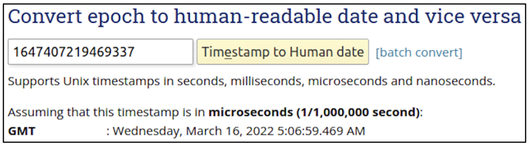

:orphan:

(timestamp-format-in-windows-linux-mac-os)=

# Timestamp Format in Windows, Linux-based and MAC Operating Systems

Digital Forensics is the scientific process of uncovering the sequence of events that led to an incident. Timestamps clearly indicate the date and time when an event occurred on a system. This blog post discusses how timestamps are stored by three major operating systems: Windows, Linux-based and MacOS.

## Importance of Timestamps in Digital Forensics

As a regular user, when you create a file, modify it and attempt to view the file modification time, you can easily view the timestamp in human readable form. The following screenshot is from a Windows machine.

Consider a forensic investigation on a Windows machine where you are analyzing some timestamps from the registry. Within the registry, timestamps are not usually found in human readable form.

Consider another scenario. A forensic investigation where you are looking at evidence of web browser activity on a system. Commonly used browsers like Firefox, Chrome and Safari store browser history, cookies, search history, etc. in database files with SQLite extension. Each database would have a bunch of tables with information about user activity, inclusive of timestamps. The timestamps are stored differently on different operating systems.

The rest of this blog post discusses the different timestamp formats seen across Windows, Linux-based and Mac operating systems.

## Windows Operating System

Within the registry, in the Current User hive, at _SOFTWARE\Microsoft\Windows\CurrentVersion\SettingSync_ there is a registry key with the name _NextAllowedUploadTime_. This key represents the timestamp at which user settings will be synced across all devices using the same Microsoft account. The timestamp is shown within the red box in the following screenshot.

There are 8 bytes of data. How can this be interpreted? On Windows systems, timestamps are stored in ‘Windows NT Time format’ also referred to as ‘Win32 FILETIME’ or NTFS file time or SYSTEMTIME.

A Windows timestamp represents the number of 100-nanosecond intervals since January 1st, 1601 UTC.

How can this 8 bytes of data be converted to human readable time? Since Windows systems store data in little-endian format, the hex value representing the timestamp is read right to left and interpreted. (To know more about little-endian format, read this post on .

The hex value is read from right to left and converted to decimal as shown in the following screenshot. This will be an 18-digit value.

To convert the 18-digit timestamp into human readable form, free converters like this one can be used: [Windows Timestamp Converter](https://www.epochconverter.com/ldap).

After conversion we can see that the timestamp corresponds to 12th April 2022, 11:29 PM GMT. At this time, Windows is configured to sync settings across all devices using the same Microsoft account.

Consider another registry key in the Current User hive: _SOFTWARE\Microsoft\Windows\CurrentVersion\Notification_. The following screenshot shows the latest timestamp at which the user received a notification about a Windows update. From the highlighted portion, it can be seen that the timestamp is represented in bytes, but is preceded by 0x character. In this case, the little-endian conversion has been done already and the decimal form of the timestamp is shown within brackets. You can proceed to convert the decimal value into human readable form.

On Windows machines, timestamps are typically found in human readable form or in Windows NT time format.

## Linux-based Operating System

Now you are investigation a device running a Linux-based operating system: Ubuntu.

On Ubuntu, web browser history can be found at _/home/<user>/.mozilla/firefox/<profile>/places.sqlite_. Table _moz_places_ has a list of URLs visited along with the timestamp. The following screenshot highlights the URL visit time of one entry.

Linux-based systems store the time in Epoch format, also known as POSIX Time or Unix epoch or Unix time. It refers to the number of seconds elapsed since 1st January 1970 GMT.

A free converter like this one, [Epoch Time Converter](https://www.epochconverter.com/#tools) helps to convert epoch time to human readable form.

The user has visited a URL on 16th March 2022 at 5:06 AM GMT.

## MAC Operating System

Now you are investigating a device running Mac OS. You are analyzing the browser history for a user located at _~/Library/Safari/history.db_. Within _history_visits_ table you will find the timestamp at which a user had visited a specific webpage. Note that this time format is different from what was observed in Windows and Linux-based systems.

On iOS devices, timestamps are stored in ‘Mac absolute time’ format also referred to as ‘Cocoa core data time’. It represents the number of seconds since midnight 1st January 2001 GMT.

To convert this timestamp to human readable time, online converters like this one, [Cocoa Time Converter](https://www.epochconverter.com/coredata) can be used.

From the following screenshot, we can see that the user has visited gmail.com on 17th October 2021 at 11:38 PM GMT.

## Other timestamp formats

On Apple iPods, timestamps are stored in Mac HFS+ time format. Some browsers like Safari, Chrome and Opera store timestamps in WebKit format.

## A final note on timestamps

There are some important factors to consider when working with timestamps:

1. Most applications store the timestamp relevant to GMT, also referred to as UTC.
2. If the timestamp is not relevant to GMT, identify the time zone the device under consideration operating is in. The time zone on the device may be different than the time zone the device is physically present in. This is quite common when a person is traveling across time zones.
3. Check if daylight savings is valid for the time zone under consideration.

With all this information, you will be quite prepared to handle timestamps in any investigation.

:::{seealso}
Want to learn practical Digital Forensics and Incident Response skills? Enrol in [MCSI's MDFIR - Certified DFIR Specialist Certification Programme](https://www.mosse-institute.com/certifications/mdfir-certified-dfir-specialist.html)
:::
