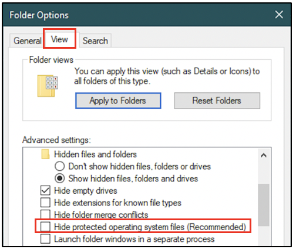
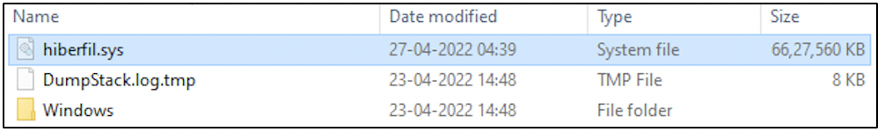

:orphan:
(windows-hibernation-files-in-digital-forensics)=

# Windows Hibernation files in Digital Forensics

When you wake up in the morning, you can recall events of the previous day. You also have memories of events that happened over the last few days. In the same way, a Windows computer also has numerous ways to recall how it had been used recently. One way is by using a hibernation file. This blog post discusses how the Windows hibernation file is useful in digital forensics.

## What is a hibernation file?

When a computer is placed in ‘hibernation node’, it is not completely shut down. Information in the computer’s RAM about the applications and files in use, is written to a file on disk called `hiberfil.sys`.

The hibernation file `hiberfil.sys` is a compressed copy of a computer’s RAM contents that is generated when the computer is placed in ‘hibernation mode’.

## How is the hibernation file useful in digital forensics?

When an investigator is presented with a computer for investigation, the first question asked would be, ‘Is the computer turned on?’. If yes, then the computer’s memory would be acquired and memory forensics would be performed on the memory dump. A computer’s memory is critical to identify information about recent activity on the system. You can read more about memory forensics _[Discover the Truth with Memory Forensics](discover-the-truth-with-memory-forensics)_

In case the computer is not powered on, it is not possible to acquire memory from it as memory disappears when a computer is shut down.

There is another option! If the computer had been placed in hibernation mode, then it is possible to get information about the applications and files used on the system recently.

## How to acquire the hibernation file from a system?

Hibernation files are typically found in the system root directory at `C:\hiberfil.sys`. By default, it exists as a hidden file. The folder viewing options must be modified to view protected operating system files, as shown in the following screenshot. By default, the ‘Hide protected operating system files’ option is checked. It must be unchecked to be able to view the hibernation file.

However, the hibernation file will exist on a system only if the hibernation mode has been enabled. The following screenshot was taken from a machine on which hibernation mode was enabled.

The hibernation file can be acquired using forensic tools or manually by a copy operation.

## How to process the hibernation file?

Since the hibernation file is a compressed copy of the RAM contents, it can be treated like a memory dump. But it must first be decompressed into raw format. Tools like _Volatility_ and `hibr2bin.exe` can help with this task.

Following decompression, existing memory analysis tools like _Volatility_ can be used to process it and find information about recent activity on the system.

_[Uncover Crucial Information within Memory Dumps](uncover-crucial-information-within-memory-dumps)_ blog post tells you about the information that you can find in a memory dump.

Information about recent network connections may be incomplete in a hibernation file. Also, hibernation files can exist only in physical machines and not in virtual machines.

## A final word on hibernation files

Here is a project idea for you:

1. Check if hibernation mode is enabled on your system. If not, enable it
2. Use an application, say Chrome browser
3. Put your computer in hibernation mode
4. Turn your computer back on and copy the hibernation file to another folder or computer for analysis
5. Decompress the hibernation file and treat it like a raw memory dump
6. Use memory forensics tools to view the list of recently active processes
7. See if you can spot an entry for `chrome.exe`

> **Want to learn practical Digital Forensics and Incident Response skills? Enrol in [MCSI's MDFIR - Certified DFIR Specialist Certification Programme](https://www.mosse-institute.com/certifications/mdfir-certified-dfir-specialist.html).**
