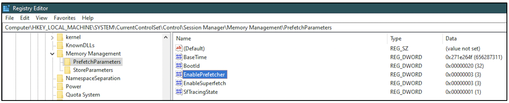
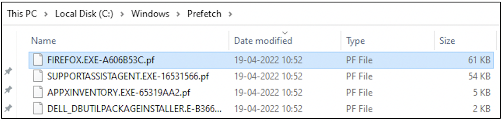

:orphan:
(windows-prefetch-files-may-be-the-answer-to-your-investigation)=

# Windows Prefetch Files May be the Answer to your Investigation

Alice and Bob are going on a hike. As they walk through the woods, they notice that they are leaving behind footprints of their trail. They hope that these footprints will help track their way back when they return from the hike. Did you know that every application executed on a Windows machine leaves behind footprints of its activity? This blog post introduces the concept of Windows Prefetch files, which acts as one of the critical footprints about recent activity on a system.

## What is a Prefetch file?

A prefetch file is a memory management feature on a Windows system. A binary file (.exe) requires various dynamic link libraries (DLLs) for execution. Whenever a binary is run for the first time, a prefetch file is created for the binary with information about the DLLs loaded for its execution. A footprint about execution of the binary is created.

If the binary is executed again, the operating system checks if a prefetch file exists for it. If so, the information stored in the prefetch file is used to help speed up execution of the binary. The existing footprint assists in execution.

## Where are Prefetch files found?

Prefetch files can be found with the _.pf_ extension at _%SYSTEMROOT%\Windows\Prefetch_ also referred to as _Prefetch Directory_. In recent versions of Windows, at any moment about 128 prefetch files can exist in this location. These are temporary files and older entries are deleted to make way for new ones.

## How is a Prefetch file useful for Digital Forensics?

The goal of Digital Forensics is to uncover recent activities on a system. Identifying footprints of recently executed binaries will help an investigator identify ‘what happened on this system?’.

If there is an entry for a binary in the Prefetch directory, it is an indicator that the binary had been executed on the system. As the binary is under execution, the prefetch file gets updated. The modification file associated with a binary’s prefetch file is indicative of a binary's activity on the system.

Head over to the _Prefetch Directory_ on your system! You can find prefetch files of recently executed applications.

## What information can be found in a Prefetch file?

Apart from having information about the DLLs used by a binary, a prefetch file also provides some more information:

1. Creation time of the prefetch file
2. Modification time of the prefetch file
3. Number of times the binary was executed
4. Latest time when the binary was executed
5. Last few timestamps when the binary was executed.
6. The directories referenced by the binary
7. The path the binary was executed from
8. DLLs used by the binary
9. Information about temporary files used by the binary
10. Hash of the executed binary

and more.

There are many free tools available to extract the information from a prefetch file.

## A final word about Windows Prefetch files

A prefetch file would exist for an executed binary, only if prefetching is enabled on a system. This is controlled by a registry value at _HKEY_LOCAL_MACHINE\SYSTEM\CurrentControlSet\Control\Session Manager\Memory Management\PrefetchParameters_

If the value of _EnablePrefetcher_ key in this location is 1 or 2 or 3, it means prefetching is enabled on a system. Each of the non-zero values is indicative of a specific prefetching configuration. If the value of _EnablePrefetcher_ is 0, it means prefetching is disabled on the system. By default, prefetching is enabled on a system.

The system from which the following screenshot was taken has prefetching enabled.

In some cases, adversaries may disable prefetching on a system to remove any footprints of their activity. When investigating a Windows machine for artifacts, check if prefetching is enabled and identify recently executed binaries through the existing _.pf_ files.

Head over to the _Prefetch Directory_ on your system! You can find prefetch files of recently executed applications, if prefetching has been enabled.

On the system from which this screenshot was taken, Firefox application was recently executed.

:::{seealso}
Want to learn practical Digital Forensics and Incident Response skills? Enrol in [MCSI's MDFIR - Certified DFIR Specialist Certification Programme](https://www.mosse-institute.com/certifications/mdfir-certified-dfir-specialist.html)
:::
