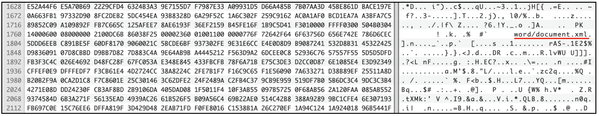

:orphan:
(a-day-in-the-life-of-a-digital-forensic-investigator)=

# A Day in the Life of a Digital Forensic Investigator

Are you wondering what Digital Forensics professionals do on a regular basis? This blog post will give you a brief idea about the activities typically performed by digital forensics professionals.

## Analyzing Data... lots of it!

Investigations may take days, weeks or even months to solve. Throughout the investigation, the professional attempts to process as much evidence as possible to help arrive at a conclusion. What might this evidence be?

_Memory Dumps:_ Memory dumps help capture the state of the system when an attack is underway. They provide _[critical information](uncover-crucial-information-within-memory-dumps)_ that may not be available otherwise.

_Log Files:_ Log files are the holy grail in digital forensics. They are records of all activities that had taken place on a system. They can be found as text files, json files, SQLite database files, etc. A single log file would have so many entries. Rather than going through each entry manually, tools can be used to sort and view the data in a desired manner. Even scripts can be written to extract log entries that meet certain conditions.

Usually before evidence is processed, the professional will have a ‘time window’ to work with. Let’s assume that a computer has been infected by malware on May 10th. It would be a good idea to focus on log entries that were collected few days prior to May 10th, rather than entries generated early in January. In this case, the time window corresponds to the first few days in May. However, some incidents may require the investigator to look at log entries earlier in time.

_Network traffic:_ Log files would also include traffic moving through the network generated by firewalls, routers, intrusion detection/prevention systems, etc. Knowing how to interpret and process network traffic involves a deep understanding of the layers in the _[OSI Model](the-osi-model-a-framework-for-data-transmission)_.

_Suspicious files:_ In some situations, the investigator may find files without any extension. Or when the extension does not match the file content. Knowing about file _[magic numbers](file-magic-numbers-the-easy-way-to-identify-file-extensions)_ comes handy in this case.

When dealing with suspicious files, the investigator may have to view its hexadecimal representation. What does this mean? Every file on a computer is made up of zeros and ones. A better way to view the sequence of zeros and ones that make up a file is by viewing its hex representation. Every 8 bits is represented by a hexadecimal byte. For example, the sequence 01101101 has its hexadecimal representation as 6D. All the bits in a file can be viewed as hex bytes. Hex Viewer/Editor applications can do this conversion for you. Most editors suitable for viewing the hex representation of files, also show the ascii representation of the files, in a column on the right side.

The following screenshot represents a section of the hexadecimal representation of a file that was found without an extension. However, in the ascii representation on the right, the phrase _word/document.xml_ can be found. This could mean that we are dealing with a Microsoft Word document. Further investigation into the file’s magic number may provide more clarity.

## Understanding the outcomes of an investigation

The best-case scenario is when upon analyzing the collected evidence, the investigator is able to identify the sequence of events that led to an unfavourable incident. It is possible to build a timeline of activities that had taken place on a computer or network right before the attack is detected. This scenario results in a very satisfied client.

Sometimes, there is no conclusive evidence to prove that the incident had indeed taken place. This is where there is no ‘smoking gun’ to prove the case. It simply means that there was not enough evidence to prove what had exactly occurred. The client is then advised to maintain a better system of logging and monitoring on their network, that would come in handy if incidents occur in the future.

Before a DFIR professional begins their assignment, the best thing to do is to assure the client that they would ‘do their best’ and not make promises about ‘finding exactly what had happened’.

## Writing Reports

Regardless of what the outcome of an investigation may be, it must be concluded by drafting a professional report. A report must contain information about relevant findings if any, along with screenshots. Every DFIR professional must have the ability to draft professional _[reports](providing-clarity-in-the-face-of-adversity-digital-forensics-reports)_.

## A word about Incident Response and Digital Forensics

In most cases, the terms _Incident Response_ (IR) and _Digital Forensics_ (DF) are used interchangeably although there are differences between the two. IR is the process of identifying and confirming that an incident has occurred. _[IR professionals](what-will-i-do-as-an-incident-responder)_ typically collect evidence for a DF professional to process. DF is the process of uncovering intricate details of all the events that led to the incident. Most specialists are trained perform both incident response and digital forensics activities.

## How to become a skilled DFIR professional?

You landed your first DFIR job, you have a basic set of skills that is valued. Here’s what you can do to become a skilled professional in the long run:

- Keep yourself in the loop about what is happening in the cyber world. There are dedicated news sites, podcasts, YouTube channels to give you a daily dose of cyber updates.
- Set up your own [own DFIR lab at home](build-your-own-digital-forensics-lab-at-home). This is a quick guide to help you get started. Then - practice, practice, practice!
- There are many software tools for DFIR available on the Internet. In your free time, develop your own research projects and get acquainted with using those tools.

Here’s a quick idea to help you get started with memory forensics:

- Set up a virtual machine on your computer. This will be the target
- Execute a malware sample on it
- Acquire memory from this virtual machine
- Perform memory forensics on the acquired memory dump and prove that you can identify the malware sample in the active process listing

After having performed such tasks in your home lab, you will be in a better position to help out when a cyber incident happens in the real world. You will know what to do!

> **Want to learn practical Digital Forensics and Incident Response skills? Enrol in [MCSI's MDFIR - Certified DFIR Specialist](https://www.mosse-institute.com/certifications/mdfir-certified-dfir-specialist.html)**
