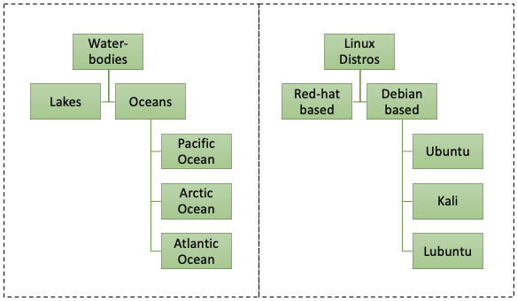

:orphan:
(a-gentle-introduction-to-digital-forensics-on-linux)=

# A gentle introduction to digital forensics on Linux

Have you watched movies where skilled cyber operators have black windows open in their computers, with coloured text scrolling through? They type some content in the black screens and magical stuff happens. Have you wondered how they go about doing all that? What applications may they be using? All those tasks can be performed on Windows, Linux-based and Mac operating systems. For now, let us focus on the Linux-based ones. This blog post introduces some basic concepts about Linux-based computers and discusses how Linux proves useful in the DFIR domain.

## What is Linux?

Take any piece of hardware – your computer. Physically, the device would have a motherboard, RAM, Wi-Fi card, Bluetooth module, etc. All the modules are useful only when a software program knows how to use them. A middle-person is required between the physical hardware and the software. This middle person is the kernel, which is actually a piece of software that perform two major tasks:

1. Interact with the hardware
2. Instruct other software components about how to interact with the hardware.

Think about the kernel as the moderator – you want to turn on Wi-Fi on your computer. You would simply click the menu option to turn on Wi-Fi. Internally, the kernel instructs the relevant hardware module to power up and start working. Every operating system has a kernel. We cannot see it, but it exists on the hard disk. One type of kernel is the Linux kernel, which was developed in the early 90s.

The kernel always works with other operating system components to handle file management, memory management, process management, etc. Operating systems that use the Linux kernel are referred to as Linux-based computers.

## What are some examples of Linux-based Operating Systems?

Using the Linux kernel, many operating systems have been developed. You may have come across names like Ubuntu, CentOS, Kali, Parrot, etc. Different organizations and communities have used the Linux kernel to build operating systems. They are also called Linux distributions or Linux distros.

Here are some examples of Linux-based operating systems:

- _Debian based distros_: Debian, Ubuntu, Lubuntu, Kali
- _SUSE based distros_: openSUSE, SUSE Enterprise
- _Red-Hat based distros_: Fedora, Red-Hat, CentOS
- _Arch-based_: Arch linux, Manjaro

Here is an analogy to break it down for you.

SUSE, Red-Hat and Arch are simply generic names assigned to the distribution type, depending on the group that created it. All of operating systems mentioned above: Ubuntu, Arch Linux, Fedora, etc. use the Linux kernel. Some people refer to Ubuntu, Kali, Fedora, etc. as Linux OS, Linux systems or simply Linux.

## How will knowing Linux benefit a DFIR professional?

Linux distros are used widely today – to host web applications, in the cloud, within IoT devices, etc.

Most of us are used to working on Windows computers - Creating files and folders, creating documents, running applications, etc. Record of every activity performed on a Windows computer can be found in _[prefetch files](windows-prefetch-files-may-be-the-answer-to-your-investigation)_, _[shellbags](windows-shellbags-in-digital-forensics)_, _[event logs](windows-event-logs-in-digital-forensics)_, _[file system journal](windows-file-system-journal-in-digital-forensics)_, etc. These records pose as solid evidence during a forensic investigation. In the same way, whenever any of the Linux distributions are used, records of user activity can be found in various locations. Knowing which those locations are, will help a forensic examiner acquire evidence as soon as possible.

When an incident occurs involving Linux-based servers or IoT devices or systems in the cloud, a DFIR professional with the skills to operate Linux systems and perform Linux forensics can assist in recovering from the incident quickly.

Also, Linux-based distros provide a number of command-line and GUI tools to assist with processing forensic evidence. There are even special distros like DEFT and Caine, specially designed to assist in forensic investigations.

## Suggested Learning Path

Now you know what Linux is, what Linux-based distros are and how they are beneficial for DFIR. The next step is to acquire skills. Here is a list of steps you can take to improve your Linux skills.

- Understand what Linux is
- Get familiar with the different types of Linux distributions
- Install a Linux OS in a virtual machine and start using it
- On Windows, the _C:_ drive holds the system files. User data is stored across _Documents_, _Downloads_, _Pictures_ and other folders. Likewise, Linux systems too have their own way of organizing system and user data. Research about it
- Get acquainted with using a Linux OS

Once you are familiar with how a Linux OS works, you can begin acquiring skills to perform Linux Forensics.

> **Want to learn practical Digital Forensics and Incident Response skills? Enrol in [MDFIR - Certified DFIR Specialist](https://www.mosse-institute.com/certifications/mdfir-certified-dfir-specialist.html).**
