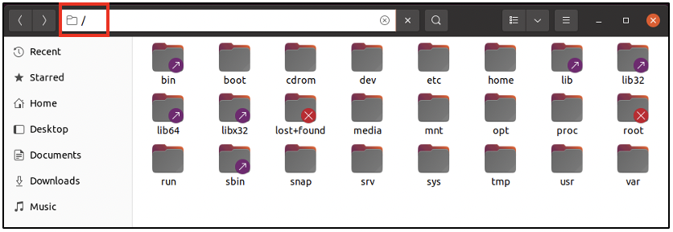

:orphan:
(a-note-on-linux-directory-structure-for-dfir)=

# A Note on Linux Directory Structure for DFIR

When you want a glass of water, you will head over to your kitchen to get it. You know the layout of your house, you know that the kitchen would have water – so you navigate there to get what you need. In the same way, to be able to perform Linux Forensics, it would be great to know about the layout of files on a Linux system and have an idea about where critical log files are stored. This blog post introduces you to the main directory structure on Linux systems. Knowing what information is held within the various directories will help a forensic examiner know where to look, while searching for evidence.

## Linux Directory Structure

On Windows computers, the _C:_ drive is the main directory under which all the system files and user files are present, organized within various folders. On Linux computers, the main directory is referred to as the _Root_ directory and is represented by a forward slash _/_.
The following screenshot was taken from a computer running Ubuntu operating system. The various folders seen here constitute the important ones you should know about. On Windows computers, within the _C:_ drive you can see folders like _Program Files_, _Users_ and _Windows_. The items seen in the following screenshot are the equivalent found on Linux computers.

Now let us take a quick look at what each folder may contain:

**bin**: Within this folder, you can find the binaries for user applications like virtualbox, text editor application, python installation files, web browsers, etc.

**boot**: This folder contains the files necessary to boot the system.

**cdrom**: On Windows computers, when you insert a CD into the computer, you would find a new folder created on your computer with the contents of the CD. On Linux systems, when a CD is inserted, its contents would appear within the _/cdrom_ folder. However, this folder was previously used. Nowadays, whenever a CD is inserted, its contents appear within the _/media_ folder.

**dev**: This folder has the configuration for devices attached to your computer. The configuration exists as files. If you attach an external hard disk to your computer, one file would be created for it, within the _/dev_ folder

**etc**: The configuration files for system-wide services and applications can be found here. If the Apache web server was installed, its configuration can be found within the _/etc_ folder.

**home**: On Windows computers, for every user, a dedicated directory is found within the `C:\Users\` folder. In the same way, on Linux computers, for every user, a dedicated directory is found within the _/home_ folder. User-specific documents and applications can be found here.

**lib, lib32, lib64, llibx32**: These folders are shortcuts to contents of /usr folder.

**lost+found**: This folder typically contains data recovered from corrupt files.

**media**: When any external media is attached to the computer, like USB drives, external hard disks and CDs, a folder is created for it within the _/media_ folder and its contents can be viewed.

**mnt**: This directory contains temporary mounts created by the user.

**opt**: Some software install their files in this directory.

**proc**: Within this directory, you can find information about every active process on the system.

**root**: This is the directory assigned to the root user, who has the maximum privileges on a Linux computer. Note that the Root directory (/) mentioned earlier is different from the root user’s directory (/root).

**run**: This folder has files required by applications during runtime.

**sbin**: This folder is similar to the _/bin_ folder, but it has system binaries that the root user would use to perform system administration. Some examples are: binary to change the password for a user, binary to add and delete users to the system, binary to format the hard disk, etc.

**snap**: This folder contains applications downloaded and installed using the tool called ‘snap’ on an Ubuntu system.

**srv**: This directory holds files used by active services on the system.

**sys**: This folder is present on some Linux systems, having files to assist with modifying the configuration of devices attached to the system.

**tmp**: Temporary files can be found here. The contents of this folder are usually deleted when the system reboots.

**usr**: This directory has a number of sub-folders having applications and files used by users.

**var**: This folder is the main store for various logs generated by applications on the system. It also has backups, cache data and mail data.

## Project Idea

Here is a small project idea for you:

- Set up a Linux system on a virtual machine. Some ideas are: Ubuntu, Kali or Fedora
- Navigate to the root directory and view the folders that are present
- Within the /boot folder, do you see files like _vmlinuz_, _initrd.img_? Research about the use of these files
- Do you see any files/folders within the _/media_ folder? Connect a USB drive to your computer. Do you see any files/folders within the _/media_ folder now?
- What can you find within the _/home_ folder?

You will find the _bin_, _boot_, _dev_, _etc_, _home_, _media_, _mnt_, _opt_, _proc_, _run_, _sbin_, _sys_, _tmp_, _usr_ and _var_ folders on all Linux systems. However, some distributions may not have the _snap_ folder. Depending on the distribution, some folders may or may not be present.

During a forensic investigation,

- you may find interesting temporary files within the _/tmp_ folder
- you may find hidden files within a user’s directory in the _/home_ folder
- you nay discover that files within the _/boot_ folder have been compromised by malware
- you may find indication of external devices connected to the system in the _/media_ folder
- you may find malicious binaries within the _/bin_ or _/sbin_ folders
- you will find critical logs within the _/var_ folder

Once you have a good idea about the directory structure on Linux, it will be easier for you to navigate through the system to search for evidence.

:::{seealso}
Want to learn practical Digital Forensics and Incident Response skills? Enrol in [MDFIR - Certified DFIR Specialist](https://www.mosse-institute.com/certifications/mdfir-certified-dfir-specialist.html)
:::
