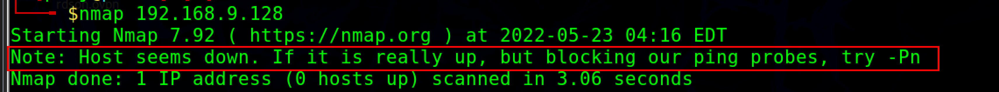
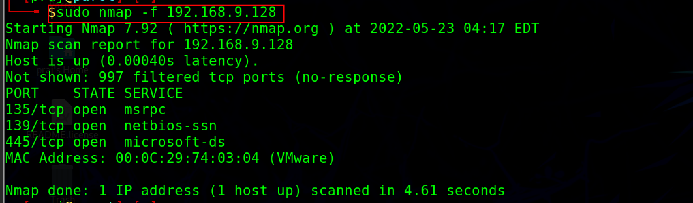
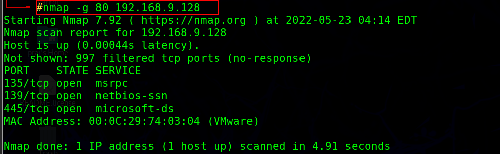
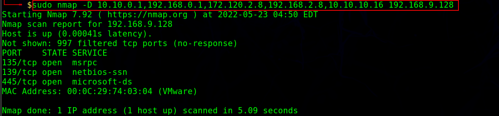
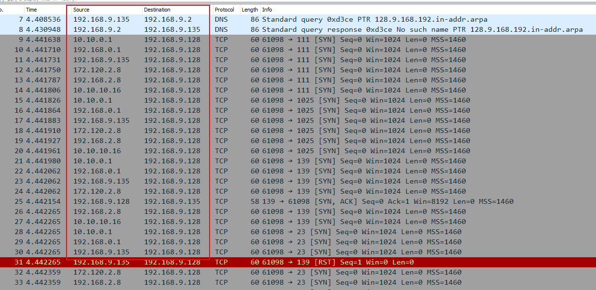
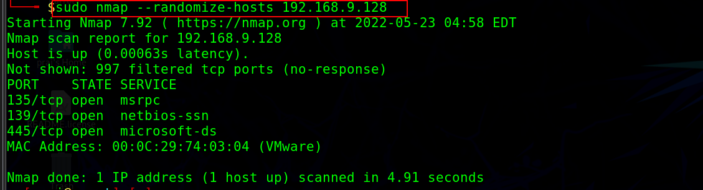
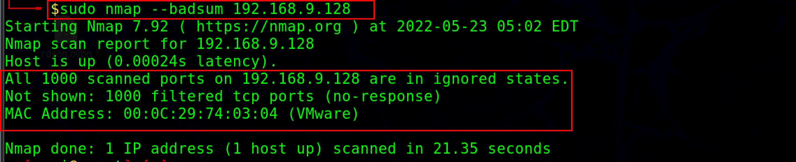

:orphan:
(bypass-ids-and-firewall-restrictions-while-network-scanning)=

# Bypass IDS and Firewall Restrictions While Network Scanning

A firewall is a security system that monitors and regulates network traffic based on specified security rules. An intrusion detection system (IDS) is a network security tool that monitors and analyses network traffic for suspicious activity and can send out alerts if it is found. Denial-of-service (DoS), person-in-the-middle (PiTM), and network reconnaissance attacks can all be detected by IDSs. An intrusion detection system (IDS) and a firewall are used to prevent unauthorized access to a network.

By using the following approaches, an attacker can evade an IDS or firewall and send intended packets to the target:

## Packet Fragmentation

The splitting of a probe packet into numerous smaller packets (fragments) when sending into the network is known as packet fragmentation. The TCP header is split into multiple packets to prevent packet filters from detecting what the packets are supposed to do.
When packets arrive at the hosts, the hosts usually queue them all up and process them one by one. Because this method needs more CPU and network resources, IDS/firewalls skip fragmented packets during port scans due to resource constraints.

As we see above our scan was blocked by windows defender. However in order to avoid being blocked by windows, use nmap with the `-f flag`.



```
nmap -f <target ip address>
-f switch is used to split the IP packet into smaller fragment packets.
```



_Note: Administrative privileges are required to run the fragscan._
Some hosts may fail to parse and reassemble the fragmented packets, which may lead to crashes, reboots, or even network device monitoring dumps.

## Source Port manipulation

In this technique to evade IDS/Firewalls, source port manipulation involves replacing actual port numbers with known port numbers. This normally occurs when the firewall is set to only allow traffic from known ports such as HTTP, DNS, FTP, SSH,etc. In nmap, the `-g or -- source-port` option is used to perform source port manipulation.

`Nmap -g 80 <target ip address>`



## IP address Decoy

The IP address decoy is a technique for evading IDS/firewalls that involves generating or manually specifying the IP addresses of the decoys. This scan makes it difficult for the IDS/firewall to distinguish which IP addresses are real and which are decoys scanning the network.
The Nmap tool can be used to perform a decoy scan. There are several types of decoy scans that can be performed with nmap:

1. `nmap -D RND:10 <target IP address>`

With this command, Nmap generates a random number of decoy IP addresses for the scan and inserts the real IP address between the decoy IPs randomly.

2. `nmap -D decoy1,decoy2,decoy3,decoy4…,ME,.. <target IP address>`

You can manually set the IP addresses of the decoys to scan the target network with this command. Use a comma `(,)` to separate the decoy IP addresses, and use the ME command to place your real IP address.

Example:`Nmap -D 10.10.0.1,192.168.0.1,172.120.2.8,192.168.2.8,10.10.10.16`



In the Wireshark, we can see the different IPs to the same target IP address.



## Randomizing Host order

This method instructs Nmap to scan the number of hosts in the target in a random order which enables to scan beyond IDS/firewall.

The --randomize-hosts option with nmap can be used to scan the host in random order.

`nmap --randomize-hosts <target ip address>`



## Sending Bad checksums

To bypass firewall rules, the attacker transmits packets with invalid TCP/UDP checksums to the target. Checksums are used to check the integrity of the packet.

`nmap -- badsum <target ip address>`



By checking for any responses, an attacker can obtain information from an improperly configured systems. If there is a response, it means that the firewall or IDS did not authenticate the obtained checksum. If the packets are dropped, it is believed that the system is configured.

## Final words:

Nmap offers various techniques to bypass the firewall and IDS and these techniques only work if IDS/firewalls are misconfigured. So in a network that has IDS and firewalls properly configured most of these techniques may not work. Every situation is different so you need to decide which one will work for you.

:::{seealso}
Looking to expand your knowledge of penetration testing? Check out our online course, [MPT - Certified Penetration Tester](https://www.mosse-institute.com/certifications/mpt-certified-penetration-tester.html)
::: In this course, you'll learn about the different aspects of penetration testing and how to put them into practice.**
