:orphan:
(collecting-linux-system-information-for-dfir)=

# Collecting Linux System Information for DFIR

When you pick a book to read, you would first read the title and a short summary about the book, before diving into the actual content. In the same way, in forensic investigations it is recommended to have an idea about the system you are working with before proceeding to collect evidence from it. This blog post highlights the information to be collected from a Linux system before proceeding with DFIR tasks during an investigation.

## Why should I collect Linux System Information for DFIR?

When investigating Windows systems, you will always be presented with a graphical user interface. However, this is not always the case with Linux systems. Most Linux server versions and some _[distributions](a-gentle-introduction-to-digital-forensics-on-linux)_ do not come with a graphical user interface. They simply have the _Terminal_, which is a command-line based interface to interact with the computer. The following screenshot shows how a _Terminal_ appears.

It may look intimidating, but it becomes very easy to use once you simply understand how it works. You type specific commands and interpret the results displayed on the screen.

## Collecting Operating System Information

You may have worked with Windows 10, Windows 7 and Windows XP. Each of those versions have their unique characteristics although they serve the same purpose. Knowing which Windows version you are working with helps to navigate the system with ease.

In the same way, it is recommended to know the flavour of the Linux-based operating system in use, when an investigation commences. There are many variants of Linux-based operating systems. There are some files present within the _/etc_ _[directory](a-note-on-linux-directory-structure-for-dfir)_ which provides the required information. `cat` command is used to view the contents of the files. The command is used as:

`cat <filename>`

The file _os-release_ within the _/etc_ folder, found on most modern Linux distributions has details about the OS in use. The following screenshots were taken from a machine running Ubuntu 21.04, a Debian-based distribution.

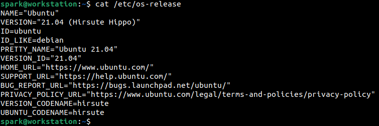

Some distributions also store OS information within the _lsb-release_ file in the _/etc_ folder, while others store this information within the _/etc/<distribution>.release_ file.

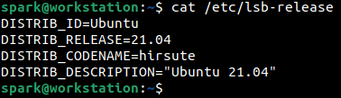

OS version information is typically written into the _/etc/issue_ file.

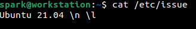

Upon installation, every OS is assigned a unique machine ID which is a randomly generated 128-bit hexadecimal string, stored within the _/etc/machine-id_ file. The creation time of this file is an indicator of when the OS was installed. On some machines, it is an indicator of when the OS was first booted.

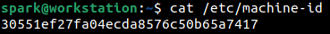

The machine ID is useful when you intend to corelate a full backup with a system.

## Collecting Time Zone Information

It is also important to identify the time zone the device is operating in, because it may or may not align with the time zone the device is physically present in. Identifying the time zone on the device helps to perform time correction if required.

Information about the time zone the device is currently operating in is stored within the _/etc/timezone_ file. From the following screenshot, it can be seen that the device is operating in Melbourne time.

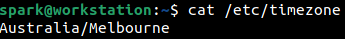

Once you have identified the time zone, you may want to identify how many hours ahead or behind this time is, to GMT. `date` command comes in handy for this. The switch _+’%:z’_ indicates the difference in hours, relevant to GMT. The colon (:) in the command is used to display the colon in the output. The + sign in the command indicates that the difference in hours must be represented in the output with a + sign or – sign. In this case, since the time zone is ahead of GMT there is a + sign in the output. If the time zone is behind GMT there would be a – sign in the output.

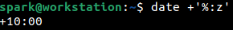

The _%Z_ switch indicates to print the abbreviated representation of the time zone, here AEST.

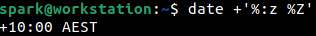

## Collecting Kernel Information

It is also important to collect information about the kernel present on the system. You can use this information to identify known vulnerabilities that may have been exploited. The `uname` command is used to print kernel information.

The _-s_ switch prints the name of the kernel in use, here Linux kernel.

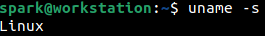

The _-r_ switch prints the kernel release information.

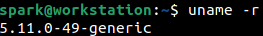

The _-v_ switch prints the kernel version information.

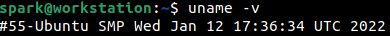

You can also combine all the above switches and use them in a single command.

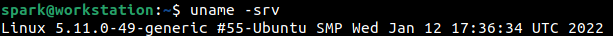

The _-a_ switch is used to display all kernel information, including the architecture of the system – here Intel (x86_64). This is particularly important, because some IoT devices running Linux run on ARM architecture.

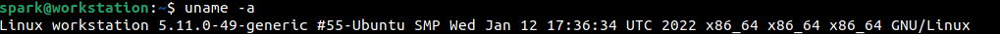

## Wrapping up

Now you know how to collect information about the kernel, operating system and time zone on a Linux system when a forensic investigation commences. There may be some variations in how you acquire this information – the file names that hold OS information may be different.

Here is a project idea for you:

- Set up Cent OS or Fedora on a virtual machine
- Attempt to identify kernel, operating system and time zone information
- What differences do you observe in the file names?

> **Looking to expand your knowledge of incident response? Check out our online course, [MDFIR - Certified DFIR Specialist](https://www.mosse-institute.com/certifications/mdfir-certified-dfir-specialist.html). In this course, you'll learn about the different aspects of incident response and how to put them into practice.**
