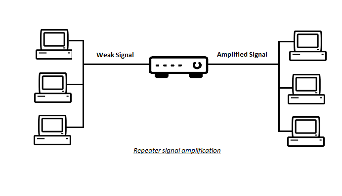
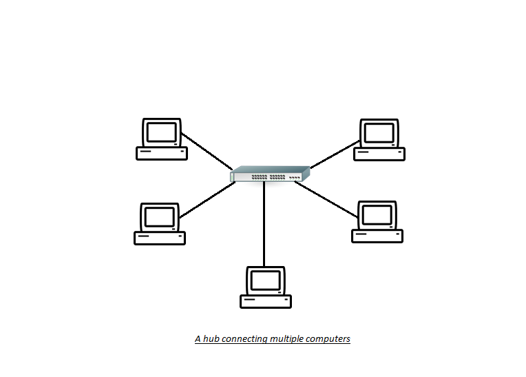
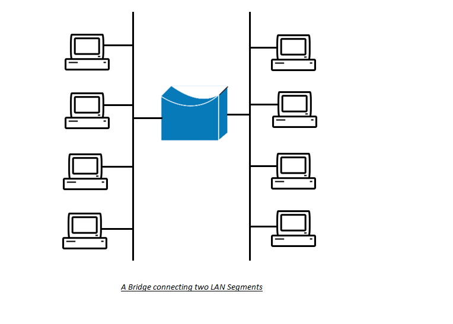
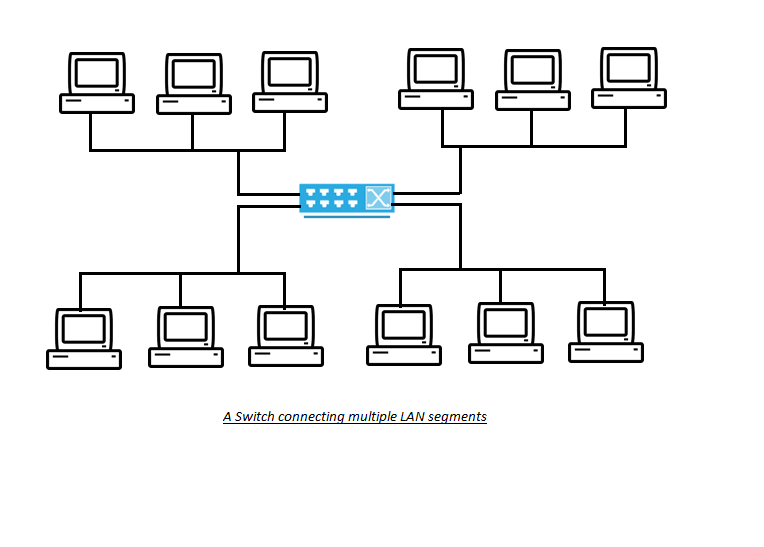

:orphan:
(common-network-devices-you-need-to-know)=

# Common Network Devices you Need to Know

A network is a collection of computers that are linked together by a wired or wireless connection in order for them to communicate electronically or access shared network resources. A variety of hardware devices are used to build and extend a computer network. This article will go over the various network devices and their functions.

## What are Network Devices?

Network devices are hardware devices that allow computers and networks to communicate with one another. These devices are often used to connect computers and electronic devices in a LAN (Local Area Network) or WAN (Wide Area Network). These devices serve various purposes and perform different functions.

Let's take a look at different types of network devices in more detail.

### Repeater:

A repeater is the most basic type of network device. There are only two ports on it. It extends the network by repeating electrical signals across multiple network segments.

A repeater operates at the OSI model's physical layer. As the signal strength diminishes over greater distances, the repeater's role is to enhance the signals by retransmitting the signals it receives. Digital Repeaters and Analog Repeaters are the two types of repeaters.

The analog repeater amplifies the analog signal, whereas the digital repeater amplifies the digital signal. Analog repeaters are less frequent than digital repeaters. The reason for this is that a digital signal is made up of discrete units from which line noise can be easily extracted, whereas line noise extraction in an analog signal is extremely complex. As a result, when an analog signal is amplified, the line noise is also enhanced, resulting in signal distortion.

### Hub:

A hub is similar to a repeater but has multiple ports. A hub allows various network segments and devices to communicate with one another. A hub is used to connect LAN devices using similar protocols. A concentrator is another name for a hub. This is because the received signals are broadcast to all systems linked to each of its ports.

A hub works at the physical layer of the OSI model as well. Hubs and repeaters don't process signals and don't recognize IP addresses. Hubs are divided into three categories: active hubs, passive hubs, and intelligent hubs.

<u>1. Active Hub:</u>

An active Hub is an electrically powered device that can boost the strength of electrical signals it receives.

<u>2. Passive Hub:</u>

A passive hub, on the other hand, only serves as a link between several devices and lacks the electrical circuitry needed to boost signal strength.

<u>3. Intelligent Hub:</u>

An intelligent hub extends the capabilities of an active hub by allowing for remote management and monitoring. An intelligent hub's functions include detecting packet congestion on its ports, discovering machines with difficulties, and collecting network statistics.

### Bridges:

A bridge operates at the OSI model's data link layer, and so uses MAC (Media Access Control) addresses. A bridge is used to link together two LAN segments that use the same protocol. It is a 2-port device and is used to offer network segmentation, which is the division of a big network into multiple domains. This permits nodes in a network to communicate with one another.

A bridge is used to filter frames arriving on its input port based on the destination MAC address. A MAC address is a unique identifier that is used to identify each network device. When a frame arrives at the bridge, it is checked for the destination MAC address. If the address is that of a device within the local network segment, the frame is forwarded to that device; otherwise, it is forwarded to the appropriate LAN segment. Bridges are classified into three types: local, remote, and translational bridges.

<u>1. Local Bridge:</u>

A local bridge is used to connect LAN segments within a local area such as a building.

<u>2. Remote Bridge:</u>

A remote bridge is used to connect LAN segments over longer distances utilizing telecommunication channels such as phone lines or optical fibers.

<u>3. Translational Bridge:</u>

A translational bridge is used to connect two LAN segments that use different network technology and protocols. For instance, suppose you have one LAN segment that uses the Ethernet framework and another that uses the Token Ring framework. Both technologies now use different frame lengths and protocols for communication. A translational bridge will be used to translate the frame between the two LAN segments.

In order to route frames between source and destination, bridges use two types of routing methodologies.

<u>Transparent Routing:</u>

The bridge in transparent routing creates and maintains a forwarding table to store the routing paths within a network. The bridge constantly learns about the network by observing data frames and storing the addresses of various network devices and the ports to which they are connected. If the bridge receives a frame with a destination address that is not in the table, it sends a query across all LAN segments except the source LAN segment ( from which the frame was sent). When the destination host responds to the query, it updates the table with the device's address and the relevant port number. The frame is then forwarded to the destination.

<u>Source Routing:</u>

Instead of relying on bridges, source routing uses frames to carry routing information to the destination. The source computer encapsulates the frame with the routing information to the destination in this routing method. As a result, the source computer determines the path taken by the frame to reach the destination.

### Switch:

A switch is a bridging device with multiple ports. It also operates at the OSI model's data link layer and is used to connect multiple LAN segments. A switch is a device that combines the functions of a hub and a bridge. It is more intelligent than a bridge. It strengthens the signal arriving at any of its ports and routes packets to their destination.

A switch uses a concept known as a virtual private link to provide a direct communication channel between two devices connected to different ports of the switch. In contrast to a bridge, a virtual private link allows frames from the source to reach the destination device directly. Instead of the destination device, the frame from the source computer in the case of a bridge was forwarded to the network segment containing the destination device. As a result, the switches enable efficient use of network bandwidth and reduce collisions between different frames.

Switches also provide an important security safeguard, namely network segmentation via VLANs (Virtual Local Area Networks). VLAN is used by security administrators to logically isolate user groups or devices based on security requirements, regardless of the physical location of the user computers or devices. For example, all users in the accounting department can form a single VLAN network. It enables communication and shared resource access among all users in the accounts department.

Aside from the layer-2 switches we just discussed, layer-3 and layer-4 switches are also in use today. A layer-3 switch operates at the network layer of the OSI model, whereas a layer-4 switch operates at the transport layer. These switches offer extremely fast and efficient routing. They use MPLS (Multiprotocol Label Switching), which routes packets over different networks using "labels" or "tags" rather than network addresses.

### Routers:

Routers operate at the network layer of the OSI model. Routers are used to connect different networks that may or may not use the same protocol. The router's function is to provide inter-network communication by routing packets from source to destination using IP addresses.

Routers use protocols such as RIP (Routing Internet Protocol), BGP (Border Gateway Protocol), OSPF (Open Shortest Path First), and others at the network layer to create routing tables, learn and store information about the network environment, generate network statistics, and map the path of network packets to the destination.

Routers use ACLs (Access Control Lists) to filter network traffic. Access Control lists are pre-defined sets of rules that are used to control incoming and outgoing network traffic. When a network packet arrives at one of a router's interfaces, it is either accepted or rejected based on the ACL rules. ACLs filter network traffic based on criteria such as source and destination IP addresses, source, and destination port numbers, as well as the protocols used. Routers operate at the network's perimeter, serving as the first line of defense against network attacks. As a result, ACLs must be correctly configured and routinely updated to block suspicious network traffic.

Routers also provide network segmentation by breaking down a large network into smaller subnetworks known as subnets. This segmentation can be based on different departments or workgroups. Network administrators use network segmentation to control the flow of traffic between different subnets based on security policies.

### Gateways:

Gateways operate at different layers of the OSI model depending on their functionality. Gateways are devices that connect two different networks that use different communication protocols. Gateways serve as both an entry and exit point for all network traffic, as all traffic must pass through the gateway before being routed to its destination. Gateways are more sophisticated than routers and bridges in that they not only serve as a connection device but also perform protocol conversion.

Gateways act as translators for network packets from different networks, allowing them to communicate easily. For example, one network communicates using Ethernet frames and connects to another network via the ATM (Asynchronous Transfer Mode) protocol. As a result, a gateway would be needed to translate communication between two networks. Some well-known examples of gateways are as follows:

<u>Email Gateway:</u>
Email gateways are used to convert email messages between two email servers that use different email vendors. Each email vendor uses a different syntax and message format for communication. An email gateway converts emails from various servers into a standard format, allowing all mail servers to easily understand the communication.

<u>Payment Gateways:</u>
Payment gateways act as a middleman between a seller's website and the buyer's bank, which processes credit/debit card transactions.

<u>VOIP Gateways:</u>
A VOIP Gateway connects a telephone company's network to the internet. For voice calls, the telecom provider may use an underlying technology such as PSTN (Public Switched Telephone Network). The VOIP gateway connects to the PSTN network and converts it into data packets that can be sent over the internet.

<u>Default Gateway:</u>
A default gateway is a device that connects a local internal network to the internet. Any network traffic between the local network and the internet is routed through the default gateway.

### Modems:

Modems operate at the physical and data link layers of the OSI model. They are responsible for modulation and demodulation. Modems are devices that allow digital signals from a computer to be transmitted over analog telephone lines. Computers store information in the form of digital signals, whereas telephone lines carry information in the form of analog signals.

The modem's job is to modulate (convert digital signals into analog signals) and demodulate (convert analog signals back into digital signals). DSL modems and cable modems are commonly used to connect to the internet via telephone lines or cables.

### Firewalls:

Firewalls, depending on their functionality, operate on the network layer, session layer, and application layer of the OSI model. Firewalls are used to restrict network access from one network to another. They are typically used to limit communication between a company's internal network and the internet.

A firewall is used to enforce a company's network security policy by filtering the incoming and outgoing network connections. Firewalls can filter network traffic based on the source and destination IP addresses, port numbers, protocols used, and much more. A firewall can be either a server that runs firewall software or a dedicated hardware device.

Firewall technology has evolved over time to provide a variety of functionality and security goals. There are several types of firewalls available today, some of which are discussed below.

<u>Packet Filtering Firewalls:</u>

Packet filtering firewalls are first-generation firewalls. These firewalls operate at the network layer of the OSI model and are the most basic types of firewalls. ACLs are used by these firewalls to accept or reject network packets. ACLs filter network traffic based on IP addresses, port numbers, and incoming/outgoing traffic direction.

<u>Stateful inspection firewalls:</u>

Stateful firewalls maintain a state table to track the communication session. It filters network traffic based on active network connections. These firewalls are third-generation firewalls.

<u>Proxy Firewalls:</u>

Proxy firewalls serve as a middleman in network communication. It acts as a barrier between the internal protected network and the untrusted network, preventing direct communication with the protected host. These firewalls are of the second generation.

Proxy firewalls are classified into two types: circuit level proxies and application level proxies.

A circuit level proxy operates at the OSI model's session layer, filtering network packets from a network perspective and not performing deep packet inspection.

Application level proxies operate at the OSI model's application layer, performing deep packet inspection to filter network traffic. Because they can filter network traffic based on protocols that operate at the application layer, these firewalls provide greater security than circuit-level proxies.

<u>Next Generation Firewalls:</u>

When compared to other firewall technologies, Next Generation Firewalls offer more features. These firewalls include an IPS (Intrusion Prevention System) to not only filter the network traffic but also look for indicators of various network attacks (DOS attacks, buffer overflow attacks, spoofing attacks, injection attacks, etc.). These firewalls are extremely fast and do not consume a lot of bandwidth.

### NIC (Network Interface Card):

Network interface cards operate at both the physical and data link layers of the OSI model. A Network Interface Card is a piece of circuitry built into a computer or other electronic device that allows it to participate in network communication. A network interface card (NIC) can be used for both wired and wireless data communication.

Each NIC has its own MAC address, which is used to identify the electronic device. Bridges, switches, and other devices within a LAN segment use this MAC address to identify the correct destination device.

### Access Points:

An access point is a transceiver (both a transmitter and a receiver) that is used to create a WLAN (Wireless Local Area Networks). A WLAN is a group of computers or devices in a small area that communicate wirelessly rather than through wired network connections. An access point serves as a link between wired and wireless network segments, allowing wireless devices to access wired network resources.

Wireless devices use a network interface card (NIC) to transmit and receive signals from access points. The wireless device and the AP must be configured to use the same communication frequency in order to communicate. Access points are typically located at various points throughout the network, allowing for network expansion.

Access points also provide network segmentation by constructing separate WLANs. Devices that need to connect to a specific WLAN must use the correct SSID (Service Set Identifier). An SSID is a unique identifier associated with a specific WLAN. This enables the creation of multiple WLANs, each with its own SSID. As a result, different WLANs with different security or business requirements can be isolated in this manner.

> **Do you want to get practical skills to work in cybersecurity or advance your career? Enrol in [MCSI Bootcamps](https://www.mosse-institute.com/bootcamps.html)!**
