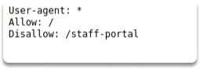
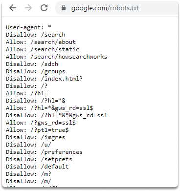

:orphan:
(content-discovery-part-1)=

# Content Discovery - Part 1

The first stage in attacking software is obtaining and analyzing critical information about it in order to acquire a better grasp of what you're dealing with. We can find information either manually, with the help of automated tools, or with Open-Source Intelligence (OSINT). This blog article will introduce you to discovering website content using automated tools.

## Where to find Hidden Content on Websites?

Hidden content discovery is the process of identifying items that are not easily noticeable to us and were not always meant for public consumption.

This material might include, for example, staff-only pages or portals, earlier versions of the website, backup files, configuration files, and administrative panels.

There are several more scenarios in which you may find relevant material and functionality:

- **new features**: The latest features that were implemented to the server for test purposes but have not yet been integrated into the main application.

- **default settings**: Standard settings of a feature in a commercial program that has been concealed from the user but remains as a service.

- **old versions of files**: Initial versions of some pages may have flaws that which been resolved in the latest release. But they are still vulnerable in the initial version.

- **config files**: Configuration files may include sensitive information like credentials.

- **program instructions**: Source files contain valuable information about the features of the app/software.

- **comments**: Comments in source code may include information such as usernames and passwords in some situations.

- **log files**: Log files may have confidential information such as valid login credentials and browsing history.

## Simple excercise - Manual disclosure of Robots.txt

Some spidering (which is also referred as the process of indexing website content) tools designed to attack web applications look for the robots.txt file. Now let's discover this file manually. First, here is a quick definition.

**What is Robots.txt file?**

The robots.txt file is a text file that instructs search algorithms which pages to display in their internet search results, or it prevents particular search engines from indexing the entire website. These pages might be administration portals or files for the website's consumers. This file provides us with a comprehensive list of website sites that the owners do not want us to find as penetration testers.

**How to manually check Robots.txt file**

You can simply type the IP address or the name of the website you want to discover on your web browser. And add backslash robots.txt as in the example:

`/robots.txt`

## Conclusion

As we have covered, manual browsing identifies the bulk of the material and functionality in a typical program. However, with the help of a variety of manual and automated tools, you can disclose relevant content and functionality that is restricted for regular users.

Now, by examining the _robots.txt file_, you already know which content is not allowed to be viewed by web crawlers.

:::{seealso}
Want to learn practical Secure Software Development skills? Enrol in [MASE - Certified Application Security Engineer](https://www.mosse-institute.com/certifications/mase-certified-application-security-engineer.html)
:::
