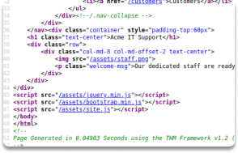

:orphan:
(content-discovery-part-2)=

# Content Discovery - Part 2

In a [previous article](content-discovery-part-1), we discussed robots.txt and automatic scanning for content. There are many more ways to discover hidden content on websites. In this blog post, we are going to manually find additional valuable information about websites.

We do this with the help of:

- Favicons
- Sitemap.xml
- HTTP headers
- In addition, the Stack framework.

**What is a hidden content?**

Hidden content refers to information that isn't immediately visible or accessible.

**1- Find out the framework of a web page by Favicon**

The favicon is a little symbol used to mark a website that appears in the browser's address bar or tab. When frameworks are used to construct a website, a favicon that comes with the installation may be left-over, and we may deduce which framework is being used if the developer does not replace it with a custom one.

Once we understand the framework stack, we may leverage other resources to learn more.

OWASP maintains a collection of standard framework icons that may be compared to the target's favicon.

When examining the source code of a website, you may find a clue indicating that the site employs a favicon.

Run the following command to retrieve the favicon and acquire its md5 hash value.

`curl https://static.licdn.com/scds/common/u/images/logos/favicons/v1/favicon.ico | md5sum`

Then check the hash in the OWASP database to find what framework the favicon belongs to.

- [https://wiki.owasp.org/index.php/OWASP_favicon_database](https://wiki.owasp.org/index.php/OWASP_favicon_database)

**2- Discover new material with `sitemap.xml`**

Unlike the robots.txt file, which limits what we can see as indexing a web page, the `sitemap.xml` file contains an inventory of every directory or file that the creator or owner wants to be featured by a browsing engine. These may feature portions of the website that are more difficult to access, or they may list some old sites that the current site no longer utilizes but are still operational behind the scenes.

Open your browser, type the site name or IP address you want to visit, and add `/sitemap.xml` to the path.

**3- Examine HTTP Headers**

When we send requests to the web server, the server responds with a variety of HTTP headers. Headers may provide helpful details, for example, the server application and the programming language being used. In the sample below, we can see that the webserver is Cloudflare. Try executing the curl command below to the web server, with the -v parameter enabling verbose mode.

`curl 104.16.65.85 -v`

**4- Learn more about programming framework**

Examining a website's page source, we can learn more about the program and other details from the framework.

Right click on a web page you want to discover and choose _view page source_ to check if you can see the framework.

## Summary

To review, we have covered several ways to manually discover hidden content such as favicons, `sitemap.xml`, HTTP headers and the stack framework. Now you know basically how to manually discover a web site.

> **Want to learn practical Secure Software Development skills? Enrol in [MASE - Certified Application Security Engineer](https://www.mosse-institute.com/certifications/mase-certified-application-security-engineer.html).**
