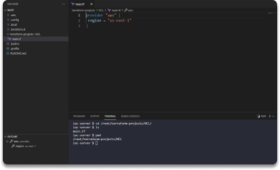
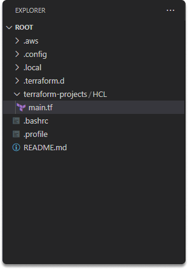
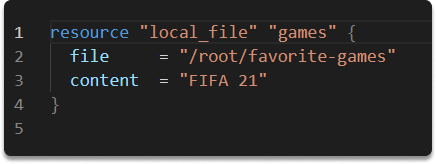
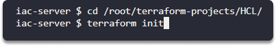
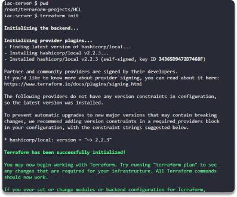
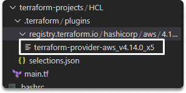
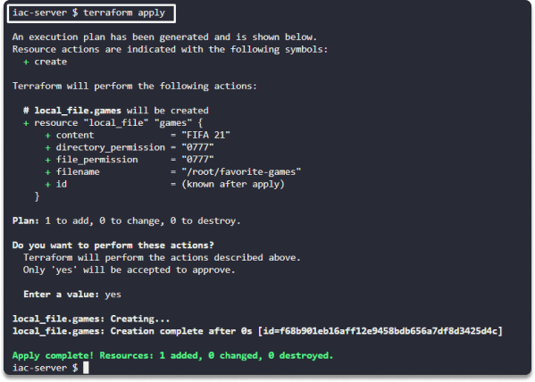

:orphan:
(deploy-your-first-project-on-terraform-with-basic-hcl)=

# Deploy Your First Project on Terraform with Basic HCL

Terraform is a powerful tool for provisioning and managing infrastructure. It is easy to use and has excellent documentation. One of its best features is its use of HCL, or Hashicorp Configuration Language. This language is easy to learn and allows for greater flexibility and control when compared to other options. In short, Terraform with HCL is an excellent choice for anyone looking for a robust, easy-to-use solution for managing infrastructure. In this blog post, we will create our first project with Terraform using HCL.

To deploy our resources, we will utilize these basic HCL commands:

- `terraform init`
- `terraform plan`
- `terraform apply`

## Introduction to Terraform and HCL

- Terraform uses HashiCorp Configuration Language (HCL).
- You save your main file with `.tf` extension.
- HCL is a declarative language.

You can code your infrastructure and Terraform builds it. It can build through a broad range of platforms such as Amazon Web Services, Google Cloud, and Microsoft Azure.

Terraform code may be written in almost any text editor. In this project, however, we will utilize Visual Studio Code for the purpose of simplicity.

## Setting up service provider

Typically, the first step in utilizing Terraform is to set up the provider(s) you want to use. Open your IDE and create a folder. Click on your folder and create a file inside it. Then, name it _main.tf_.

```
provider "aws" {
 	region = "us-east-2"
}
```

This informs Terraform that you will be utilizing AWS as your provider and that you want to deploy your infrastructure into AWS.
the _us-east-2 region_ .



## Defining resources

You can set up various types of resources for each sort of provider such as instances, virtual private networks, servers, load balancers so on.

The following is the typical syntax for creating a resource in Terraform.

```
resource "<provider>_<type>" "name" {
[configuration]
}
```

This code tells Terraform that your provider is Amazon Web Services(AWS) and you want to deploy your infrastructure in US-East-2 zone.

```
resource "aws_instance" "my_amazon_linux" {
   ami          = "ami-0022f774911c1d690"
   instance_type = "t2.micro"
}
```

**resource type**: It is the first value following the resource keyword in a resource block (_aws_instance_ in our case).

**name**: is a unique identifier that you may use to refer to this resource throughout the Terraform code. The value following the resource type is the resource name (_my_amazon_linux_).
arguments: consists of configurations unique to that service.

**provider**: The provider is generally the value before the underscore in the resource type (_aws_).

The AWS instance resource takes several other parameters; however, for the time being, we need two of them:

**ami**: An Amazon Machine Image (_AMI_) is an AWS-based and maintained image that contains the information needed to begin an instance.

**instance_type**: Instance types are different combinations of CPU, memory, storage, and networking capabilities that allow you to pick the best mix of resources for your applications.

Now we have defined our _t2.micro_ instance.

## Files and directories

**.tf**: Stores configuration files in Terraform using HCL.



**.terraform**: Terraform sets up the provider-related code to`.terraform` folder.

**terraform.tfstate**: It includes all details of your resources.

## Get started with basic HCL commands to deploy your resources

Now, let's define and deploy our resources.

**1-)** Copy and paste this code to your IDE.

```
resource "local_file" "games" {
  file     = "/root/favorite-games"
  content  = "FIFA 21"
}
```



**`terraform init`**

When we start using it, first we should run `terraform init`. Terraform init instructs Terraform to check our code, determine which providers we are employing, and build the infrastructure.

How should we work with a new Terraform code?

- First step is to change the directory to where your main.tf file is.

- And then execute `terraform init`.

**2- )** Run `terraform init`.





When we run this command, Terraform creates a plugins directory to store provider information.



**`terraform plan`**

It checks if there are any additional resources that aren't in the state file. Before making any changes, you may use the plan command to examine what Terraform will accomplish. This is an excellent technique to double-check your code before releasing.

**3- )** Run `terraform plan`.


| symbol | function |
| ------ | -------- |

Run `terraform plan`.


| symbol | function |
| ------ | -------- |
| +      | create   |
| -      | delete   |
| ~      | modify   |

**`terraform apply`**

Run the `terraform apply` command to build the resource. The apply command displays the same plan output and prompts you to indicate if you wish to proceed with this plan.

**4- )** Run `terraform apply`.



Congratulations, you have now deployed your very first resource using Terraform!

> **Want to learn practical cloud skills? Enroll in [MCSF Cloud Services Fundamentals](https://www.mosse-institute.com/certifications/mcsf-cloud-services-fundamentals.html).**
