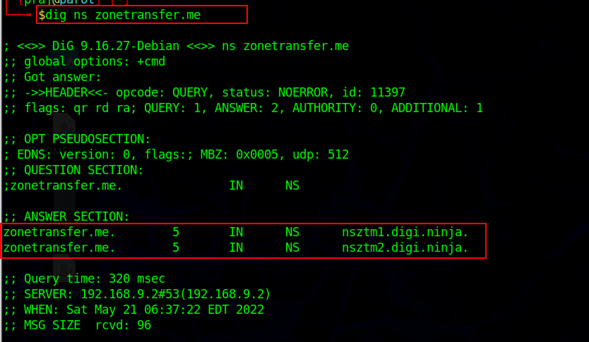
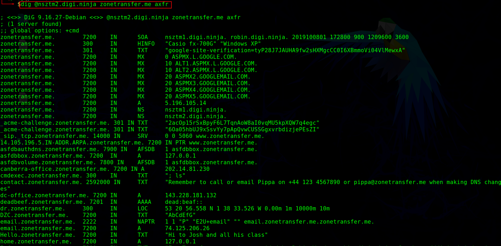
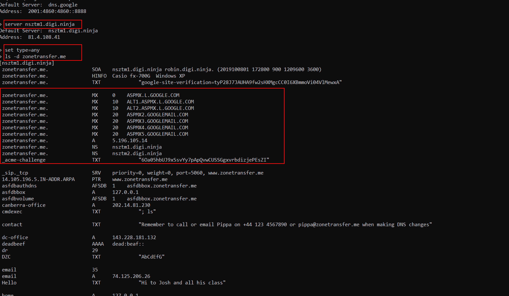
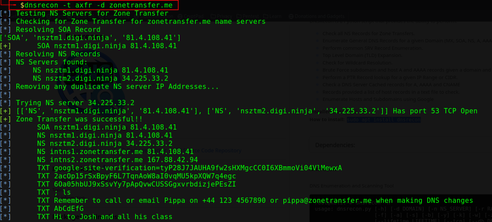
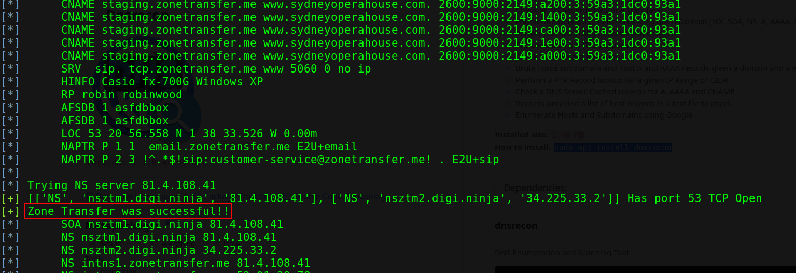

:orphan:
(dns-enumeration-using-zone-transfer)=

# DNS enumeration using zone transfer

DNS enumeration is the process of identifying all DNS servers and records for a specific domain. This information can identify potential security flaws such as unprotected DNS servers and zone transfers. DNS enumeration can also be used to collect information about a target company, such as identifying email and web servers.

## What is DNS zone transfer?

A DNS zone transfer is a type of DNS query in which one DNS server sends another DNS server a complete copy of its zone file. A zone file contains a mapping of DNS names to IP addresses and other resource records. DNS data is replicated over a network of DNS servers using zone transfers.

DNS administrators typically employ this form of communication to keep secondary DNS servers in sync with the primary DNS server. In some cases, however, a malicious attacker can exploit a DNS zone transfer to obtain sensitive information about a target network, such as a list of all hostnames and IP addresses. Zone transfers can either be initiated manually or automatically.

The attacker impersonates a client and submits a zone transfer request to the DNS server to accomplish a DNS zone transfer. The server then delivers a piece of its database to the attacker as a zone. The zone may contain a larger amount of information about the DNS zone network.

_Let us look at different tools used for DNS zone transfer_

DNS zone transfer can be performed by an attacker using tools such as _nslookup_, _dig command_, and _dnsrecon_.

## Dig

dig is a Linux-based command-line tool for querying DNS name servers and retrieving information on target host addresses, name servers, mail exchanges, etc.

`dig ns <target domain>`

The above command retrieves all the DNS name servers of the target domain. The attacker then uses one of the name servers from the output to see if the target DNS enables zone transfer.

`dig @<domain of name server> <target domain> axfr`



There are several mechanisms to perform DNS zone transfer but the simplest one is AXFR, AXFR refers to the protocol used to perform DNS zone transfer.



After performing the zone transfer if the domain is not protected. An attacker can get various information like _MX (mail server)_, _A record(IPV4 Address)_, and _SOA (start of authority)_.

## Nslookup

Attackers and security experts use the nslookup command to query the DNS name servers and collect information about the target host addresses, name servers, mail exchange, etc. To transfer a DNS zone, use the commands listed below.

```
Nslookup
Server <domain of name server>
Set type=any
```

Set the query type to any to retrieve information about the target domain's DNS zone. The following command is used to attempt zone transfer.

`ls -d <domain of name server>`



## DNSrecon

To zone transfer, the attacker uses DNSrecon to check all NS records of the target domain. To zone transfer, the target website, use the following command.

```
dnsrecon -t axfr -d <target domain>
-t flag specifies the type of enumeration performed, axfr is the enumeration type.
-d option specifies the target domain.
```





## DNS Enumeration prevention methods

- DNS zone transfer to untrusted hosts is disabled
- Private hosts and their IP addresses should not be listed in DNS zone files of the public DNS servers
- Use premium DNS registration services to hide sensitive data

:::{seealso}
Looking to expand your knowledge of penetration testing? Check out our online course, [MPT - Certified Penetration Tester](https://www.mosse-institute.com/certifications/mpt-certified-penetration-tester.html)
::: In this course, you'll learn about the different aspects of penetration testing and how to put them into practice.**
