:orphan:
(don-t-be-fooled-by-malware-in-disguise-identifying-obfuscated-malware)=

# Don't be Fooled by Malware in Disguise - Identifying Obfuscated Malware

The use of _"obfuscation"_ is one of the strategies used by threat actors to hide their malware, avoid detection, and prevent investigation. The goal is to change the code in such a way that it becomes more difficult to understand while maintaining the program's functioning. The structure, the way the code is written, or the use of encoding/encryption are all examples of modifications. This article will solely cover the fundamentals and methods for determining whether or not the sample we're evaluating has been obfuscated in some way. So relax, we've got you covered; this is just a warm-up.

General high-level view of the obfuscation process is something like...:

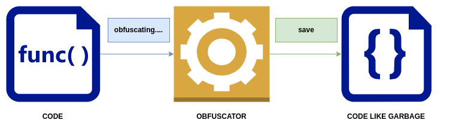

What happens is the code, whether it is written in a low-level language (_assembly_) or a high-level language (_C++_), will go through a process that is called the _obfuscator_ and the end product is a new file that is hard to understand because of the obfuscation applied.

Is it true that we won't be able to figure out what a program's true nature is if it's obfuscated?

No, however depending on the type of obfuscation used, it will cause problems for the analyst, slowing down their research, making the process take longer, and potentially costing a lot more money. Is it, therefore, worthwhile? Depends!

Obfuscation methods include:

- packing
- code transformations
- compressing, encryption or encoding

We will look at three basic things to detect if obfuscation has been applied, which are:

- abnormal `PE`-sections
- APIs used
- entropy

## Abnormal PE sections

It's not difficult to look for unusual section names, but keep in mind that they could be modified at any time. When you detect a `.text` section with a zero raw, on-disk size relative to its virtual size in memory, it's _a good indicator that obfuscation is there_!

This method is mostly used by **Packers**. More on packers will be covered later.

You should ask yourself the question: _How could a section have no data on disk, but only when it’s in memory?_

The answer is that the program will load its code into that portion of memory and run it from there.

Check the _Virtual Size_ and _Raw Data Size_ in the executable's `.text` section and compare them. When loading `PE` into memory, the virtual size refers to the amount of RAM assigned to the `.text` section. The size of the `.text` section within the image of `PE` on the disk determines the size of raw data. If the discrepancy between these two values is large, the suspected file is likely to be compressed and obfuscated:

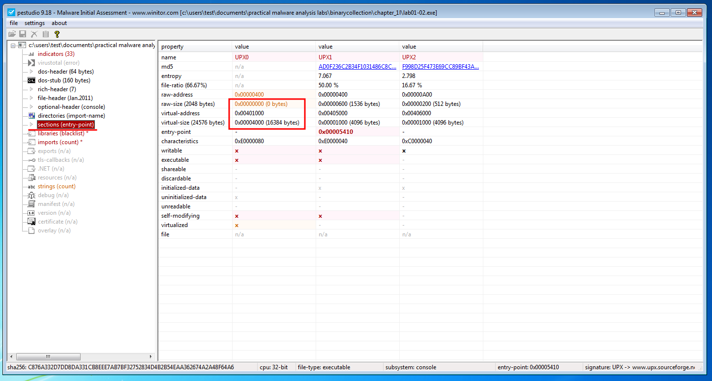

Notice the raw size and the virtual size of the `.text` section in the figure to the top. As you can see the section has a raw size of zero! That is abnormal.

But wait! Was that the only abnormal thing?? No, check the section _Characteristics_ of both and you’ll notice they are not the same:

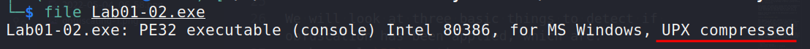

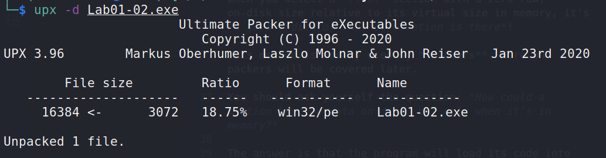

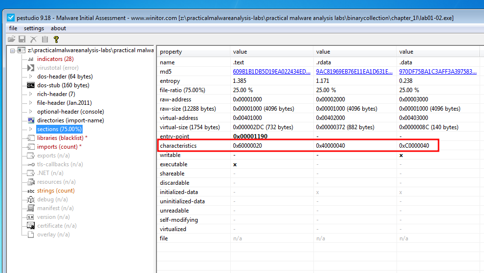

As you can see, we unpack sample via _UPX_ and investigate. Also note that malware analyst can easily identify this type of packing simply by using \*nix file command or any GUI tool such as [_exeinfo_](https://github.com/ExeinfoASL/ASL) or [_PEStudio_](https://www.winitor.com/) (the latter are Windows tools).

See the figure at the bottom shows that this section has code, is readable, and is executable, which is completely normal:

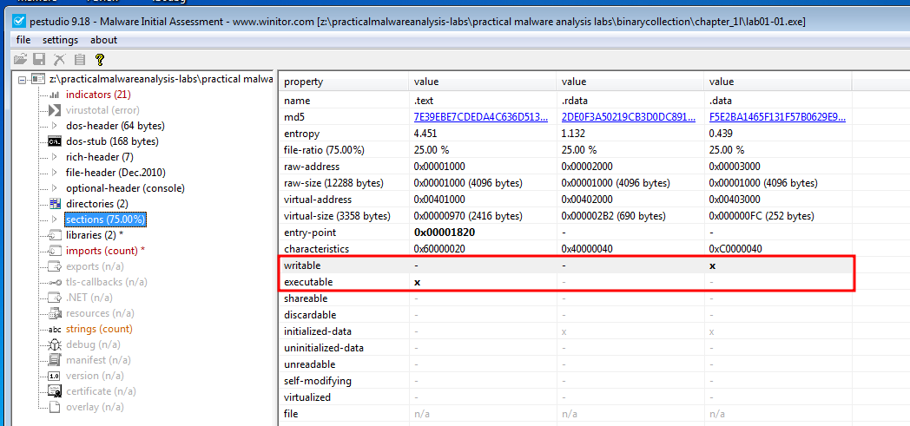

On the other hand, the other figure has read, write, and execute permissions on this section, plus contains uninitialized code, which is _abnormal_!:

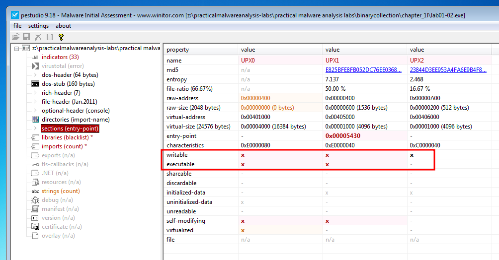

## APIs used

Another thing to look out for is what APIs the sample is using. Now, we don't want to limit this section to simply packer APIs; otherwise, we'd rename it "packing and unpacking," but if a sample, for example, uses encryption or encoding, we might be able to see it through the APIs it uses.

You'll realize why we underlined the word might when you've completed reading this obfuscation article; it was done on purpose, but don't worry, it'll all make sense later in the future parts...

For example, when loading this obfuscated sample into [_IDA Pro_](https://hex-rays.com/ida-pro/), it may remark something like "hey, I couldn't detect any imports for this sample"!

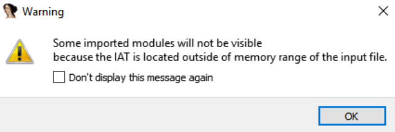

There are simple tools that could help us also with identifying obfuscation and if there is any encoding or encryption being applied, such as [exeinfo]:

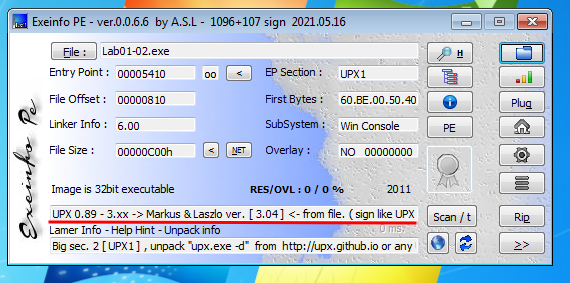

## Entropy

Entropy is a mathematical formula for calculating unpredictability.

When obfuscation is used, it implies that the level of randomness will be high, and vice versa. As a result, Malware Analysts use it to determine whether or not a file sample is obfuscated.

On a scale of `0-8`, the greater the value, the more probable the malware is packed, with values of `7-8` almost conclusively indicating the sample is packed. This is good because `PeStudio` says we'll need to unpack the malware in order to extract some useful IOCs:

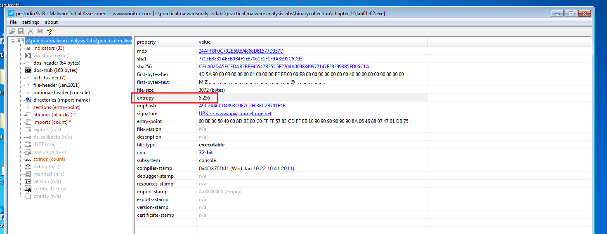

One thing to keep in mind while using Entropy for detection is that it does not provide a definitive answer as to whether the sample is obfuscated or not; however, it is a good idea to check and then verify using other approaches, which we shall discuss later.

Code on first image is for the original sample:

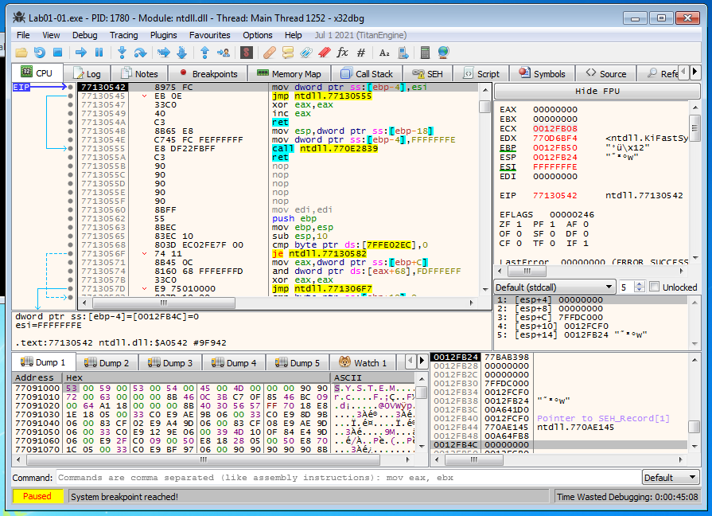

while the code on the second image is for the obfuscated sample:

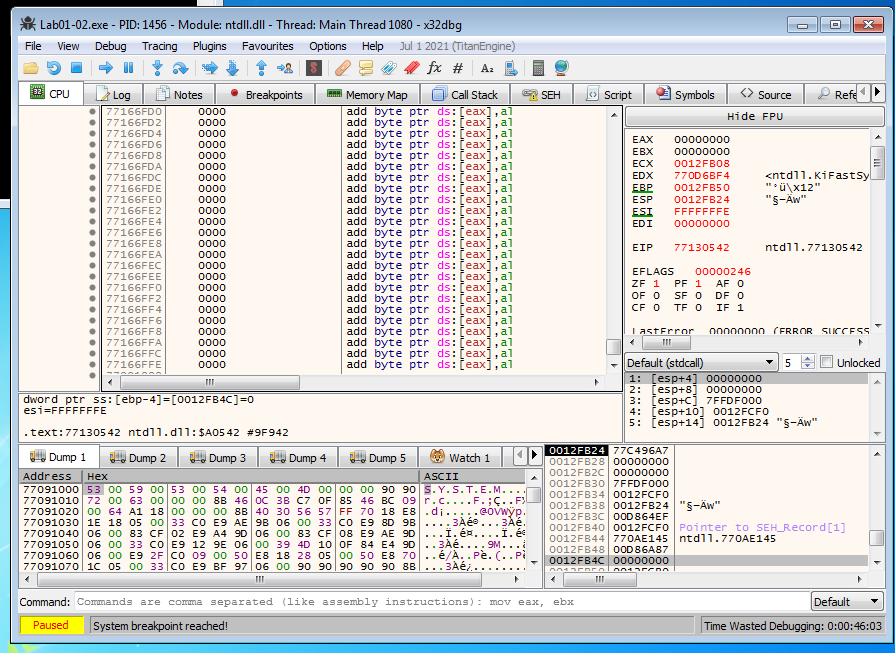

Do they look different?

You might be asking a good question: _so obfuscation is only used for bad purposes?_

Is there a quick answer? _No_. Long answer: _it can also be used to safeguard software copyrights and manage digital rights._

## Conclusion

We just wanted to remind you that this isn't all there is to obfuscation, and while you should check out the obfuscation blog part, you shouldn't skip over the other blog articles unless you already have the skills covered in those. The obfuscation blog post will cover a wide range of topics and concepts. Don't miss it because it will also cover anti-reverse engineering.

## References

- [PEStudio](https://www.winitor.com/)
- [exeinfo](https://github.com/ExeinfoASL/ASL)
- [IDA Pro](https://hex-rays.com/ida-pro/)
- [Practical Malware Analysis Book Labs](https://github.com/mikesiko/PracticalMalwareAnalysis-Labs)

> **Would you like to learn practical malware analysis techniques? Then register for our online course! [MRE - Certified Reverse Engineer](https://www.mosse-institute.com/certifications/mre-certified-reverse-engineer.html).**
