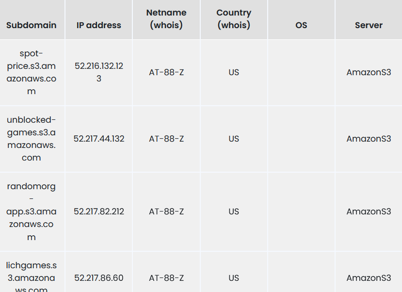
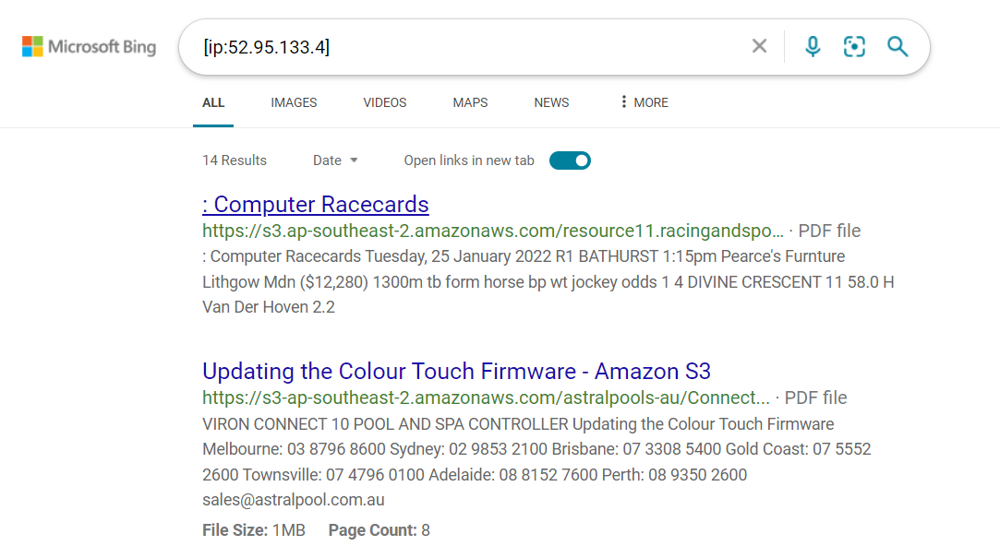
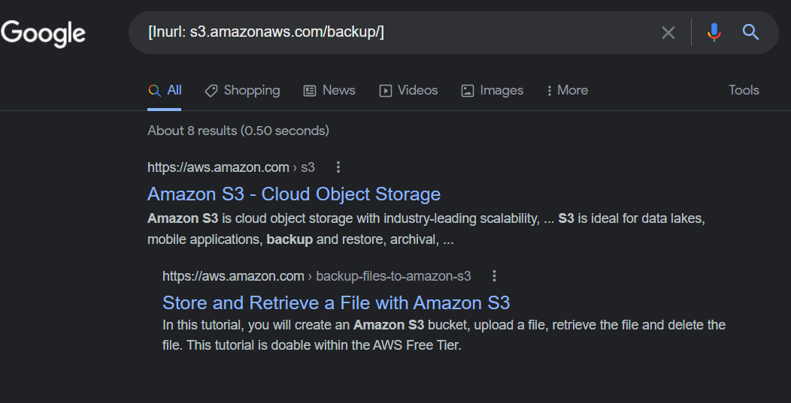

:orphan:
(enumerating-aws-s3-buckets)=

# Enumerating AWS S3 Buckets

S3 buckets are one of the most important aspects of Amazon Web Services (AWS). They are used to store and retrieve data and can be accessed from anywhere in the world. S3 buckets are also used to host static websites. In this article, we will look into different techniques attackers use to identify AWS S3 Buckets.

_Techniques to identify S3 buckets are as follows:_

## Bruteforcing URL

AWS assigns each S3 bucket with a unique identification number, an attacker will use a brute force attack on the S3 bucket in order to identify the correct bucket. An S3 bucket URL looks like the below:

`https://s3.amazonaws.com/<bucket name>`

Attackers use numerous tools such as burp suite to perform the attack.

## Finding Subdomains:

Before we deep dive into finding subdomains for S3 buckets let us look at what subdomains are. Subdomains are a way to divide a larger domain into smaller, more manageable parts. By breaking up a domain into subdomains, you can more easily organize and structure your website. For example, you might have the main website at `www.example.com`, and then create subdomains for different sections of the site, such as `blog.example.com`, `store.example.com`, and `support.example.com`.

Sometimes subdomains can hold the exact data an attacker is looking for for a successful attack, there are numerous ways one can find S3 bucket subdomains, using tools like Pentest-tools, shodan, Robtex, and many more. Here is an image showing some of the subdomains extracted using the amoeba mentioned tools for S3 buckets.

## Reverse IP search:

Reverse IP search is a process of searching for all the domain names that are hosted on a given IP address. This can be useful in finding all the websites that are hosted on a particular server, or in finding all the websites that are associated with a particular company or organization.

Search engines such as bing can be used for reverse IP search in order to identify the domains of S3 buckets, the command to do so looks like the below

`ip:< victim IP address>`

Use the IP address received from the subdomain search and perform a reverse IP search. The command looks as the follows

`ip:52.95.131.4`

## Google Dorking:

Google Dorking is a hacking technique that uses google advanced search services, to find valuable data, for instance, if your target website is `example.com` instead of searching data for `example.com` throughout the web, you can use commands like `filetype:txt inurl:example.com`, this will locate all the files in the `example.com` with the extension `.txt`.

Now we will use the same technique to find s3 buckets and any directories they may have, the command to do so looks like the below:

`inurl:s3.amazonaws.com/database/`
`inurl:s3.amazonaws.com/backup/`

This will find every URL in `s3.amazonaws.com` with the directory _backup_

## AWS S3 Buckets Best Practices

There are a few best practices to follow when using AWS S3 Buckets. First, it is important to enabling versioning on your bucket. This will allow you to keep track of all the different versions of files that are stored in the bucket, and you can easily revert back to older versions if necessary. Secondly, it is a good idea to enable MFA Delete on the bucket. This will add an extra layer of security and will help to prevent accidental deletions of files. Finally, it is important to set up access control lists (ACLs) on the bucket to ensure that only authorized users have access to the files.

> **Looking to expand your knowledge of cloud penetration testing? Check out our online course, [MCPT - Certified Cloud Penetration Tester](https://www.mosse-institute.com/certifications/mcpt-cloud-penetration-tester.html). In this course, you'll learn about the different aspects of cloud penetration testing and how to put them into practice.**
