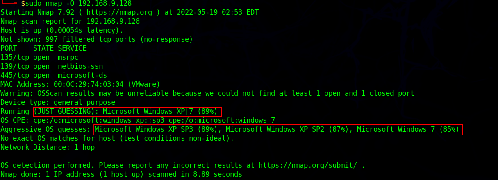
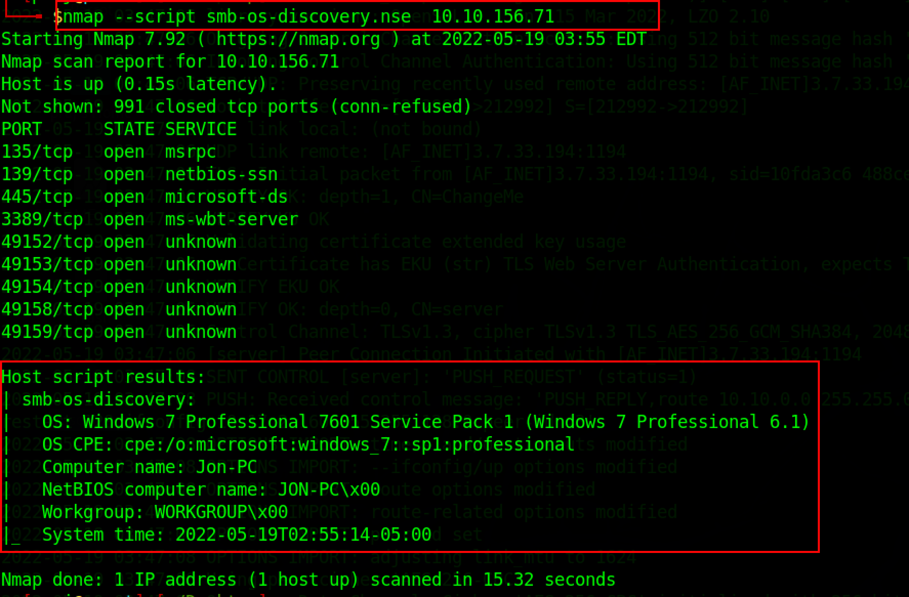

:orphan:
(find-out-what-is-banner-grabbing-and-how-to-prevent-it)=

# Find out What is Banner Grabbing and How to Prevent it

OS fingerprinting, also known as banner grabbing, is a technique for determining the operating system that is installed on the targeted machine. Once the operating system and its version are determined, the attacker then finds the system vulnerabilities and exploits that may work on that machine to carry out further attacks. Active and passive banner grabbing are the two types of banner grabbing.

## Active Banner Grabbing

The attacker uses active banner grabbing to send various network packets to a remote target, and the response is compared with the database. The principle behind active banner grabbing is that each operating system's IP stack has a unique way of responding to specifically built TCP packets. Because of differences in TCP/IP stack implementations, responses from different operating systems differ as a result the operating system of that machine can be found.

## Passive Banner Grabbing

Passive banner grabbing enables security analysts and attackers to obtain OS information while remaining anonymous. Passive banner grabbing is similar to the active banner, it is based on differences in TCP/IP stack implementation and how the operating system responds to packets. However, instead of scanning the target host, passive banner grabbing captures packets from the target via sniffing or uses intermediate software and platforms like shodan, censys, etc…

_Passive Banner grabbing includes :_

**Sniffing the network traffic:** An attacker can determine the Operating System by capturing and analyzing packets by analyzing network traffic using tools like Wireshark, TCPdump, etc..

**Banner grabbing through page extension:** Looking through the page extension in the URL may help in determining the application information. for example .aspx is used by IIS server and windows platform

## OS fingerprinting using NMAP

It is critical to understand the operating system running on the target machine in order to exploit it. Nmap is one of the tools used for operating system discovery.
Nmap starts by scanning the target machine's ports, to check whether the ports are open or closed. Nmap then transmits TCP and UDP packets to a remote target and analyses the responses. If there is a match, Nmap compares its Nmap-os-DB database and displays the OS details.

```bash
sudo nmap -O <IP_address>
-O flag is used to enable OS detection.
```



_Note: To perform TCP/IP fingerprinting for OS scans, Nmap requires administrative privileges. If the target host does not have at least one open and one closed port, the Nmap OS Scan results may not be accurate._

## OS discovery using Nmap script engines

The Nmap script engine allows users to build and publish scripts to automate various networking activities. To perform OS discovery, security professionals and attackers use a variety of scripts. For example, smb-os-discovery is a built-in script that can be used to gather OS information over the SMB protocol. The `-sc` flag can be used to run Nmap script engines(NSE). `--script` command can be used run customs scripts.



## Banner Grabbing Prevention methods

When the port is open, it indicates that the service/banner is active on it. When an attacker uses banner-grabbing techniques to connect to an open port, the system displays sensitive information like as the operating system, server type, and version. The prevention measures of banner grabbing are as follows:

- Display false banners to deceive attackers.
- The vendor and version information in the banner should be disabled.
- Disable any unnecessary network services on the network host.
- To protect your applications from known server attacks, keep your server and systems up to date.
- Disable or change banner information, use tools such as serverMask.
- Hide file extensions to hide web technologies and change file extensions like .asp to .htm or .foo to hide the server's identity.

:::{seealso}
Looking to expand your knowledge of penetration testing? Check out our online course, [MPT - Certified Penetration Tester](https://www.mosse-institute.com/certifications/mpt-certified-penetration-tester.html) In this course, you'll learn about the different aspects of penetration testing and how to put them into practice.
:::
