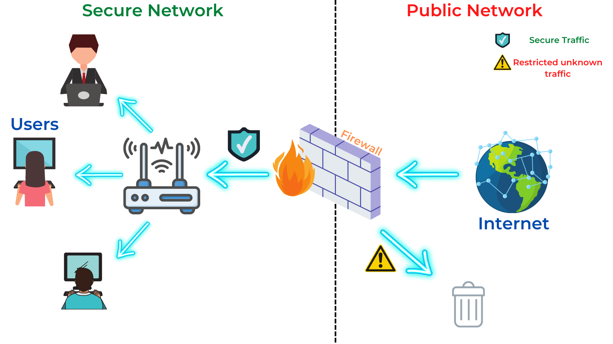

:orphan:
(firewalls-creating-trust-barriers-to-stop-external-threats)=
# Firewalls: Creating Trust Barriers to Stop External Threats

A firewall is an essential component of any organization's security infrastructure. It can be implemented as hardware, software, or a hybrid of the two. A firewall can help to protect a network from attack by restricting unauthorized incoming traffic. A firewall is often used to create a barrier between a trusted internal network and an untrustworthy external network, such as the Internet.

## Different types of firewall 

Firewalls are classified into two types: hardware and software. In this section, we will look at the various types of firewalls and their advantages and disadvantages.

### Hardware-based firewall

A hardware-based firewall is typically installed at the network's edge as an integral part of the router or as a standalone device. It is an important network component that helps to defend a local system with minimal setups. It employs a method known as packet filtering to examine the headers of packets with the owner's predefined source and destination addresses. If the source or destination IP addresses match, packets are transmitted to the user; otherwise, packets are rejected. Implementing a hardware-based firewall can be complicated and expensive.

**Advantages:**

- **No Interference:** As hardware firewalls are not connected to the network, they do not load or slow down the system. It can be easily replaced, removed, or shut down with little to no disruption to daily operations.

- **Speed:** Hardware-based firewalls are designed to provide a faster reaction time and handle heavy traffic volumes.

- **Security:** A firewall with its own hardware and operating system adds another layer of security and makes it less vulnerable to attacks.

**Disadvantages:**

- More expensive than a software-based firewall
- Difficult to implement

### Software-based firewall

In most operating systems, a software-based firewall sits between an application and the network components. In contrast to hardware firewalls, a software-based firewall can be quickly installed and configured to meet the demands of the user. It protects against unwanted access and malware by filtering all incoming traffic.

This form of firewall consumes more resources in order to work, slowing down the system and increasing the load on it.

**Advantages:**

- Less expensive than a hardware-based firewall
- Mainly used for home use
- Easier to implement

**Disadvantages:**

- Consumes more system resources
- Could be disabled by the user or an attacker that has gained elevated privileges on the machine

## Firewall limitations

Firewalls are an important security tool to protect any system but they come with some limitations.

- Firewalls are ineffective against social engineering attacks, which involve sending a malicious link to an employee via email.
- Internal attacks cannot be prevented by firewalls.
- Because all connections must pass through a firewall, it can occasionally create a bottleneck..
- Firewalls cannot read tunnelled traffic; for example, while using a VPN, data is tunnelled from source to destination.
- Software-based firewalls can sometimes slow down the internet and make services unavailable.
- A firewall does not provide protection if there is a misconfiguration in the application or network settings.
- Firewalls do not prevent attacks from a common port or application.

## Final Words

A firewall is a software or hardware-based device that prevents unwanted access to your computer. It accomplishes this by screening traffic and banning certain types of traffic deemed harmful. Firewalls can be quite effective in preventing malicious attacks, but they are not without limitations. It's crucial to remember that a firewall is only as good as its configuration, so make sure your firewall is set up correctly to safeguard your system.

> **Do you want to get practical skills to work in cybersecurity or advance your career? Enrol in [MCSI Bootcamps](https://www.mosse-institute.com/bootcamps.html)!**