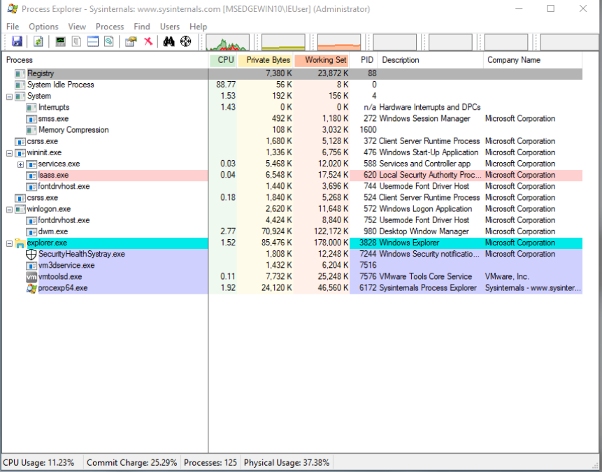

:orphan:
(get-a-handle-on-windows-processes-and-services-for-better-anomaly-identification)=

# Get a Handle on Windows Processes and Services for Better Anomaly Identification

Whether you intend to use Windows 10 to run your samples or collect samples from a Windows 10 environment, it is crucial to be able to distinguish between normal and abnormal Windows 10 processes. Once you comprehend what is running and how it is running, it will be simpler to identify anomalies. While this post is not about Threat Hunting (check out [Threat Hunting blog posts](threat-hunting-main-page)), where this approach could be extremely useful, we believe it will be useful for Malware Analysis.

It is preferable to use [Sysinternals Process Explorer (procexp)](https://docs.microsoft.com/en-us/sysinternals/downloads/process-explorer) when reviewing this section so that you can visualize the information. On the bottom are displayed a few of the Windows 10 processes that will be discussed in this section:

**System Idle process** - This is not truly a process and is used to track the idleness of the system's `CPU`. This process has no parents and have `PID: 0`. No true image, cmd line, etc. Note that its created by `ntoskrnl.exe`. Always runs in kernel-mode. Number of threads represents the number of available CPUs: one thread for each CPU to keep it busy.

**Windows Registry** - Not truly a process. No parent (was 4 (system)). No image. In lieu of _page pools_, used for managing the _Windows registry_. Therefore, it serves as a cache for the Windows Registry in memory rather than on disk.

**System process** - There is no true image for this process too! This process also has no parents and have `PID: 4`. Childs: `smss.exe`, Memory Compression and Interrupts.
Note that:

- Created by `ntoskrnl.exe`
- Runs in kernel-mode only
- Owns the sockets and handles to any file that the kernel opens
- Processes ID are multiple of 4 with the value 4 belonging to system

You might be asking: _Why did the System Process have a Process ID of 4 when the System Idle Process had 0?_

Process IDs on Microsoft Windows are multiple of 4, with the value of 4 always belonging to System.

**Windows interrupts** - Interrupts is not truly a process. Parent: system. No image. Just used to measure the time required to service HW interrupts and deferred Procedure Calls.

**Windows Memory Compression Process** - Memory compression "Process". Parent process is system. Used to store memory compression in its address space. Useful for systems with restricted assets.

**Windows Session Manager Subsystem** - `smss.exe`. Parent process is `system` and started by system. Childs: `winlogon.exe`. Image: `C:\Windows\System32\smss.exe`. Cmdline is `SystemRoot\System32\smss.exe`.
Notes that:

- 1st User-mode process
- Responsible for initiating user sessions
- At any given time, only one copy should exist!
- Create session number one
- Create session number zero (system services)
- Begins during boot-up;
- Initializes environment variables
- Loads the subsystems `OS/2`, `POSIX`, and `Windows (Win32)`.
- Loads both the kernel and user modes of the `Win32` subsystem: `Win32k.sys` (kernel mode) and `winsrv.dll` and `csrss.exe` (user mode)
- Creates `DOS` device mappings (such as `COM`, `LPT1`, and drive letters) that are listed at `HKLM\System\CurrentControlSet\Control\Session Manager\DOS Devices`.
- Creates memory paging files for virtual memory

**Windows Initializasion Process** - `wininit.exe`. This is created by `smss.exe` but not the currently running copy. What happens is, another `smss.exe` creates this process then exits. (Parent dies). The child processes creates on Windows 10:

- `services.exe`
- `lsass.exe`
- `Fontdrvhost.exe`
- `Ism.exe`
- `LsaIso.exe`
- `WerFault.exe`

Image is `C:\Windows\System32\wininit.exe`. Cmdline: `wininit.exe`.
Notes:

- Creates the `%windir%\temp` directory
- `DEP` and High Entropy `ASLR` enabled
- Check Strings /Environment

**Windows Service Control Manager (SCM)** - `Services.exe`. Parent process is `wininit.exe`. Childs: `svchost.exe` (System and ShareHost Third-Party services), Third-Party Services Standalone .exe. Systen Scheduled Tasks set to run with system privileges and task action set to custom handler.
Cmdline is `wininit.exe`. Cwd: `C:\Windows\System32`.
Notes that:

- `SLR`, `DEP`, `CFG` all enables
- Used to control services that run as background services and are not attached to a user session
- SCM will either directly start the process or call `svchost.exe` which will host the service DLLS.
- Only one instance should be running at any given time
- Runs under session 0

**Windows Service Host Process** - `svchost.exe`. Parent process is `services.exe`. What abouts childs? Many should adopt the blacklist method (`cmd.exe` and parent cmdline!="\*schedule\*" may detect backdoor shell activity). Images is `C:\Windows\System32\svchost`.
Note that:

- Multiple instances can be running
- User should be one of three options:
  1. NTAUTHORITY\SYSTEM
  2. LOCAL SERVICE
  3. NETWORK SERVICE
- Must include `-k <name>`, where `<name>` is a category key value
- in the registry: `Software\Microsoft\Windows NT\currentVersion\Svhost`
- All instances should be running in session 0
- Cmd Check: `tasklist /svc/ fi "IMAGENAME eq such"`

**Local Security Authentication Server** - `lsass.exe`. Parent process `winlogon.exe` for pre-Vista Windows versions, and `wininit.exe` for post-Vista Windows versions. Image is `C:\Windows\System32\lsass.exe`. Cwd is `C:\Windows\System32\`.
Notes that:

- Location of autostart is: `HKLM\System\CurrentControlSet\Services\VaoHSV`
- Utilizes session 0 (3e7)
- In charge of enforcing the security policy, validating passwords, and generating access tokens.
- Usually target for code injection
- Receives the username and password captured by `winlogon.exe` for authentication and checks to see if they match those stored in the registry or active directory.
- The `LSASS` process calls `NtCreateToken` to generate an access token object containing the user's security profile, and then sends it to `winlogon.exe`.

**Windows Explorer** - `explorer.exe`. Parent process is `userinit.exe` or `winlogon.exe`, but can be anything `.exe` using `explorer.exe`. Children processes: Anything started by interactively by a user session (e.g. `firefox.exe` or `mspaint.exe`) and programs set to autostart (`RunKey` and `StartupFolder`). Image is `C:\windows\explorer.exe`.
Notes that:

- Parent will show as `<Non-existent Process>` since `userinit.exe` terminates itself.
- Autostarts from: `HKLM\SOFTWARE\Microsoft\Windows NT\CurrentVersion\Winlogon\Shell`

**Windows Logon** - `winlogon.exe`. Parent is "does not exist" since `smss.exe` exits. Childs processes are: `dwm.exe`, `mpnotify.exe`, `fontdrvhost.exe`, `userinit.exe`, `PhotoScreensaver.scr` and `scrnsave.exe`. Image and cmdline is `C:\Windows\System32\winlogon.exe`. Cwd: `C:\Windows\System32\`.
Notes:

- Used for interactive user logon and logoff when SAS keystroke combinations (ctrl+alt) are employed. Processes
  `Ctrl+Alt+Del`
- Executed in session 1
- Changes to files and directories protected by Windows File Protection are monitored
- When credentials are required and the UI displays the logon dialog, `LogonUI.exe` may be generated.
- `winlogon.exe` can also call Network Provider DLLs if additional secure authentication is required.
- Secure Authentication Sequence (SAS)
- is used to send the username and password to `LSASS.EXE` via LPC, and in return receives an access token object containing the user's security profile. Then, under the registry key `HKLM\Software\Microsoft\WindowsNT\CurrentVersion\Winlogon`, `winlogon.exe` calls the initial process (`userinit.exe` by default).

**Windows Client/Server Runtime Subsystem** - `csrss.exe`. No parent process. Image is `C:\Windows\System32\csrss.exe`.
Notes that:

- User-mode process that is part of the windows32 subsystem.
- Legacy process (from Windows NT)
- Responsible for the Windows console
- With `win32.sys` kernel-mode devices driver, plus `conhost.exe` for console windows, in addition to a variety of DLLs to convert Windows API calls to kernel mode system service calls.
- An idle process that monitors the CPU's idle time using a single thread

**Windows User Initialization Process** - `userinit.exe`. Parent process is `winlogon.exe`. Childs are `explorer.exe` and `cmd.exe` (or a like) with cmd line containing "\*\\\\netlogon\\\\\*" (stuff set to autostart via NetLogon Share). Initializes the user environment, starts `explorer.exe`, and then exits. This is why `explorer.exe` is displayed without a parent. Note that `winlogon.exe`, the parent process of `userinit.exe`, does not terminate because it also handles system logoff.

**Windows Local Security Authority Process** - `lssas.exe`. Parent process is `wininit.exe`. Childs? Rare (exclude legit ones like passwordfilters and a like). Image is `C:\Windows\system32\lsass.exe`

## References

- [Sysinternals Process Explorer (procexp)](https://docs.microsoft.com/en-us/sysinternals/downloads/process-explorer)

> **Would you like to learn practical malware analysis techniques? Then register for our online course! [MRE - Certified Reverse Engineer](https://www.mosse-institute.com/certifications/mre-certified-reverse-engineer.html).**
