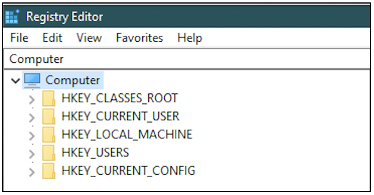
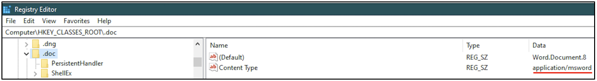
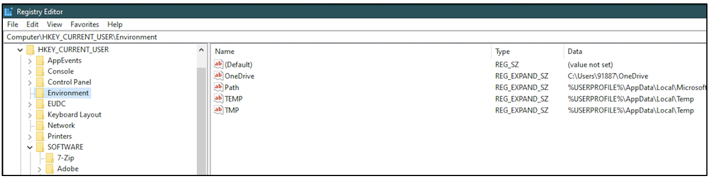
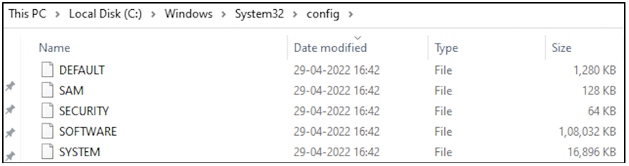
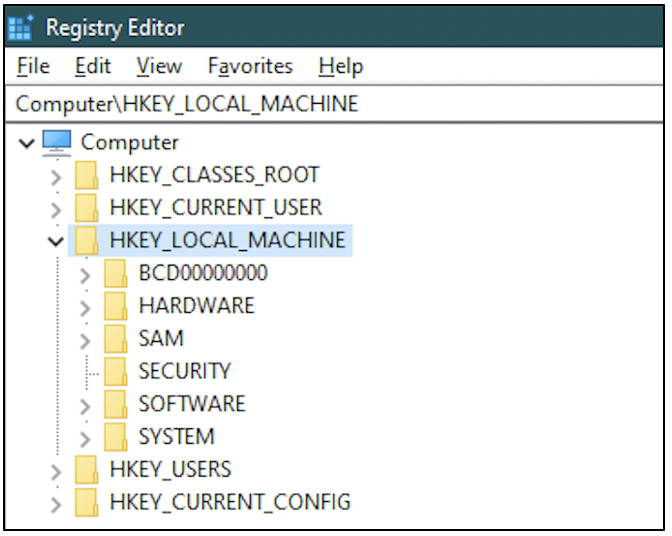
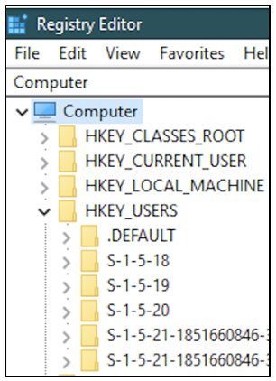
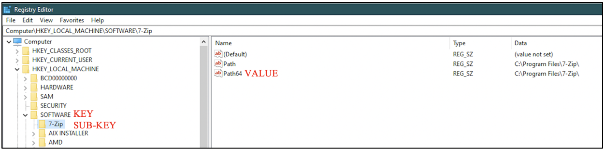

:orphan:
(get-the-most-out-of-the-windows-registry-in-your-digital-forensic-investigations)=

# Get the Most out of the Windows Registry in your Digital Forensic Investigations

Think about a big dictionary! It is like a database of words listed along with multiple meanings, synonyms and antonyms for each. Likewise, Windows systems store configuration information in a database commonly referred to as the Windows Registry. This blog post will give you a brief idea about the registry and how it may be useful during a forensic investigation.

## What does the Windows Registry contain?

The Windows Registry holds configuration information about all the applications on the system, user-specific settings, configuration of various hardware devices used by the system, settings for all the software on the system, etc.

## How to access the Windows Registry?

To access the contents of these files, the _Registry Editor_ application can be used. The registry is made up of five main branches called _hives_, shown in the following screenshot.

- **HKEY_CLASSES_ROOT**: This hive is abbreviated as HKCR. It typically has information about the association between file extensions and the applications to open them with. From the following screenshot, we can see that files with _.doc_ extension are configured to be opened with Microsoft Word.

- **HKEY_CURRENT_USER**: This hive is abbreviated as HKCU. It has settings specific to each user on the system. It has information about the installation path for every application on the system, PATH variable settings for every user, location of temporary folder for every user, etc. This is shown in the following screenshot.

- **HKEY_LOCAL_MACHINE**: This hive is abbreviated as HKLM. It is the most critical hive on a system. It contains information relevant to system startup, user passwords, boot files, security configuration, etc. The information stored on this hive can also be found via Windows Explorer at _%SYSTEMROOT%\System32\Config_ folder, across five files: DEFAULT, SAM, SECURITY, SOFTWARE, SYSTEM. The following screenshot shows how the files would appear on your computer.

These files are readable through the Registry Editor application.

- **HKEY_USERS**: This hive is abbreviated as HKU. This hive has user-specific configuration information for all the currently logged on users to the computer. The information is organized according to the Security Identifier (SID) for a user. The folder names shown in the following screenshot have been truncated.

- **HKEY_CURRENT_CONFIG**: This hive is abbreviated as HKCC. This hive is actually a shortcut to a path in HKLM which holds real-time information about the hardware profile currently being used.

All the hives store data as key-value pairs. It is possible for a key to have numerous sub-keys.

## How is the registry useful during a forensic investigation?

If you are acquiring the memory from a computer for forensic analysis, there is the possibility of finding recently modified registry keys that have not been written to disk yet. You can read **[more about introduction to memory forensics](discover-the-truth-with-memory-forensics)**.

If you are acquiring the forensic image of a computer’s hard disk, then you will have complete access to the registry on it. You can read more about _[forensic images](get-the-evidence-you-need-with-forensic-images)_.

## What information is useful from the registry?

From the registry, you can find critical information that can change the course of your entire investigation.

- Is prefetching enabled or disabled on this computer? You can find more information about _[Prefetch files](windows-prefetch-files-may-be-the-answer-to-your-investigation)_. If you find that prefetching has been disabled, then it is quite difficult to find which binaries were executed recently on the computer.
- Is hibernation enabled or disabled on this computer? You can find more information about _[Hibernation files](windows-hibernation-files-in-digital-forensics)_
- Is the pagefile cleared when the system is shut down?
- Which applications are automatically started when the system is booted?
- Do deleted files land in the Recycle Bin or are they gone forever?
- Is Event logging enabled or disabled on this computer?

## Project Idea

Here is a small project idea for you!

1. Open the ‘Registry Editor’ application on your computer
2. Navigate to _HKLM\SOFTWARE\Microsoft\Windows\CurrentVersion\Run_. This path is often referred to as the registry location for _Autostart_ programs (applications that are automatically started when the system is booted)
3. View all the programs that will start when your system has been booted

Why is this registry path useful? Let’s assume you downloaded a video attachment from an email. When you opened that video, you noticed that it also opens up _Notepad_ application on its own and it has some content written in a foreign language. You closed that video, but every time you restart your system, you notice that _Notepad_ application opens automatically and the same foreign language content is displayed.

What is happening here is: when you downloaded the video attachment, you have accidentally downloaded some malware onto your computer. The video could have been from a malicious source. That malware has modified the autostart location in the registry to bring up the binary for _Notepad_ whenever the system is rebooted.

Knowing how the registry works and how critical evidence can be interpreted is a valuable skill for a forensic investigator.

> **Want to learn practical Digital Forensics and Incident Response skills? Enrol in [MCSI's MDFIR - Certified DFIR Specialist Certification Programme](https://www.mosse-institute.com/certifications/mdfir-certified-dfir-specialist.html).**
