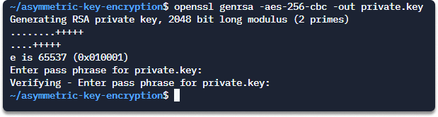
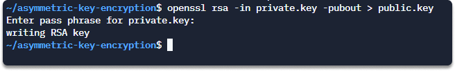
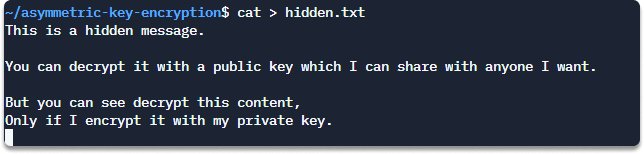
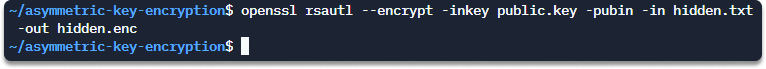
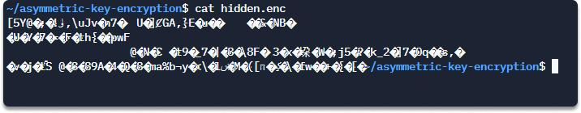
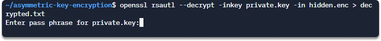
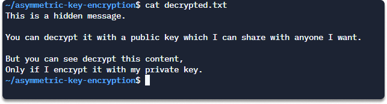

:orphan:
(hands-on-with-public-key-cryptography)=

# Hands On with Public Key Cryptography

In this blog post, we are going to introduce public-key cryptography, in which you have two keys to hide and write data, and we will look at applications, benefits, and drawbacks. Finally, in the last section, we will do an exercise to apply cryptographic skills to a passion project.

## What is asymmetric (public-key) cryptography?

Symmetric cryptography is much quicker but less secure than asymmetric encryption.
You need two keys to encrypt and decrypt a message:

- The public key for encryption
- The private key for decryption

To encrypt and decrypt, opposing and adjacent keys must be used in combination.

## Applications of asymmetric algorithms

Public key authentication is utilized in digital signature processes, in encryption activities (in which information is encrypted with a public key and decrypted with a private key), and in authentication or encryption of session keys (where you encrypt the session key with a public key to supply confidentiality).

Asymmetric key cryptography is used in:

**digital signatures**: You can also utilize asymmetric key algorithms to enable digital signature technology. Let’s say your friend wants to ensure that a message bearing his name was sent by him. He or she needs to generate a message digest with a hashing method. He will need his private key to encrypt the message digest. You decide to validate your friend’s signature. You also want to verify that the digest of the message you decrypted is correct. The only way of achieving this is by using your friend’s public key.

**encryption**: Let’s assume that you want to send a message to a friend with an asymmetric system. Let’s take a glance at the keys used for what purpose and who uses them.
You create the message you want to send to your friend and encrypt it with your friend’s public key.
Your friend wants to open the message. Your friend can decrypt the encrypted message with his private key. Your friend is the only person who can decrypt the message you sent by encrypting it with a public key (which is your friend’s). Let’s say your friend wants to reply but in an encrypted form. Again, your friend goes with the asymmetric system because he or she doesn't trust the symmetric algorithm. Your friend encrypts the message only by using your public key. You get the message and want to decrypt it. You need your friend’s private key. Private keys are for encryption, and public keys are used in decryption.

**session key authentication**: You can encrypt a session with a public key to ensure key credential confidentiality.

## Advantages of asymmetric key cryptography

There are various advantages to using asymmetric encryption versus symmetric systems.
The following are some of the primary advantages of asymmetric key cryptography:

**Integrity, authentication, and non-repudiation**: If a user does not reveal their private key to others, communication signed by that user can be proven to be accurate and from a specific source and cannot later be rejected.

**Scalable**:The same key pair is used to interact with all asymmetric cryptosystem users. As a result, the technique is quite scalable.

**Easy administration**: Asymmetric systems allow users to be deleted much more simply. Asymmetric cryptosystems have a way of canceling keys, essentially eliminating a user from the system.
Anyone who agrees to take part in this system will be given not one, but two keys. They need to make their public key available to anybody they want to bind with.

## Weaknesses of public-key encryption

The following are some of the drawbacks of asymmetric key cryptography:

**speed**: Applications require massive amounts of secure information transfer utilities from both asymmetric and symmetric cryptography to complete transactions.

**performance**: Asymmetric systems do not perform well with large amounts of data.

**trust**: An accepted public key system must be able to clearly and reliably combine a key pair with a specific individual or party. You can address this issue through public-key infrastructure (PKI).

Advantages of the PKI system for key sharing
A PKI system can provide a safe and secure way of linking a key pair to a specific user or party, and is thus a commonly used technique for accomplishing this aim.

## Summary

Asymmetric (Public-Key) Public-key cryptography, is a type of cryptography in which the encryption key is not identical to the decryption key. This means that anyone can encrypt data with a public key, but only the person who has access to the corresponding private key can decrypt it. This type of encryption is often used in online transactions and for securing sensitive data.
The advantages of asymmetric (public-key) cryptography are that it's more efficient than symmetric (private-key) cryptography .

## Hands-on with Public-key cryptography

_Time Estimated: 10 Minutes_

In this activity, we are going to create a private key with symmetric encryption (with AES256 cipher) on Linux with _OpenSSL_. And we will also create a public key to share with people. Lastly, we will verify that we can decrypt this file only with a private key.

Let’s start!

**Step 1** First of all we are going to create a password-protected private key with symmetric encryption and specify our choice of a cipher as `AES256`. Copy and paste this command to your shell.

`openssl genrsa -aes-256-cbc -out private.key`

**Step 2** Create a public key from your private key.

`openssl rsa -in private.key -pubout > public.key`

Enter your password if you have specified.

**Step 3** Create a file that will contain your hidden message.

`cat > hidden.txt`

Type Ctrl+D when you are finished.

**Step 4** Encrypt the `hidden.txt` file using your public key.

`openssl rsautl --encrypt -inkey public.key -pubin -in hidden.txt -out hidden.enc`

**Step 5** Until now, we have created a private key and a public key out of it. Then we encrypt a file with our public key to share with anybody we want. Now nobody can decrypt the message other than us, because only we have the private key ( assuming that you don’t share your private key with anybody).

Run this command for verification:

`cat hidden.enc`

**Step 6** Now we will decrypt the hidden message using our private key.

`openssl rsautl --decrypt -inkey private.key -in hidden.enc > decrypted.txt`

**Step 7** Open `decrypted.txt` with this command.

`cat decrypted.txt`

> **Do you want to get practical skills to work in cybersecurity or advance your career? Enrol in [MCSI Bootcamps](https://www.mosse-institute.com/bootcamps.html)!**
