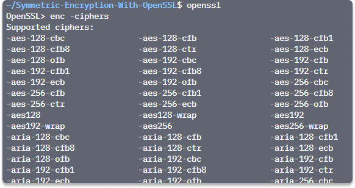
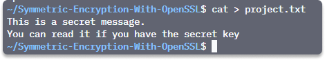
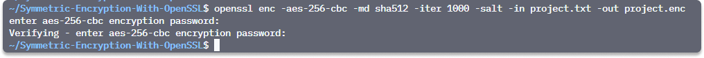
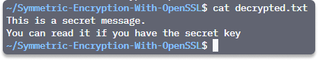

:orphan:
(hands-on-with-shared-key-encryption)=

# Hands-on with shared key encryption

Shared key encryption is a type of encryption where the key is shared between the sender and receiver of the data. This means that both parties have access to the same key, which is used to encrypt and decrypt the data. This type of encryption is often used in communication between two parties who know each other. In this article, we are going to discuss private key encryption, types of ciphers, and examples of encryption systems. We will also talk about security on shared-key algorithms and finally make a quick hands-on activity to apply the information for a solid understanding.

Cryptographic authentication is classified into two types:

- Asymmetric (public) key cryptography
- and symmetric (shared) key cryptography

## Shared key cryptography

Shared key encryption is a symmetric encryption algorithm that uses the same key to encrypt and decrypt the data.
This type of encryption is used in many different applications, such as securing wireless connections or file transfers.

It is also used to authenticate a message sender, which provides proof that the message was not tampered with during transmission.

Symmetric key encryption (which is also referred to as “shared” or “private”) models use a _single key_ for encoding and decoding functions in an authentication framework.

Both the client and server require duplicates of the key for authentication to be successful.

Cryptographic authentication information may be static or dynamically generated.

### Symmetric key algorithms

It uses encryption algorithms such as:

- DES, 3DES, CAST,
- or hash algorithms such as SHA1 or MD5

There are two kinds of symmetric ciphers:

- block ciphers: Triple-DES and the AES.
- and stream ciphers : RC4

**block cipher**: Texts are encrypted in fixed-size blocks by a block cipher. The block dimension is about the specific symmetric cipher and key length.

**stream cipher**: is based on a key. Stream ciphers are faster and smaller to build than block ciphers, they have a security exchange. Certain sorts of attacks employing only the ciphertext can expose information about the plain text if the same keystream is utilized.

To produce a keystream, use a key generation method (The XOR function).

## Well-known symmetric encryption systems

**DES**

- IBM's Data Encryption Standard (DES), is established on the organization’s Lucifer algorithm.
- DES comes with a 64-bit block size and a 56-bit key.
- NIST established DES in 1976 as a government standard for non-classified information encryption, following which it became extensively used in commercial applications.
- DES was used for over two decades, until 1997 when users learned that a 56-bit key size would not provide adequate levels of security.

**3DES**

Triple DES (3DES) was developed to deliver more security than DES. It was an enhanced implementation of DES. It delivered on its promise of more encryption strength than DES, but it proved insufficiently weak to last indefinitely.

**AES**

- The Advanced Encryption Standard is 3DES's replacement (AES).
- AES has been developed to replace both DES and 3DES.
- AES uses the Rijndael Block Cipher, which has a changeable block length and a key length of 128, 192, or 256 bits.

### Security on shared key encryption

The security of this type of encryption relies on both parties using the same key. For example, if one party changes their secret key, then all messages encrypted with it will be unreadable by the other party until they also change their secret keys.

If you share your static key over an untrusted channel or technology, an intruder may gain access to the key and personate one of the reliable clients.

To protect from eavesdropping, provide the key to the peer, on a line other than the one used for transmitting the ciphertext.

## Hands-on with AES

_Estimated Time: 5 minutes_

In this quick activity, we are going to encrypt and decrypt a file with AES256 algorithm on Linux with _OpenSSL_.

_Time: 5 minutes_

**Step 1** Open your terminal and run this command to see different ciphers you can use for the encryption:
`openssl enc -ciphers`:

**Step 2** Create a simple text file to store our secret message. You can name it as you wish (we named it _project.txt_)

`cat > project.txt`

Type `ctrl+ D` when you’re finished.

**Step 3** To encrypt this message, specify a cipher from the list and specify a hash digest for the key generation.

`openssl enc -aes-256-cbc -md sha512 -iter 1000 -salt -in project.txt -out project.enc`

**Step 4** Enter a password.

**Step 5** Type `cat project.enc` to verify that the message is unreadable.

**Step 6** Now we're going to decrypt the _project.enc_ file with this command:

`openssl enc -aes-256-cbc -md sha512 -iter 1000 -in project.enc -out decrypted.txt -d`

**Step 7** Enter the password, which is the same key we used to encrypt the file in step 4.

`openssl enc -aes-256-cbc -md sha512 -iter 1000 -in project.enc -out decrypted.txt -d`

You have successfully applied your symmetric key knowledge by encrypting and decrypting a _.txt_ file with a single key in Linux with OpenSSL.

> **Do you want to get practical skills to work in cybersecurity or advance your career? Enrol in [MCSI Bootcamps](https://www.mosse-institute.com/bootcamps.html)!**
