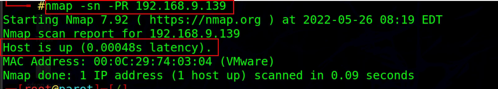
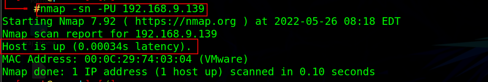
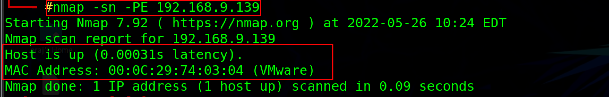
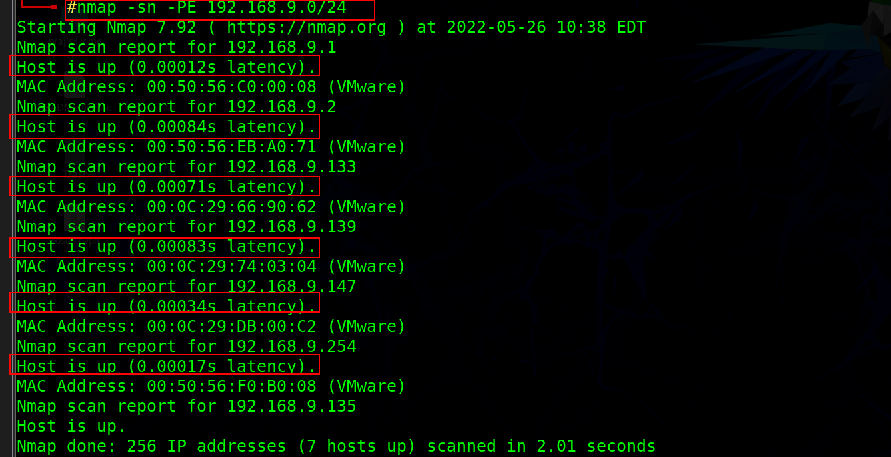

:orphan:
(host-discovery-get-the-information-you-need-about-a-network)=

# Host Discovery: Get the Information You Need About a Network

Host discovery is the process of identifying all the devices that are connected to your network. This can be done manually, but it's often more efficient to use a tool like Nmap. Once you know all the active hosts that are present on your network, the next phase is to begin testing them. Let us have a look at different types of host discovery techniques...

## ARP ping scan

ARP ping scanning is a network scanning technique that uses ARP packets to detect host computers on a network. In the ARP ping scan, the Address Resolution Protocol (ARP) is used to resolve a host's MAC address from its IP address.ARP scan displays the MAC address of the device's network interface as well as the MAC addresses of all other devices on the LAN that share the same IPv4 address. If the host IP associated with the respective hardware destination address is active, an ARP response will be generated.

Nmap can be used to perform an ARP ping scan and identify the live hosts

```
Nmap -sn -PR <your IP address>
-PR option is used for the ARP ping scan.
-sn option is used to disable the port scan.
```



## UDP ping scan

In the UDP ping scan, Nmap delivers UDP packets to the target host, the default ports the Nmap uses to check UDP services are 40 and 125, which are uncommon and used for sending UDP packets to the packet. The attacker sends UDP packets to the target host and if the attacker receives a UDP response means that the target host is active. If the host is inaccessible, the attacker may obtain error messages such as the host is unreachable or TTL exceeded.

```
Nmap -sn -PU <your IP address>
-PU option is used for the UDP ping scan.
```



Ping scans using UDP provide the added benefit of discovering systems behind firewalls with strict TCP filtering.

## ICMP ECHO ping scan :

Attackers and security professionals use ICMP ping scan to send ICMP packets to target specific systems and collect all relevant information. ICMP ECHO requests are sent during an ICMP ping scan. If the host is online, it will respond with an ICMP ECHO. This scan type can be used to determine whether ICMP packets are allowed via the firewall or to locate active devices.

```
Nmap -sn -PE <your IP address>
-PE option is used for the ICMP ECHO ping scan.
```



**Note:** When UNIX/Linux and BSD-based machines perform ICMP echo scanning, these operating systems respond to ICMP echo requests to the broadcast addresses. Due to differences in TCP/IP stack implementation, this method of scanning does not work on Windows-based networks.

## ICMP ECHO ping sweep

This type of ping sweep is a basic scanning technique used to determine which IP address ranges map with live hosts. This type of scan is also known as ICMP sweep. ICMP ECHO requests are sent to multiple hosts during a ping sweep, and if the host is active, it will respond with an ICMP ECHO reply.

`Nmap -sn -PE <your IP address range>`



Final words:

There are various methods one can use to identify if the host is alive or not based on which operating system is present on the target system. The following are some host discovery countermeasures.

- Configure the firewalls to detect and block ping sweep attempts automatically.
- Use IDS and Intrusion prevention systems to prevent ping sweep attempts.
- Kill the connection with any host that sends more than 10 ICMP ECHO queries.

:::{seealso}
Looking to expand your knowledge of penetration testing? Check out our online course, [MPT - Certified Penetration Tester](https://www.mosse-institute.com/certifications/mpt-certified-penetration-tester.html)
::: In this course, you'll learn about the different aspects of penetration testing and how to put them into practice.**
