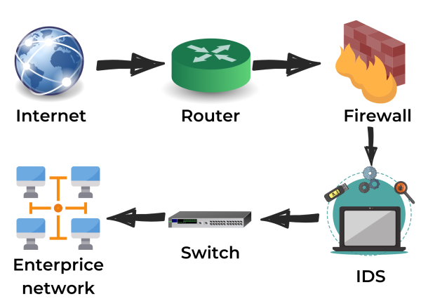

:orphan:
(how-do-intrusion-detection-systems-work)=

# How do intrusion detection systems work?

The intrusion detection system (IDS) is a security system that monitors, detects, and protects a network from malicious activity. IDS works by alerting when an intrusion is detected. IDS are widely used to strengthen an organization's security because they monitor all incoming and outgoing traffic for any malicious activity.
There are two kinds of IDS: active and passive.

Passive IDS detects malicious network activity, whereas active IDS detects and prevents malicious network activity.

## How does an IDS work?

The fundamental goal of an intrusion detection system is to intercept, detect attacks, and prevent hostile activity. Intrusion detection systems are typically positioned before or after the firewall, depending on the traffic to be monitored.

- Initially, network traffic is received from the internet by the router linked with the organization's network.
- As illustrated in the diagram above, the traffic moves across the network and arrives at the Intrusion detection system.
- Intrusion detection systems have sensors that monitor specific malware signatures in the packets
- If the IDS detects malware activity then it sends an alert of a probable attack to the Incident Response team
- In some cases, a preset set of actions is taken to contain the attack

## Intrusion detection methods

### **Anomaly-based Detection**

Anomaly detection is a method that contains a database of how a system normally behaves. The behaviors of the systems compared with the database, anything else is considered an anomaly, and an alert is generated for a potential threat. Although his method is useful in detecting threats, creating a model of normal software use patterns is the most challenging part.

### **Signature-based detection**

Signature-based detection works by compiling a database of all known malware; each malware has its own signature. Signature-based detection finds intrusions by simulating pattern matching of malware signatures and network events. Because signature-based detection compares to a known database of malware signatures, it has a high threat detection rate and few to no false positives.

### **Hybrid Detection**

This is a technique that uses both Anomaly-based and Signature-based detection. This allows an organization to efficiently detect, intercept and contain more potential threats with fewer to no false positives.

## Categorizing Alerts

Intrusion detection system alerts are classified into four types.

### **True Positive**

A true positive occurs when the intrusion detection system generates an alarm if a legitimate attack is underway. An attacker is actively attempting to infiltrate a network in this situation.

### **False Positive**

A false positive occurs when an incident causes an alarm despite the fact that no genuine attack is taking place. It happens because the intrusion detection system misidentifies normal system behavior as an attack.

### **False Negative**

A false negative occurs when the intrusion detection system fails to alert despite the network being attacked. This is the most dangerous failure because the system's primary function is to detect threats.

### **True Negative**

A true negative is a condition in which an intrusion detection system considers the event in question as genuine, implying that the IDS is functioning properly and disregarding the system's regular behavior.

## Conclusion

In conclusion, an intrusion detection system is a valuable security tool that can be used to protect networks and systems from attack. When choosing an intrusion detection system, it is important to consider the needs of the organization and the environment in which it will be deployed.

> **Do you want to get practical skills to work in cybersecurity or advance your career? Enrol in [MCSI Bootcamps](https://www.mosse-institute.com/bootcamps.html)!**
