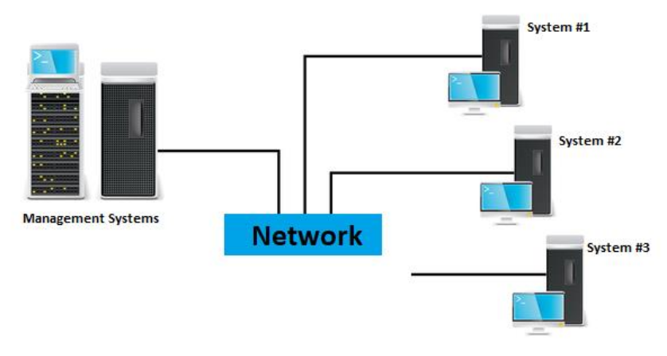
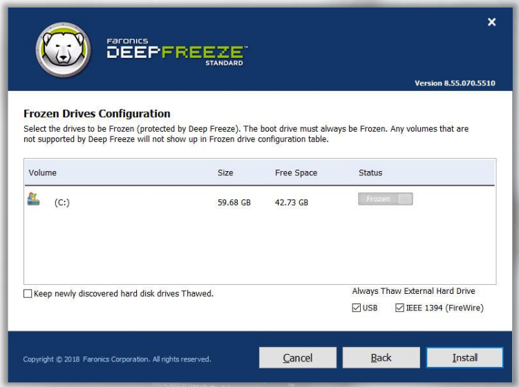
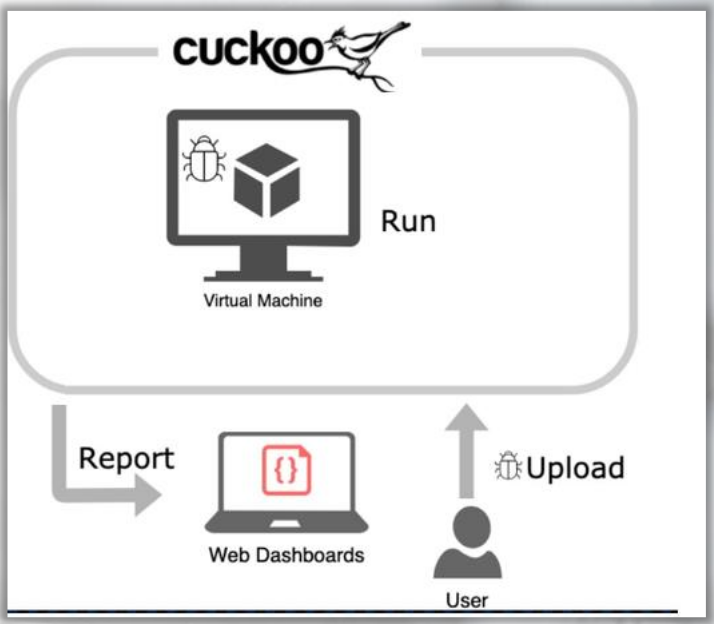

:orphan:
(introduction-to-behavior-analysis-techniques)=

# Introduction to Behavior Analysis Techniques

In this series of blog posts, we will examine several aspects of dynamic malware analysis. We will examine the behavior of malware and why it must be dynamically analyzed, the various dynamic analysis methodologies, and their advantages and cons. and negative aspects of each method, technique, and tool.

## Introduction

We will also explore the technical features of the many varieties of malware, including but not limited to:

- Downloaders
- Droppers
- C&C
- Backdoors
- KeyLoggers
- Fileless malware

Then, we will discuss the techniques used by malware to execute their malicious payloads, such as Injection Techniques, Persistent Methods, LoLBins, etc.

First, we will cover the definition of dynamic analysis, the different forms of dynamic analysis, when to utilize each, and their distinctions.

Then, we will go into the world of Windows processes, including what they are, the many sorts of resources required, and how they are utilized.

Up until now, we believed we could evaluate malware using static methods, such as examining signatures, the functions APIs they employ, or disassembling and examining low-level code.

However, what if these techniques do not reveal much or do not tell the complete story?

What if we have a sample that conceals information?
What if the malware sample is compressed using a bespoke format?
What is the packing mechanism?
What if the malware expands its arsenal?
By updating itself with external code?
How will we proceed?
Be able to determine what and how that occurred?
Sample testing brings you closer to answering these questions.
Consequently, dynamic analysis comes into play here.

_Dynamic Malware Analysis_ is analyzing malware samples by running them in a contained environment.

Yes, we will execute the malware sample to determine what it does, how it acts, the damage it does, what operations are conducted, and how they are executed. During the execution, we will examine the affected systems and services to determine whether the malware is hiding and, if so, how it is hidden. All of this a contained environment.

A contained environment can range from a basic virtual machine to a physically isolated system operating on a physically isolated network. This is contingent upon the type of virus you are battling and your budget.

There is now a discussion regarding the relative usefulness of static analysis vs dynamic analysis. Due to the complexity of the technologies utilized by malware creators, several researchers and analysts believe that dynamic analysis is preferable to static analysis.

However, there is no correct solution, therefore it does not hurt to know all sides and employ them when necessary.

It is the analyst's responsibility to follow, monitor, and comprehend what is occurring, which is another reason why it is referred to as _"dynamic analysis."_

Does that imply that the sample should not be run?
The answer is unquestionably _NO_. If you are prepared and know what you're doing, you should be able to locate some answers.

Execution Environments:

- Virtual Machines
- Separate Physical Systems
- Automated Sandbox

## Virtual Machines

One of the most prevalent methods is to execute the malware sample in a virtual machine.

This VM is typically in a pre-configured state, a point in time that might be quickly rolled back to in the event of an error or the need to repeat a step. The ability to repeat a step with the push of a button is one of the primary reasons this is so popular today!

In subsequent blog postings, we will discuss this topic in further detail.

You may be wondering _if you should install the Virtual Machine Hypervisor on your computer (host)_.

Well, we recommend that you run the sample at a minimum within a virtual machine, but we also recommend that you do so on a computer that does not house sensitive or private data. You never know when you're working with a sample that could escape your sandbox and do damage to your system!

## Separate Physical Systems

This is another alternative for executing malware, however it is contingent on the availability of funds for distinct networks and systems.

This may be the best solution, but it is also the most expensive. Certainly a costly one!

When executing the sample on a physical system, it is advantageous to have tools that can provide the system back to a normal, clean condition; i.e. _"reboot to restore."_ You do not wish to configure your workstation from scratch, do you?

There are many tools that can help, and we will mention a few
of them.

**Shadow Defender (SD)** - A simple-to-use reboot-to-restore security solution for Windows that safeguards the actual environment of your computer from malicious actions and undesired alterations.

_SD_ can run your system in a virtual environment referred to as _"Shadow Mode"_, which can divert each system modification to the virtual environment without affecting your actual environment. This makes malware analysis more practical.

[**DeepFreeze**](https://www.faronics.com/products/deep-freeze) - Another excellent reboot-to-restore security solution that enables system administrators to safeguard the core operating system and configuration files on a workstation or server by restoring the computer to its saved configuration each time it is rebooted.

It could also be beneficial for malware investigation for this reason.

## Automated Sandbox

If you are unable to operate your own environment for a variety of reasons, you still have the option of utilizing an automated sandbox.

[**Cuckoo**](https://cuckoosandbox.org/) is an instance of an automated sandbox environment for malware analysis. This will be covered in further depth towards the conclusion of this subject.

## Feeding the Malware

Another essential aspect of dynamic analysis is adapting to the modifications required by malware. You may now be asking, _"What does that mean?"_ In other words, you must provide the sample you are working on with all the environmental criteria it requires.

In other words, the environment in which the malware is executed on our analysis system must match that of the device it was designed for.

There are two states to define the security level of the contained environment you create:

1. _Insecure environment_
2. _Hardened environment_

**Insecure environment** - To see how malware behaves, one of the techniques employed is to purposefully create an insecure environment devoid of numerous security protections. You need to understand the capabilities of the malware you are working with.

This also necessitates running the sample with elevated privileges to evaluate its performance as a high integrity process.

**Hardened environment** - This method is typically used to test a system's capacity to withstand a successful compromise of the environment.

In other words, you want to determine how secure the environment would be if this malware sample were executed in it. By doing so, you may uncover misconfigurations and/or vulnerabilities in your environment that can be exploited.

Typically, the sample is executed with varied user permissions.

## Dynamic Analysis Methodology

It is always beneficial to adhere to and implement a particular methodology. It is not a rigid roadmap that cannot be altered to accommodate new paths, but it is a reasonable starting point for the majority of malware samples that we will execute in a controlled environment.

Each phase of the technique consists of a varied number of activities or steps:

- _Phase 1: Baseline_
- _Phase 2: Pre-Execution_
- _Phase 3: Post-Execution_
- _Phase 4: Analyze and Document_

Frequently, numerous iterations are required between phases 2 and 4 to complete the study.

**Phase 1: Baseline:**

1. Create a VM with the OS needed.
2. Install all the tools needed.
3. Take a snapshot of the VM.
4. This will be considered your baseline

**Phase 2: Pre-Execution**

1. If required, perform any special setting.
2. Transfer a Malware Sample to a Virtual Machine.
3. Launch the necessary tools (for example, monitoring, tracking, debugging, etc.).

**Phase 3: Execution:**

1. Execute the Malware.
2. Commence watching and tracking its behavior and activities:
   System calls - File access - Network traffic - And so forth...
3. Screenshots, memory dumps, configuration files, registry files, unpacked executables, etc.

**Phase 4: Analyze and Document:**

1. Analyze and take notes of everything that happened.
2. Observe exhibited behavior.
3. Document events and actions.

This will help with your final report.

## References

- [Shadow Defender](http://www.shadowdefender.com)
- [Deep Freeze](https://www.faronics.com/products/deep-freeze)
- [Sandboxie](https://www.sandboxie.com/)
- [Cuckoo Sandbox](https://cuckoosandbox.org/)
- [Practical Malware Analysis Book](https://www.amazon.com/Practical-Malware-Analysis-Hands-Dissecting/dp/1593272901)

:::{seealso}
Would you like to learn practical malware analysis techniques? Then register for our online course! [MRE - Certified Reverse Engineer](https://www.mosse-institute.com/certifications/mre-certified-reverse-engineer.html)
:::
