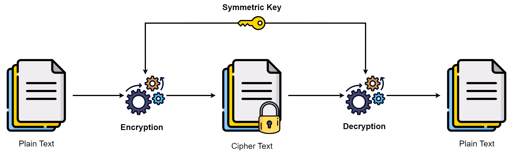
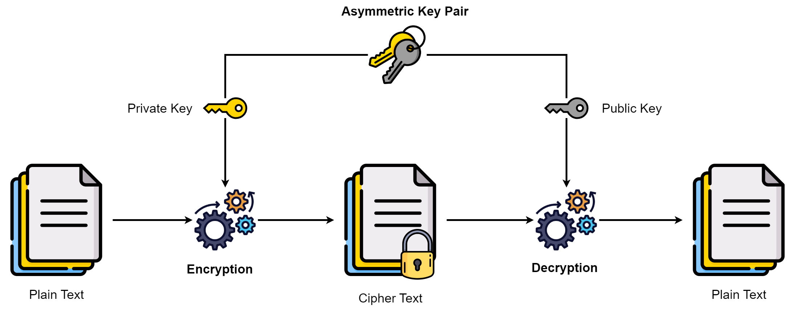
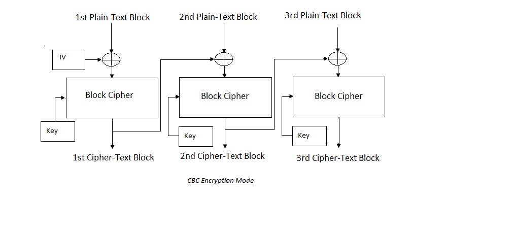
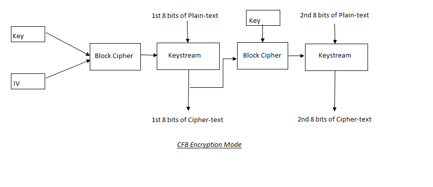
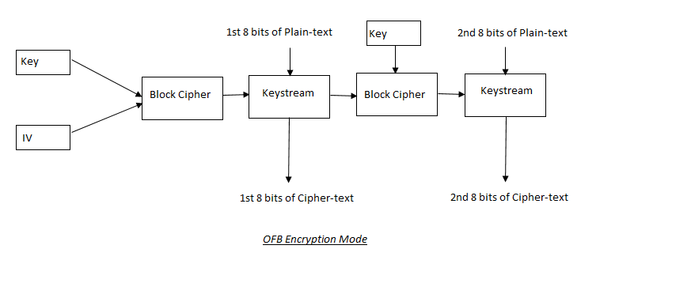
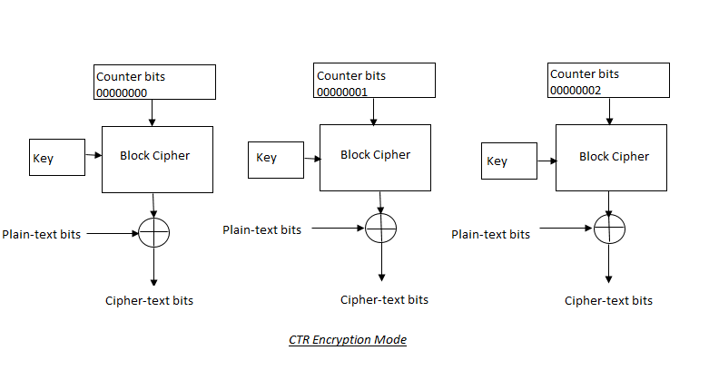

:orphan:
(introduction-to-cryptography-and-block-cipher-modes)=

# Introduction to Cryptography and Block Cipher Modes

Cryptography is the science of encrypting sensitive information into an unreadable format so that it can only be viewed by intended recipients. Messages such as sensitive state secrets or communication between military groups have been delivered using cryptographic methods throughout history. With rapid development in the field of computer science, cryptographic techniques have evolved over time to ensure safe data transfer.

## Introduction

Encryption is an application of cryptography. It is the process of converting plain text into cipher text using various algorithms and keys. Plain text is described as the original message in an easily readable format. Cipher text is a message that has been encrypted in such a way that it cannot be understood without decrypting.

The set of rules/techniques utilized for encrypting and decrypting data is known as an encryption algorithm. The majority of these rules/techniques take the form of sophisticated mathematical formulas.

An encryption key is a randomly generated set of characters and/or numbers that is used to scramble/unscramble the data.

After the message is delivered, it is decrypted and returned to its original form on the receiving end. Decryption is the process of converting cipher text back into plain text.

### Types of Encryption:

Based on the cryptographic techniques utilized, there are two basic types of encryption: symmetric encryption and asymmetric encryption. Let's take a closer look at each of these types.

#### Symmetric Encryption:

The sender and receiver utilize the same keys for encryption and decryption in Symmetric Encryption. The secret key is another name for the encryption key. The key must be protected by the users on both the sending and receiving ends.

The strength of the symmetric encryption depends upon the security of the secret key. If the secret key's security is compromised, your information may be exposed to unauthorized entities. The key should be shared between the sender and receiver over secure communication channels.

For the same key length, symmetric encryption is much faster and stronger than asymmetric encryption. It is substantially more difficult to decrypt data encrypted with symmetric encryption. The symmetric encryption's strength grows as the key length increases. In comparison to asymmetric encryption, symmetric encryption can encrypt huge volumes of data very quickly.

Systems that use symmetric encryption are not scalable. This means that as the number of persons who require a key for encryption grows, so does the number of keys. As a result, key management is a difficult task. The formula for calculating the number of keys required by **n** number of people:

`Number of symmetric keys needed = n(n-1)/2`

This means that if 100 people want to communicate with each other using symmetric encryption, 4950 unique keys would be required.

Symmetric encryption only ensures data confidentiality. There is no way to tell who is sending the data with symmetric encryption. As a result, authentication is not provided by symmetric encryption.

#### Asymmetric Encryption:

The sender and receiver utilize different keys for encryption and decryption in asymmetric encryption. The two keys are related mathematically.

Public-key cryptography is another name for asymmetric encryption. The public and private keys are the two types of keys. The public key is a key that is accessible to everyone. The private key is a key that can only be known by the owner. If an attacker obtains the public key, he should not be able to extract the private key from it. Encryption and decryption are accomplished using both public and private keys. If the data is encrypted with the public key, the only way to decrypt it is to use the private key. In contrast, data encrypted with the private key can only be decrypted using the public key.

In contrast to symmetric encryption, which only provides data confidentiality, asymmetric encryption provides both confidentiality and authentication. If the sender is transmitting sensitive information to a specific person, the data will be encrypted using the receiver's public key. Only the person who received the data, i.e. the receiver, will be able to decrypt it using his private key. This is how asymmetric encryption ensures the confidentiality of data.

If the sender wants to ensure the receiver that the data came from him alone, he will encrypt the data with his own private key. Using the sender's public key, anyone on the receiving end will be able to decrypt the data. Authentication is provided by this technique, which ensures that the data received is actually from the sender.

In comparison to symmetric encryption, asymmetric encryption is substantially slower. This is because asymmetric encryption performs complex mathematical processing on data before transmission. Symmetric encryption simply entails repeatedly transposing and substituting data bits which is not a processor-intensive process.

When employing asymmetric encryption, key management and distribution are much easier. This method does not require secure key distribution. Instead of worrying about distributing unique keys, you may just distribute your public keys to the people you wish to communicate with.

### Types of Symmetric Encryption algorithms:

Block ciphers and stream ciphers are the two main types of symmetric encryption algorithms.

#### Block Ciphers:

The message is separated into blocks of a specified length in block ciphers. To generate cipher text, each of these blocks is mathematically processed using an encryption key. To prevent creating patterns in the cipher-text, block ciphers sometimes use an Initialization Vector.

Initialization Vectors are a randomly generated set of bits that are combined with the key to be used in the encryption process. It's because if the key stays the same, two plain-text blocks encrypted with the same key will generate identical cipher-text blocks, resulting in patterns in the overall cipher-text. It will make it easier for the attacker to decrypt the data and uncover the key.

#### Stream Cipher:

A stream cipher does not divide the message into blocks of bits. Instead, each message bit is separately encrypted. Stream ciphers encrypt bits in the stream using keystream generators, which do not form patterns in the overall ciphertext. Stream ciphers are most commonly employed in streaming communication data like audio or video.

#### Block Cipher Modes:

There are five different modes of block ciphers:

<u>1. ECB (Electronic Codebook Mode):</u>

Plain text is split into 64-bit blocks in ECB mode. The same key is then used to encrypt each block individually. If a block is shorter than 64 bits in length, ECB uses block padding. The problem with ECB mode is that it encrypts the same block of plain-text into the same cipher-text, resulting in patterns in the cipher-text. As a result, the ECB mode is vulnerable to cyber-attacks.

The ECB mode of block cipher encryption is the quickest and most straightforward. Each cipher-text block can be decrypted independently from the others. As a result, any cipher-text block can be decrypted without having to wait for subsequent cipher-text blocks to arrive.

<u>2. Cipher Block Chaining Mode:</u>

The CBC mode was a step forward from the ECB. By injecting randomness, CBC mode addresses the problem of patterns in the ciphertext. In CBC mode, each plain-text block is encrypted using the value of the previous cipher-text block. An IV (Initialization Vector) is used to encrypt the initial block of plain-text. Each cipher-text block's bits are XORed with the bits of the following plain-text block. The output is then sent into the block cipher, which uses the encryption key to encrypt the plain-text bits.

This chaining technique implies that each cipher-text block is reliant on the previous blocks. If an error occurs in one block of cipher-text, it will affect all subsequent blocks since the error will be propagated.

<u>3. CFB(Cipher Feedback Mode):</u>

CFB is similar to CBC, but with a few differences. CFB makes use of both block and stream ciphers. The encryption key and the IV are combined to create a keystream of random bits. To produce the eight bits of cipher-text, the bits of the keystream is XORed with the initial eight bits of plain-text. The destination receives one copy of the cipher-text bits. The other copy is used to encrypt the next eight bits of plain text. Using this encryption method increases the randomness of the cipher-text produced.

If there is an error in one block of cipher-text in CFB mode, it will affect all subsequent blocks because the error will be propagated.

<u>4. OFB (Output Feedback mode):</u>

Instead of cipher-text blocks, the keystream is utilized to encrypt each block of plain-text in output feedback mode. The keystream bits are created by combining the encryption key and IV. Before the XOR operation, these bits are passed to the following block. After the bits of the keystream is XORed with the plain-text, the cipher-text is generated.

Because each plain-text block is encrypted independently of the other, the chances of errors propagating to next blocks of cipher-text are low with OFB. So if a cipher-text block contains an error, only that block will be affected.

<u>5. CTR (Counter mode):</u>

CTR works similarly to OFB mode. It employs an Initialization Vector (Counter) whose bits are incremented with each block of plaintext bits. A unique keystream value is created by combining these counter bits with the encryption key. These keystream bits are XORed with the plain-text bits to produce encrypted cipher-text bits.

The performance of this mode is dramatically improved because it allows for concurrent encryption of individual code blocks. There is also no possibility of error propagation because there is no chaining involved. Each block of code can be decrypted without waiting for subsequent blocks to arrive at the receiving end.

### Symmetric Encryption Algorithms:

There are several symmetric encryption techniques in use today. This section will go through some symmetric encryption schemes.

#### DES (Data Encryption Standard):

IBM developed DES in 1970, and NIST accepted it as a standard in 1977. Due to DES's lack of security strength, it was eventually replaced with AES(Advanced Encryption Standard).

The DES algorithm is a symmetric block encryption method. The DES algorithm divides the data into 64-bit blocks. To produce 64 bits of cipher-text, each block passes through 16 rounds of transposition and substitution. The DES algorithm has a 64-bit key length, with 56 bits for the key and 8 bits for parity.

#### 3DES (Triple-DES):

NIST adopted Triple-DES, or 3DES, to replace DES. It was a fast patch to address DES's security vulnerabilities before a new standard was developed (i.e. AES).

3DES is a variant of DES that performs three times the number of mathematical operations. 3DES conducts 48 rounds of transposition and substitution on 64-bit plain-text blocks. The key length varies from 112 to 168 bits and it uses up to three distinct keys.

#### AES (Advanced Encryption Standard):

AES, formerly known as the Rjindael algorithm, is a symmetric encryption algorithm that was adopted as a standard by the National Institute of Standards and Technology (NIST) in 2001. This technique is presently used to protect sensitive unclassified information in the United States government. It was created to succeed the DES algorithm.

The key length and block side influence the number of computing rounds conducted on the data. 10 rounds are conducted if the key length and block size are both 128 bits. 12 rounds are conducted if the key length and block size are both 192 bits. 14 rounds are conducted if the key length and block size are both 256 bits.

#### Blowfish:

Bruce Scheiner created Blowfish, an open source symmetric encryption technique. It was one of the algorithms designed to replace DES.

The data is divided into 64-bit blocks. Each data block goes through 16 mathematical processing rounds. The Blowfish algorithm's key length ranges from 32 to 448 bits.

#### IDEA (International Data Encryption Algorithm):

IDEA is a patented symmetric encryption method that was intended to replace DES.

It divides the data into 64-bit pieces. Every block is broken into 16 smaller blocks, each of which goes through eight rounds of cryptographic processing. In IDEA, the key length is 128 bits.

#### RC4 (Rivest Cipher 4):

Ron Rivest designed RC4 for RSA Security in 1987. The encryption algorithm is a stream cipher. It is a very quick and efficient algorithm, however it is no longer in use due to several security flaws.

#### RC5 (Rivest Cipher 5):

Ron Rivest invented the RC5 block cipher in 1994. RC5 is a straightforward and quick encryption technique. Block lengths of 32, 64, or 128 bits are used. The length of the key can be up to 2048 bits. Each block of data can be cryptographically processed up to 255 times.

#### RC6 (Rivest Cipher 6):

RC6 is a proprietary block cipher encryption technique derived from RC5. Ron Rivest collaborated with his colleagues at RSA Security to create RC6. It was also a contender to succeed DES.

The data is divided into 128-bit blocks by RC6. The key size can be as much as 2048 bits. In RC6, each data block goes through 20 rounds of cryptographic functions. In comparison to RC5, RC6 offers a significant increase in speed and efficiency.

### Asymmetric Encryption Algorithms:

This section contains a brief description of implementations of asymmetric encryption algorithms.

#### The Diffie-Hellman Exchange Method:

Whitfield Diffie and Martin Hellman invented the Diffie-Hellman exchange technique, which is an asymmetric encryption algorithm. This approach was created to address the problem of key distribution in symmetric encryption. This approach enables the exchange of keys through an unsecured communication channel.

Consider the following scenario to better understand how the Diffie-Hellman Exchange technique works. Using this method, Alice and Bob seek to derive the same symmetric encryption key. They exchange public keys. Alice now encrypts the symmetric key with her private key and Bob's public key using the Diffie-Hellman algorithm. Bob uses this algorithm to decrypt the incoming data using his private key and Alice's public key to extract the symmetric key on the receiving end. As a result, Alice and Bob can successfully exchange keys for subsequent use in symmetric encryption using this method.

This method is vulnerable to person-in-the-middle attacks. It is critical to use authentication mechanisms such as public key certificates to address this security risk. These certificates will verify the identity of the individual sending the data.

#### RSA (Rivest Shamir Adleman Algorithm):

In 1987, Ron Rivest, Adi Shamir, and Leonard Adleman developed the RSA asymmetric encryption method. It's commonly used for security services such as digital signatures, key exchange, and encryption.

The difficulty of factoring huge numbers into their original prime numbers provides the security of this approach. Two very large prime numbers are utilized to generate the public key and private key used in RSA. It is quite difficult to factorize that big number back into prime number pairs in order to decrypt the message using RSA. The key length in RSA is 1024 or 2048 bits.

With symmetric algorithms like DES or AES, RSA is utilized as a key exchange mechanism. This works by using RSA to exchange the key that will be used in symmetric encryption between the sender and receiver. With the receiver's public key, the sender encrypts the symmetric key. The recipient decrypts the message with his private key to retrieve the secret encryption key.

RSA can also be used to create digital signatures. The message can be signed with the sender's private key. Any individual can verify this signature using the sender's publicly available key. This allows the original sender's signature to be verified.

#### ECC (Elliptical Curve Cryptography):

ECC is an asymmetric encryption algorithm based on elliptic curve discrete logarithms. The ECC encryption system offers the same security services as the RSA encryption system. ECC, on the other hand, is far more efficient than RSA since it uses fewer resources. ECC is commonly employed in wireless and cellular devices with limited resource capacity for encryption.

#### El Gamal:

El Gamal is an asymmetric encryption algorithm that is an extension of the Diffie-Hellman method. It was created by Taher El Gamal and is named after him. It provides the same security services as RSA.

Its difficulty comes from calculating discrete logarithms in a finite field. The discrete logarithm is the power to which an integer must be raised to obtain the other integer. It is relatively easier to raise a number to large powers, but the inverse computation of discrete logarithm is highly complicated. When compared to other asymmetric algorithms, El Gamal's major flaw is its performance. This algorithm is the slowest and demands a lot more resources for mathematical operations.
