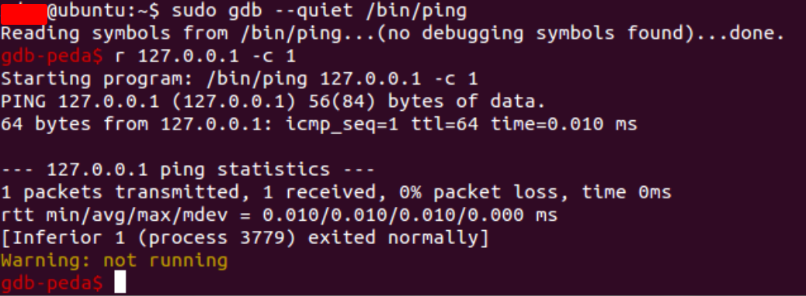
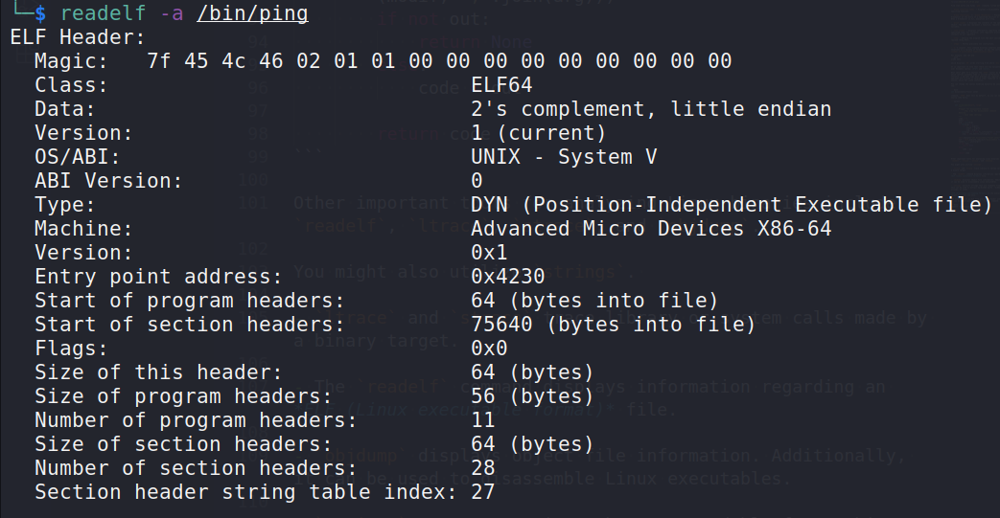

:orphan:
(introduction-to-linux-binary-exploitation-part-1)=

# Introduction to Linux binary exploitation - Part 1

In order to begin the process of exploiting Linux binaries, we first need to become familiar with the target. We will need the appropriate instruments in order to accomplish it. Because gathering information is the most important aspect of any security research activity, including binary exploitation, it is very important to know how to use tools that will help us recognize what is happening inside the target binaries.

In contrast to Windows, where the majority of apps feature graphical user interfaces, Linux and the majority of Linux exploitation tools feature command line terminals.

Linux's default debugger is _gdb_. It is preinstalled on the majority of Linux distributions and is available via:

```bash
sudo apt-get install gdb
```

To increase the visibility of gdb findings, there are a large number of plugins available on the web that were created by the community and made available to the public.
There are `PEDA` and `pwndbg` among them. In this article, `PEDA` will be utilized.

`PEDA` is easily downloadable and configurable. Its GitHub repository can be accessed at the following URL:
[https://github.com/longld/peda](https://github.com/longld/peda)

The installation instructions are simple and straightforward.

The `/.gdbinit` file provides startup commands to be executed by `gdb`. You can compare it to a `.bashrc` file for `gdb`.

Simply use the command:

```bash
gdb [file]
```

to debug a file with gdb. Note that debugging suid binaries or attaching to a more privileged process will not be permitted.

Once the program has been loaded into `gdb`, it can be executed using the `run` or `r` command.

You are also allowed to specify command line arguments after the `run` command:



Find some extra and handy `gdb` commands listed below:

- `disas [function name]` - Displays a disassembly of the specified function.

- `break [function]` or `break *0xaddress` - Places a breakpoint at the entry of a specified function or address.
  When a breakpoint is hit, execution will stop.

- `print [name]` – Displays the contents of the specified object. The name may represent a function, register, or variable.

- `info [name]` - Displays information regarding the specified name; for instance, info registers prints the contents of all registers.

- `step` - Advance the program till the next source line is reached (Step Over).

- `stepi` - Follow precisely one instruction.

- `x` – inspect. This command displays numerous memory locations in a variety of formats. It has the syntax `x/[number of units][data type][location name]`.

For example, you can use:

```bash
x/20w $esi
```

which displays `20` words starting from where `esi` points to.

It is important to note that there are two variants of common user Assembly syntax: _AT&T_ and _Intel_.

What about gdb? It's employs the `AT&T` syntax by default, which implies assembly code is written differently. For instance, a percent sign must precede any register, else the operands are written in reverse order compared to the `Intel` syntax, which may cause confusion.

You can change the syntax handling manually by issuing
the:

```bash
set disassembly-flavor intel
```

command. `PEDA` does this by default, as you can see in its source code below:

```python

    def disassemble(self, *arg):
        """
        Wrapper for disassemble command
            - arg: args for disassemble command
        Returns:
            - text code (String)
        """
        code = ""
        modif = ""
        arg = list(arg)
        if len(arg) > 1:
            if "/" in arg[0]:
                modif = arg[0]
                arg = arg[1:]
        if len(arg) == 1 and to_int(arg[0]) != None:
            arg += [to_hex(to_int(arg[0]) + 32)]

        self.execute("set disassembly-flavor intel")
        out = self.execute_redirect("disassemble %s %s" % (modif, ",".join(arg)))
        if not out:
            return None
        else:
            code = out

        return code
```

Other important tools for analyzing Linux binaries include `readelf`, `ltrace`, `strace`, and `objdump`.

You might also utilize `strings`.

- `ltrace` and `strace` trace library or system calls made by a binary target.

- The `readelf` command displays information regarding an _ELF (Linux executable format)_ file.

- `objdump` displays object file information. Additionally, it can be used to disassemble Linux executables.

- `strings` extracts strings that are readable from a binary.
  This can be used to extract hardcoded paths, "hidden" strings, or names.

_ELF (Executable and Linking Format)_ is the executable file format for Linux and unix.

The components of an ELF file are an ELF-header and ELF-data.
It can be investigated with the `readelf` command:

```bash
readelf -a /bin/ping
```



An ELF header contains crucial information for the operating system regarding how to process the file. Here are the most crucial elements of the header:

- It begins with the hexadecimal sequence: `7f 45 4c 46`

- Class specifies the architectural target

- Data refers to the endianness type (little or big)

Type may be `CORE` (core dumps), `DYN` (shared objects), `EXEC` (executables), or `REL` (relocatable files).

Memory corruption is the cause of core dumps. They can be supplied to `gdb` to analyse crashed programs with greater precision. We will use core dumps later on during exploit development.

Before moving on to the last three types, it is necessary to define linkers and loaders.

Linkers are responsible for connecting the names of functions to their actual memory locations. During a call to a function, the linker is responsible for identifying the function's memory address inside a system library and writing it to the executable's process memory so that the function may be accessed at that address. A loader's responsibility is to load programs from storage into memory.

If an executable requests to be loaded at an already occupied memory address, it must be moved. Relocation is the process of repositioning a module in memory to avoid address clashes.

ELF files contain a `.reloc` section as this should be done in an organized manner. Whenever the desired loading address is unavailable, it is the responsibility of the `.reloc` section to patch the program with new addresses.

Consequently, relative addressing is employed to describe the addresses of program functions.

Relative addressing identifies a function's address by its offset from the loading base address, as opposed to its entire address.

For example, if the relative virtual address of a function is `0x123` and its program is loaded at `0x804000`, the function can be found at `0x804123`.

Additionally, executable files may contain _symbols_. Symbols describe the executable code and include function and variable names, among others. The developer of an executable may disable support for symbols during compilation.

Many function and variable names provide a hint as to what they are intended to achieve; for instance, locating functions titled `getName()` or `printName()` can eliminate a great deal of reverse engineering work.

The removal of symbols from an ELF file is known as _stripping_.

Now that some Linux executable handling ideas have been described, let's define the three remaining ELF file formats:

- EXEC (executables)
- REL (relocatable files)
- DYN (shared objects)

_Executable files_ can be mapped directly into memory upon execution.

Files that are relocatable are executables that facilitate the relocation process.

In the event of an address collision, they employ relative addressing and modify the addresses of their components with a constant offset to their dynamic base address.

Shared Objects are function libraries. They comprise parts typical of both executable and relocatable files from a technological standpoint. They are frequently identifiable by their `.so` extension.

During program launch, shared objects are loaded into a program that will use them.

_Sections_ are common locations within an ELF file that contribute to its functionality. Sections are mapped into the process memory during startup. Mapping involves placing them in the memory of a newly generated process based on their size and the information they contain.

Theoretically, none or all of the section's permissions - `read`, `write`, and `execute` - can be enabled.

:::{seealso}
Looking to expand your knowledge of vulnerability research and exploitation? Check out our online course, [MVRE - Certified Vulnerability Researcher and Exploitation Specialist](https://www.mosse-institute.com/certifications/mvre-vulnerability-researcher-and-exploitation-specialist.html) In this course, you'll learn about the different aspects of software exploitation and how to put them into practice.
:::
