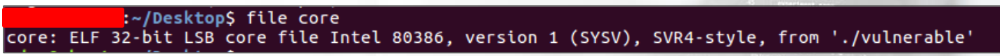

:orphan:
(linux-exploitation-stack-smashing)=

# Linux Exploitation: Stack Smashing

_Stack_ is an area of memory within a process that is used to store data by the process itself. Unlike registers, which are modest in size but the fastest temporary data storage option, the stack provides more space. Stack is also used to track the program's execution.

When a new function is called, the last address preceding the function call is saved on the stack in order to determine where execution halted during the function call.

This is referred to as the _return address_ since it is where the program will return after a function has completed.

The stack is aligned with 4 bytes (32 bit).

Additionally, the stack expands toward lower addresses. Therefore, if the first piece put onto the stack has the address `0xbffffff`8, it will fill the area betwee `0xbfffff8` and `0xbfffff5`. The address of the next piece to be pushed into the stack is `0xbffffff4`.

If no sophisticated countermeasures are in place, the stack is just another memory location that can be accessed and modified in the same manner as any other address.

A programming fault causes stack overflow, sometimes referred to as buffer overflow or stack-based buffer overflow. This may occur if the program handles user-supplied data insecurely.

In programming languages such as `C` and `C++`, it is necessary to declare the size of each variable you intend to use. This is necessary because the application must reserve specific quantities of memory during execution.

You can then freely utilize your variable, for instance by copying data from another location in memory to it/ Nonetheless, you may choose to save user-supplied input in your specified variable.

How can you know that the user will not provide more information than expected? What if this occurs?

Let's use an exemplary C program in order to simulate a stack overflow scenario. We will use `Ubuntu 14, 32-bit` version.

For now, you just need to know that we will disable `NX` and `ASLR` in order to be able to conduct basic exploitation of a stack overflow.

Before compiling any susceptible code, let's determine what must be done to enable exploitation. If you reboot your system during the exploitation, you will be required to disable `ASLR` after each reboot. Save the following commands for later if you like to complete the workouts alongside us.

Compile:

```bash
gcc -fno-stack-protector -z execstack program.c -o program
```

Disable ASLR:

```bash
echo 0 | sudo tee /proc/sys/kernel/randomize_va_space
```

Let’s consider the following source code:

```cpp
#include <stdio.h>
#include <unistd.h>

int overflow() {
  char buffer[500];
  int userinput;
  userinput = read(0, buffer, 500);
  printf("\nUser provided %d bytes. Buffer content is: %s\n", userinput, buffer);
  return 0;
}

int main(int argc, char *argv[]) {
  overflow();
  return 0;
}
```

This application is secure.
Let's start with the `main()` function and work our way down:

- The `overflow` function is called.
- The `overflow` function declares a `500-byte`-wide variable.
- The variable is _"read"_ `500 bytes` from the user. The function then verifies the result by reporting the buffer size and the buffer itself.

Let’s now think about the user’s input. _What if we are allowed to write more than the declared variable’s size?_

Let's change some piece of code:

```cpp
#include <stdio.h>
#include <unistd.h>

int overflow() {
  char buffer[500];
  int userinput;
  userinput = read(0, buffer, 700);
  printf("\nUser provided %d bytes. Buffer content is: %s\n", userinput, buffer);
  return 0;
}

int main(int argc, char *argv[]) {
  overflow();
  return 0;
}
```

Let’s compile the program:

```bash
gcc -fno-stack-protector -z execstack vulnerable.c -o vulnerable
```


The characters must be entered manually into the program. However, manually entering hundreds of characters can be a laborious endeavor. Using output redirection, we can interact with the program's stdin.


We are already aware that the buffer variable is `500` bytes in size. Additionally, we are permitted to send `700` bytes to it. Let's capitalize on this fact. Also, let's increase the core dump limit.

Core dumps are `ELF` files that are generated when a segmentation fault (memory corruption) occurs within a binary. Execute the following command in the same terminal window where the vulnerable program is running:

```bash
ulimit –c unlimited
```


Upon sending 700 "A"s to the binary, we observe that it has crashed.



Let's examine it using gdb:


Due to multiple "A" characters being supplied to the program buffer, the stack was overflowed and the `EIP` register was populated.

Let's investigate how this occurred using `gdb`.

We begin by launching the program in `gdb` and disassembling the `main` function. The call to the `overflow()` function is visible.


Then, let's disassemble the `overflow()` function. We can see a few interesting points there:


The buffer variable is pushed onto the stack prior to the `read` function call. This is accomplished by moving `[ebp-0x200address ]`'s to `EAX` (lea instruction) and then pushing it onto the stack as an argument to the `read()` function (`push eax`).
The `push 0x0` preceding the call to `read()` is the second argument and refers to the standard input. As these arguments are prepared, the `read()` function is invoked, and the user's input is read into the memory location `0x200` bytes from the `EBP`.

We can set a breakpoint prior to and following the `read()` function. Additionally, we will need a breakpoint at the final instruction of the function, `return`.

The breakpoints are set in the following locations:


Now, we can execute the application. Python output redirection is still possible while in the debugger, but it must be accomplished in a different manner. We will save our target buffer to a file and then _"feed"_ the _"A"_ characters to the executable.


Immediately, the first breakpoint is hit. We can confirm where we are by examining the `5` instructions at the current `eip`, as follows:


As our variable was located in `ebp-0x200`, let's obtain its address using the `p` command and then examine its current contents:


We see that nothing important resides there (no "A"s).

Let us `continue` (or `c`) and observe the second breakpoint being reached. Examining the variable now reveals that the `read()` function was successfully executed, as the letter "A" is now present:


Examining further, there are lots of "A"'s:


As the number of "A"s that were copied onto the stack exceeded the declared size of the variable, they needed to be placed. Normal program behavior dictates that they are copied further down the stack, displacing other data intended to reside there.

One piece of data that was overwritten on the stack was the return address. Once the `overflow()` function is complete, the return address that was pushed onto the stack is meant to be picked up to restore the rest of the `main()` function.

As we `continue` once more, we reach the final breakpoint established by the `return` instruction.
The `return` instruction transfers the information at the top of the stack to the `EIP`.

Initially, the saved return address (that is, the address of the instruction immediately following the call to `overflow()`) was restored. However, as the attacker saved the unexpectedly long input into memory, that location was overwritten (along with some space after it), so we have just `AAAA` (hex `0x41414141`) there.

The program is unaware of this and attempts to retrieve the return address, which should be at the top of the stack. The screenshot reveals that the data at the top of the stack was actually overwritten.

The program is attempting to resume execution at location `0x41414141`. Such a location does not exist in the process's memory, resulting in a segmentation fault:


As we now advance an instruction, a segmentation fault occurs because `0x41414141` has been placed in `EIP`. This is not a valid memory address, so the program has terminated:


By providing the program with sufficient amounts of lengthy data, we were able to influence the value of the `EIP` and, consequently, the address of the code to be executed.

If we could replace `0x41414141` with a real address, the program would begin executing the code located at that location.

We would like to know the exact size of the buffer required for the saved return address to begin to overflow. Then, we could precisely replace the `EIP` with our own controlled data. There are several ways to calculate the offset between the beginning of the buffer and the `EIP`.

The metasploit distribution includes the `pattern create.rb` and `pattern offset.rb` tools.

Additionally, one of the `PEDA` utilities is `pattern_create`.

They both function in the same manner – producing a pattern of a unique string of a specified length.

During the crash, `EIP` is overwritten with some bytes belonging to this string.

We can instantly save the pattern to a file and feed it to the
executable, as follows:


It is also possible to identify the correct offset to the `EIP` based on the `EIP` value.


Let's use this value to build a new payload and execute the executable (we're essentially trying to fill the `EIP` with "B"s):


Our computations were accurate. The B's were used to overwrite the `EIP`. We can thus control the program's execution flow:


In the next part we will abuse EIP control and run our own code.

## References

- [gdb-peda](https://github.com/longld/peda)

> **Looking to expand your knowledge of vulnerability research and exploitation? Check out our online course, [MVRE - Certified Vulnerability Researcher and Exploitation Specialist](https://www.mosse-institute.com/certifications/mvre-vulnerability-researcher-and-exploitation-specialist.html). In this course, you'll learn about the different aspects of software exploitation and how to put them into practice.**
